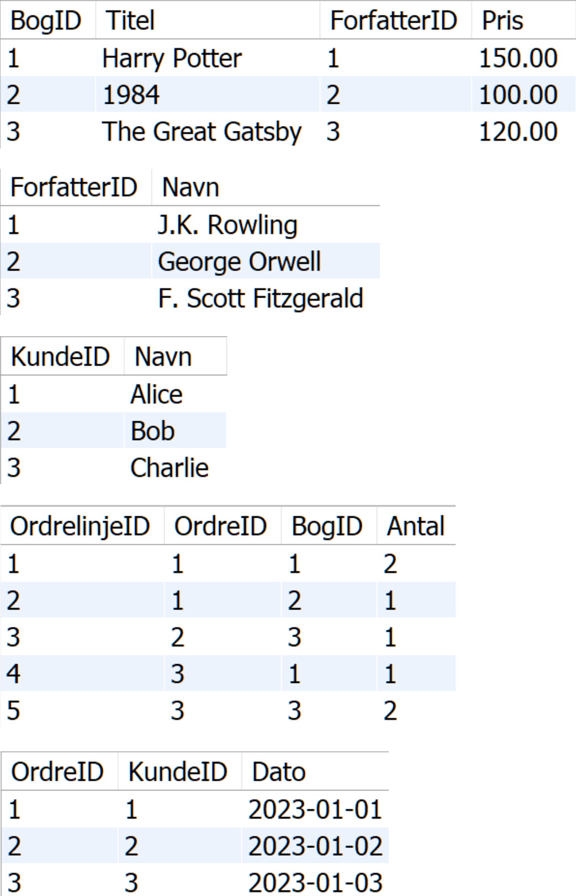
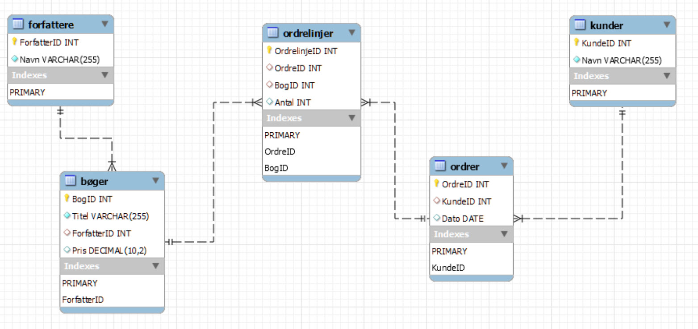

<span class="fs-1">
[HOME](../index.md){: .btn .btn-blue }
</span>

# Løsning boghandel
Her er et løsningforslag på normaliseringsopgaven med boghandlen.

## Tabeller
Tabeller med data



## Er Diagram


## SQL kode
```sql
-- Opret databasen - Boghandel
CREATE DATABASE Boghandel;
USE Boghandel;

-- Opretter Forfattere tabel
CREATE TABLE Forfattere (
    ForfatterID INT PRIMARY KEY,
    Navn VARCHAR(255) NOT NULL
);

-- Opretter Bøger tabel
CREATE TABLE Bøger (
    BogID INT PRIMARY KEY,
    Titel VARCHAR(255) NOT NULL,
    ForfatterID INT,
    Pris DECIMAL(10, 2),
    FOREIGN KEY (ForfatterID) REFERENCES Forfattere(ForfatterID)
);

-- Opretter Kunder tabel
CREATE TABLE Kunder (
    KundeID INT PRIMARY KEY,
    Navn VARCHAR(255) NOT NULL
);

-- Opretter Ordrer tabel
CREATE TABLE Ordrer (
    OrdreID INT PRIMARY KEY,
    KundeID INT,
    Dato DATE,
    FOREIGN KEY (KundeID) REFERENCES Kunder(KundeID)
);

-- Opretter Ordrelinjer tabel
CREATE TABLE Ordrelinjer (
    OrdrelinjeID INT PRIMARY KEY,
    OrdreID INT,
    BogID INT,
    Antal INT,
    FOREIGN KEY (OrdreID) REFERENCES Ordrer(OrdreID),
    FOREIGN KEY (BogID) REFERENCES Bøger(BogID)
);

-- Indsætter eksempeldata i Forfattere
INSERT INTO Forfattere (ForfatterID, Navn) VALUES
(1, 'J.K. Rowling'),
(2, 'George Orwell'),
(3, 'F. Scott Fitzgerald');

-- Indsætter eksempeldata i Bøger
INSERT INTO Bøger (BogID, Titel, ForfatterID, Pris) VALUES
(1, 'Harry Potter', 1, 150.00),
(2, '1984', 2, 100.00),
(3, 'The Great Gatsby', 3, 120.00);

-- Indsætter eksempeldata i Kunder
INSERT INTO Kunder (KundeID, Navn) VALUES
(1, 'Alice'),
(2, 'Bob'),
(3, 'Charlie');

-- Indsætter eksempeldata i Ordrer
INSERT INTO Ordrer (OrdreID, KundeID, Dato) VALUES
(1, 1, '2023-01-01'),
(2, 2, '2023-01-02'),
(3, 3, '2023-01-03');

-- Indsætter eksempeldata i Ordrelinjer
INSERT INTO Ordrelinjer (OrdrelinjeID, OrdreID, BogID, Antal) VALUES
(1, 1, 1, 2),
(2, 1, 2, 1),
(3, 2, 3, 1),
(4, 3, 1, 1),
(5, 3, 3, 2);
```