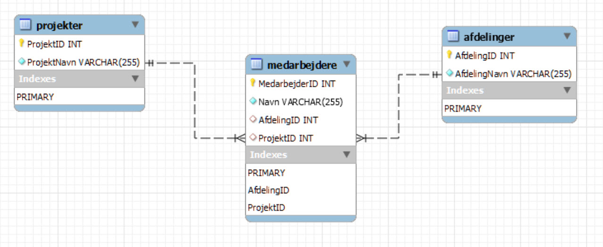

<span class="fs-1">
[HOME](../index.md){: .btn .btn-blue }
</span>

# Normalisering i Databaser
Normalisering er en proces i databasedesign, der har til formål at reducere **redundans** og forbedre **dataintegritet**. Processen indebærer organisering af data i en database, således at det bliver lettere at vedligeholde og mere effektivt at hente data. Normalisering opnås gennem en række regler og principper, der leder designet af databasen.

## Formål med Normalisering
Reducer Redundans: Undgå gentagelse af data i forskellige tabeller, hvilket sparer lagerplads og reducerer risikoen for inkonsistente data.
Forbedr Dataintegritet: Sikrer, at data er nøjagtige, pålidelige og konsistente over hele databasen.
Forenkl Datahåndtering: Gør det lettere at indsætte, opdatere og slette data i databasen.

## Normalformer
Normalisering opdeles i flere "normalformer", hver med sine egne regler og krav. De mest almindelige normalformer er:

- **Første Normalform** (*1NF*): Kræver, at alle værdier i en tabel er atomiske (ikke-delelige) og at hver kolonne har en unik navn.
- **Anden Normalform** (*2NF*): Opnås, når tabellen er i 1NF, og alle ikke-nøgleattributter er fuldt funktionelt afhængige af primærnøglen.
- **Tredje Normalform** (*3NF*): Opnås, når tabellen er i 2NF, og alle attributter er kun afhængige af primærnøglen.

Der findes også højere normalformer som **BCNF**, **4NF** og *5NF*, men for mange praktiske anvendelser er **3NF ofte tilstrækkeligt**.

## Eksempel - Medarbejderdatabase
Forestil dig en virksomhed, der har en database for at holde styr på deres medarbejdere, deres afdelinger, og hvilke projekter de arbejder på. I starten har de alle disse informationer i en enkelt tabel:

### MedarbejderTabel (Uopdelt)
| MedarbejderID | Navn               | Afdeling   | Projekt         |
|---------------|--------------------|------------|-----------------|
| 1             | Anna Andersen      | HR         | Rekruttering    |
| 2             | Brian Bjørn        | IT         | Systemopdatering|
| 3             | Clara Christensen  | IT         | Appudvikling    |
| 4             | David Dalsgaard    | Marketing  | Kampagne        |
| 5             | Emma Eriksen       | HR         | Personaleudvikling |
| 6             | Frank Frandsen     | IT         | Systemopdatering|


**Denne tabel har flere problemer:**
- **Redundans**: Afdelingsnavne og projektnavne gentages for hver medarbejder i samme afdeling/projekt.
- **Opdateringsanomalier**: Hvis en afdelings navn ændres, skal det opdateres for hver medarbejder i den afdeling.
- **Sletningsanomalier**: Hvis den sidste medarbejder i en afdeling forlader virksomheden, og vi sletter denne medarbejder fra tabellen, vil information om afdelingen gå tabt.
- **Indsætningsanomalier**: Vi kan ikke tilføje en ny afdeling til databasen, medmindre vi også tilføjer en medarbejder, der arbejder i den afdeling.

## Normalisering
### **Første Normalform** (*1NF*)
Tabellen er allerede i 1NF, da alle værdier er atomiske.

### **Anden Normalform** (*2NF*)
For at opnå 2NF, opretter vi separate tabeller for **Medarbejdere**, **Afdelinger**, og **Projekter**, og bruger fremmednøgler til at linke dem sammen.

**Medarbejdere**
| MedarbejderID | Navn               | AfdelingID | ProjektID |
|---------------|--------------------|------------|-----------|
| 1             | Anna Andersen      | 1          | 1         |
| 2             | Brian Bjørn        | 2          | 2         |
| 3             | Clara Christensen  | 2          | 3         |
| 4             | David Dalsgaard    | 3          | 4         |
| 5             | Emma Eriksen       | 1          | 5         |
| 6             | Frank Frandsen     | 2          | 2         |

**Afdelinger**
| AfdelingID | AfdelingNavn |
|------------|---------------|
| 1          | HR            |
| 2          | IT            |
| 3          | Marketing     |

**Projekter**
| ProjektID | ProjektNavn       |
|-----------|-------------------|
| 1         | Rekruttering      |
| 2         | Systemopdatering  |
| 3         | Appudvikling      |
| 4         | Kampagne          |
| 5         | Personaleudvikling|

### **Tredje Normalform** (*3NF*)
For at opnå 3NF, sikrer vi, at alle felter i tabellerne kun er afhængige af primærnøglen, og ikke af andre felter. I dette tilfælde er vi allerede i 3NF, da alle ikke-nøgleattributter kun er afhængige af primærnøglen i deres respektive tabeller.
Dette design reducerer redundans, forbedrer dataintegriteten, og gør det lettere at vedligeholde databasen.

**Medarbejdere**
| MedarbejderID | Navn               | AfdelingID | ProjektID |
|---------------|--------------------|------------|-----------|
| 1             | Anna Andersen      | 1          | 1         |
| 2             | Brian Bjørn        | 2          | 2         |
| 3             | Clara Christensen  | 2          | 3         |
| 4             | David Dalsgaard    | 3          | 4         |
| 5             | Emma Eriksen       | 1          | 5         |
| 6             | Frank Frandsen     | 2          | 2         |


**Afdelinger**
| AfdelingID | AfdelingNavn |
|------------|---------------|
| 1          | HR            |
| 2          | IT            |
| 3          | Marketing     |


**Projekter**
| ProjektID | ProjektNavn       |
|-----------|-------------------|
| 1         | Rekruttering      |
| 2         | Systemopdatering  |
| 3         | Appudvikling      |
| 4         | Kampagne          |
| 5         | Personaleudvikling|

### ER-Diagram


### SQL kode
```sql
-- Opret databasen - Medarbejdere
CREATE DATABASE Medarbejdere;
USE Medarbejdere;

-- Opretter Afdelinger tabel
CREATE TABLE Afdelinger (
    AfdelingID INT PRIMARY KEY,
    AfdelingNavn VARCHAR(255) NOT NULL
);

-- Opretter Projekter tabel
CREATE TABLE Projekter (
    ProjektID INT PRIMARY KEY,
    ProjektNavn VARCHAR(255) NOT NULL
);

-- Opretter Medarbejdere tabel
CREATE TABLE Medarbejdere (
    MedarbejderID INT PRIMARY KEY,
    Navn VARCHAR(255) NOT NULL,
    AfdelingID INT,
    ProjektID INT,
    FOREIGN KEY (AfdelingID) REFERENCES Afdelinger(AfdelingID),
    FOREIGN KEY (ProjektID) REFERENCES Projekter(ProjektID)
);

-- Indsætter eksempeldata i Afdelinger
INSERT INTO Afdelinger (AfdelingID, AfdelingNavn) VALUES
(1, 'HR'),
(2, 'IT'),
(3, 'Salg');

-- Indsætter eksempeldata i Projekter
INSERT INTO Projekter (ProjektID, ProjektNavn) VALUES
(1, 'Projekt X'),
(2, 'Projekt Y'),
(3, 'Projekt Z');

-- Indsætter eksempeldata i Medarbejdere
INSERT INTO Medarbejdere (MedarbejderID, Navn, AfdelingID, ProjektID) VALUES
(1, 'Alice', 1, 1),
(2, 'Bob', 2, 2),
(3, 'Charlie', 3, 3),
(4, 'Diana', 1, 1),
(5, 'Edward', 2, 2);

-- Vis data
select * from medarbejdere;
select * from afdelinger;
select * from projekter;
```