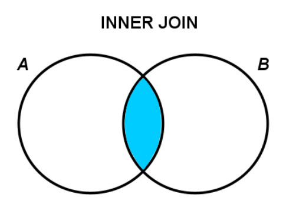
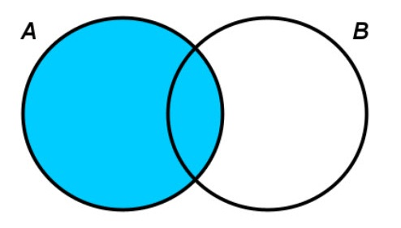
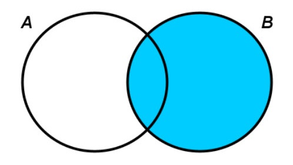

# Relationer
I en relationel database henviser "*relation*" oftest til en tabel. En tabel repræsenterer en **entitetstype**, og hver række i tabellen repræsenterer en instans af denne entitetstype. Kolonnerne repræsenterer **attributter** (*egenskaber*) for entiteten.

Men når man taler om "*relationer*" i forbindelse med databaser, er det ofte forholdet mellem tabeller der menes. Dette forhold oprettes ved hjælp af nøgler - **primærnøgler og fremmednøgler**.

## Typer af relationer
**One-to-One (1:1)** En post i Tabel A relaterer til én og kun én post i Tabel B, og omvendt.

**One-to-Many (1:M) / Many-to-One (M:1)**
En post i Tabel A kan relateres til mange poster i Tabel B, men en post i Tabel B relaterer til kun én post i Tabel A.

**Many-to-Many (M:M)**
En post i Tabel A kan relateres til mange poster i Tabel B, og omvendt. Dette håndteres typisk ved hjælp af en mellemliggende tabel, ofte kaldet en "junction" eller "bridge" tabel. Det er **ikke** muligt at oprette en Many-to-Many relation direkte i MySQL.

## Fordele og ulemper ved relationer:
**Fordele:**
- **Dataintegritet**: Relationer sikrer, at databasen opretholder korrekt og konsistent data, hvilket forhindrer mange former for dataforvrængning eller duplikation.
- **Data Normalisering**: Relationer hjælper med at undgå redundans og inkonsistens ved at sikre, at data kun opbevares ét sted.
- **Effektiv Forespørgselsbehandling**: Korrekt designede relationer tillader effektiv datahentning.

**Ulemper:**
- **Kompleksitet**: Designing og vedligeholdelse af relationer kan være komplekst, især i store databaser.
- **Performance Overhead**: Forkert designede relationer, især *Many-to-Many* relationer, kan nedsætte ydeevnen.

## "Skole" eksempel
Forestil dig en database for en skole. En tabel, **Studerende**, indeholder generel studerende information, mens en anden tabel, **StuderendeDetaljer**, indeholder mere dybdegående information som Email for hver studerende. Hver studerende i Studerende-tabellen korresponderer til præcis én post i **StuderendeDetaljer**.

### Entiteter
- **Studerende**: Med attributter som StuderendeID (*Primær Nøgle*), Navn, etc.
- **StuderendeDetaljer**: Med attributter som StuderendeID (*Primær Nøgle og Fremmed Nøgle til Studerende*), Email, etc.
- **Klasser**: Med attributter som KlasseID (*Primær Nøgle*), KlasseNavn, etc.
- **Kurser**: Med attributter som KursusID (*Primær Nøgle*), KursusNavn, etc.
- **StuderendeKurser**: Med attributter som StuderendeID (*Fremmed Nøgle til Studerende*), KursusID (*Fremmed Nøgle til Kurser*).

### Relationer
- **Studerende og StuderendeDetaljer**: One-to-One relation baseret på StuderendeID.
- **Studerende og Klasser**: One-to-Many relation, hvor mange studerende kan være i én klasse. Relationen baseres på en fremmed nøgle i Studerende, som peger på KlasseID i Klasser.
- **Studerende og Kurser**: Many-to-Many relation faciliteret af StuderendeKurser-tabellen. StuderendeKurser indeholder to fremmednøgler: én fra Studerende og én fra Kurser.

**One-to-Many:**
I samme skoledatabase kan der være en tabel Klasser og en tabel Studerende. Én klasse kan have mange studerende, men hver studerende tilhører kun én klasse.

**Many-to-Many:**
Hvis vi introducerer en tabel **Kurser**, kan en studerende tage mange kurser, og hvert kursus kan have mange studerende. Det er **ikke** muligt at oprette en *Many-to-Many* relation i MySQL.

Dette forhold kan repræsenteres ved hjælp af en mellemliggende tabel, **StuderendeKurser**, der indeholder fremmednøgler fra både *Studerende* og *Kurser*.

### ER-diagram


### SQL kode
Her kan du hente en SQL kode fil der opretter databasen og indsætter eksempel data.

[Skoledatabase.sql](./sql/skoledabase.sql)

# JOIN Typer
I relationelle databasesystemer som MySQL er JOIN-operationer vitale, når man ønsker at kombinere rækker fra to eller flere tabeller baseret på en relateret kolonne mellem dem. 

Her er en beskrivelse af de 3 mest almindelige JOIN-typer i MySQL.

## INNER JOIN (eller JOIN)
Returnerer rækker, når der er en **match i begge tabeller**.



```sql
SELECT 
	Studerende.Navn,
    StuderendeKurser.KursusID 
FROM Studerende INNER JOIN StuderendeKurser
ON Studerende.StuderendeID = StuderendeKurser.StuderendeID;
```

## LEFT JOIN (eller LEFT OUTER JOIN)
Returnerer **alle rækker fra den venstre tabel** og de **matchende rækker fra den højre tabel**. Hvis der ikke er et match, vil resultatet fra den højre tabel være NULL.



```sql
SELECT 
	Studerende.Navn,
    StuderendeKurser.KursusID 
FROM Studerende LEFT JOIN StuderendeKurser
ON Studerende.StuderendeID = StuderendeKurser.StuderendeID;
```

## RIGHT JOIN (eller RIGHT OUTER JOIN)
Returnerer **alle rækker fra den højre tabel** og de **matchende rækker fra den venstre tabel**. Hvis der ikke er et match, vil resultatet fra den venstre tabel være NULL.



```sql
SELECT 
	Studerende.Navn,
    StuderendeKurser.KursusID 
FROM Studerende RIGHT JOIN StuderendeKurser
ON Studerende.StuderendeID = StuderendeKurser.StuderendeID;
```

Vælg den rette JOIN type ud fra dit specifikke behov for at sikre, at din forespørgsel returnerer de ønskede resultater.