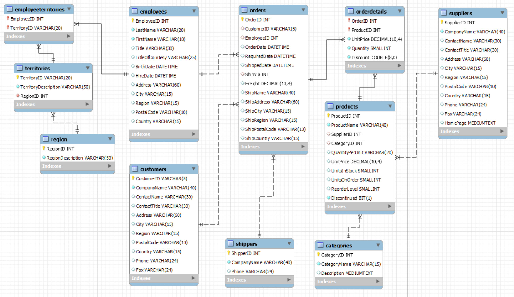
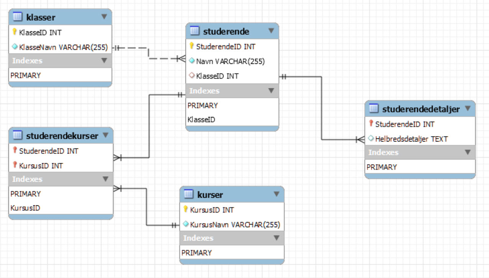
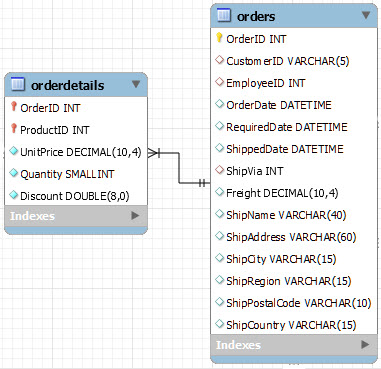
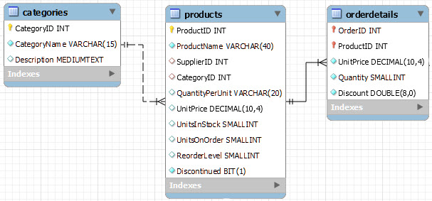

<span class="fs-1">
[HOME](../index.md){: .btn .btn-blue }
</span>

# SQL


**SQL** (*Structured Query Language*) er et domæne-specifikt sprog, der anvendes i programmering og designet til at håndtere, og hente data i relationelle databaser.

# Eksempel databaser
## Northwind

### ER-diagram Northwind


### Power BI
Du kan hente Power BI fil med forbindelse til MySQL Server - [northwind.pbix](./sql/northwind.pbix)

### SQL File Northwind
Du kan hente SQL file for oprettelse og indsætning af data: []()

## "Skole" eksempel
Forestil dig en database for en skole. En tabel, Studerende, indeholder generel studerende information, mens en anden tabel, StuderendeDetaljer, indeholder mere dybdegående information som Email for hver studerende. Hver studerende i Studerende-tabellen korresponderer til præcis én post i StuderendeDetaljer.

### ER-diagram "Skole"


### SQL File "Skole"
Du kan hente SQL file for oprettelse og indsætning af data: [skoledabase.sql](./sql/skoledabase.sql)

## SELECT
Bruges til at hente data fra en database.

**Eksempel**: *Hent alle kolonner fra en tabel ved navn "orders"*

```sql
SELECT * FROM orders;
```

**Eksempel**: *Hent kun kolonner: OrderID, CustomerID, OrderDate
fra en tabel ved navn "orders"*

```sql
SELECT
    OrderID,
    CustomerID,
    OrderDate
FROM orders;
```

## DISTINCT
Vis kun unikke værdier ud fra en kolonne

Eksempel: Find alle lande der er sendt noget til, vis kun hvert land en gang.

```sql
SELECT DISTINCT ShipCountry
FROM orders;
```

## WHERE
Bruges til at filtrere resultaterne baseret på en betingelse.

**Eksempel**: *Vælg alle kolonner fra "orders" hvor "EmployeeID" er lig med 5.*

```sql
SELECT * FROM orders
WHERE EmployeeID = 5;
```

## ORDER BY
Bruges til at sortere resultaterne i en forespørgsel.

**Eksempel**: *Vælg alle kolonner fra "orders" hvor "EmployeeID" er lig med 5. Sorteret efter "OrderDate" i stigende orden - ASC*

```sql
SELECT * FROM orders
WHERE EmployeeID = 5
ORDER BY OrderDate ASC;
```

Samme, bare i faldende orden - DESC

```sql
SELECT * FROM orders
WHERE EmployeeID = 5
ORDER BY OrderDate DESC;
```

## Beregnet kolonne
Det er muligt at fortage beregninger og oprette nye kolonner med beregningen.

**Eksempel**: *Ud fra tabellen orderdetails beregnes en total pr. række* - **UnitPrice * Quantity AS RowTotal**

```sql
SELECT
    OrderID,
    ProductID,
    UnitPrice,
    Quantity,
    UnitPrice * Quantity AS RowTotal
FROM orderdetails;
```

## GROUP BY
Bruges til at gruppere rækker, der har de samme værdier i udvalgte kolonner.

**Eksempel**: *Summering af hver enkelt order i tabellen orderdetails*

```sql
SELECT
    OrderID,
    SUM(UnitPrice * Quantity) AS RowTotal
FROM orderdetails
GROUP BY OrderID
ORDER BY OrderID;
```

## JOIN
Bruges til at kombinere rækker fra to eller flere tabeller baseret på en relateret kolonne.

**Eksempel 1**: *Hvad er omsætningen pr. Country?. For at finde dette skal der opretters forbindelse (JOIN/Relation) mellem tabellerne:*

- orders
- orderdetails



```sql
SELECT
	ShipCountry,
    SUM(UnitPrice * Quantity) AS Total
FROM orders JOIN orderdetails
ON orders.OrderID = orderdetails.OrderID
GROUP BY ShipCountry
ORDER BY Total DESC;
```


**Eksempel 2**: *Hvad er omsætningen pr. Category?. For at finde dette skal der opretters forbindelse (JOIN/Relation) mellem 3 tabeller:*

- categories
- products
- orderdetails



```sql
SELECT
    CategoryName,
    SUM(orderdetails.UnitPrice * orderdetails.Quantity) AS Total
	FROM categories JOIN products
	ON categories.CategoryID = products.CategoryID
	JOIN orderdetails
	ON products.ProductID = orderdetails.ProductID
	GROUP BY CategoryName
    ORDER BY Total;
```