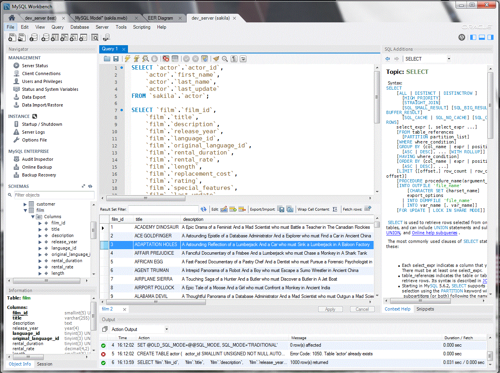

[HOME](../index.md){: .btn .btn-blue }

# MySQL Workbench
**MySQL Workbench** er en integreret udviklingsmiljø (*IDE*) og en visuel administrationstjeneste udviklet af Oracle Corporation til databasearkitekter, administratorer, og udviklere, der arbejder med MySQL. Det tilbyder et omfattende sæt af værktøjer til design, udvikling, og administration af MySQL databaser i én samlet applikation.

[MySQL officiel side](https://www.mysql.com/products/workbench/)

## Kernefunktioner i MySQL Workbench
- **Visuel Design**: Workbench tillader brugere at visuelt designe databasemodeller, skabe og redigere tabeller, views, stored procedures, triggers og meget mere ved hjælp af et grafisk interface, hvilket gør det nemmere at forstå databasens struktur og design.
- **SQL Udvikling**: Det leverer avanceret SQL-editorfunktionalitet, som hjælper med at oprette, udføre og optimere SQL-forespørgsler.
- **Databaseadministration**: Workbench indeholder værktøjer til håndtering og overvågning af MySQL-serverinstanser samt til at foretage backup og recovery af databasedata. Administrationskomponenten tillader også brugere at konfigurere brugeradgang, servervariabler og andre serverrelaterede opgaver.
- **Data Migration**: MySQL Workbench tilbyder en datamigreringsassistent, som hjælper med at overføre data fra andre databasetyper som Microsoft SQL Server, Microsoft Access, og andre relationelle databasestyringssystemer til MySQL.
- **Performance Tuning**: Med Performance Dashboard og Performance Reports kan brugere identificere potentielle flaskehalse og udføre tuning af deres databaser for at opnå optimal ydeevne.

## Hvorfor Bruge MySQL Workbench?
- **Konsolidering af Værktøjer**: Samler design, udvikling og administrationsopgaver i én applikation.
- **Øget Effektivitet**: Brugere kan hurtigt og nemt udføre opgaver, der kan være komplekse og tidskrævende uden et visuelt værktøj.
- **Fejlreduktion**: Den visuelle natur og de valideringsværktøjer, der er indbygget i Workbench, kan hjælpe med at mindske fejl i databasedesign og administration.
- **Support og Dokumentation**: Som et produkt af Oracle, er der omfattende dokumentation og et aktivt community, der kan bistå brugere med udfordringer og spørgsmål.

**MySQL Workbench** er en kraftfuld applikation, der gør det nemmere at arbejde med MySQL-databaser fra en visuel kontekst, hvilket er særligt nyttigt for dem, der foretrækker en grafisk repræsentation af data og strukturer frem for kommandolinjeinterfaces. Med dens intuitive design og omfattende funktionalitet er det blevet et populært valg for databaseprofessionelle verden over.

## Installation
Installation af MySQL Workbench kan variere lidt afhængigt af dit operativsystem.

## Windows
- Download Installationsfilen: [Åben den officielle MySQL-downloadside](https://dev.mysql.com/downloads/workbench/)
- Vælg og download den version af MySQL Workbench, der er kompatibel med din version af Windows (32-bit eller 64-bit).
- Installation: Åbn den downloadede fil og følg vejledningen i installationsguiden. Accepter licensaftalen og vælg din installationstype (typisk "Developer Default" for de fleste brugere).
- Klik "Next" og "Install" for at starte installationsprocessen.
- Efter installationen er afsluttet, kan du vælge at starte MySQL Workbench direkte eller finde det i dine programmer.

## macOS
- Download Installationsfilen: [Åben den officielle MySQL-downloadside](https://dev.mysql.com/downloads/workbench/).
- Download DMG-arkivet til macOS.
- Installation: Åbn det downloadede DMG-arkiv.
- Træk MySQL Workbench-ikonet til din Applications-mappe.
- Åbn MySQL Workbench fra Applications-mappen. (*Bemærk: Du skal muligvis godkende appen i dine sikkerhedsindstillinger, afhængigt af dine systempræferencer*).

Når du har installeret MySQL Workbench, kan du begynde at oprette forbindelse til MySQL-serverinstanser og udføre forskellige databaseudviklings- og administrationsopgaver. 

*Brug den officielle MySQL-dokumentation for de mest opdaterede og detaljerede instruktioner - [MySQL Workbench](https://dev.mysql.com/doc/workbench/en/)*