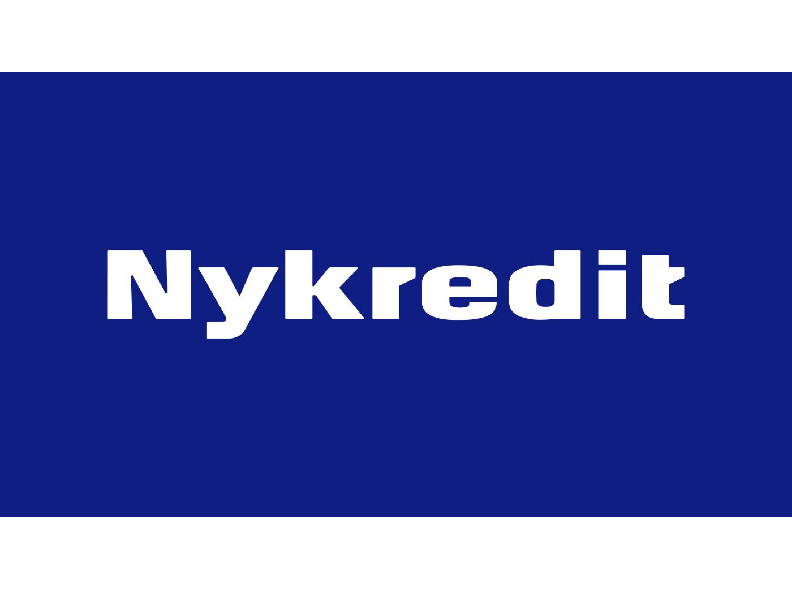

[HOME](../index.md){: .btn .btn-blue }

# Agil dag med Nykredit
Vi er så heldige at Ulrik Skovgaard fra Nykredit kommer denne dag og taler om Agile processor.

Det bliver et super spændende indlæg hvor I vil få indblik i hvordan Nykredit arbejder med agile teams og processer. I vil også få et indblik i virksomheden Nykredit.

## Tidspunkt
**Begge** klasser skal møde kl. 08:30 i lokale A370 - *Der hvor i normalt er*
