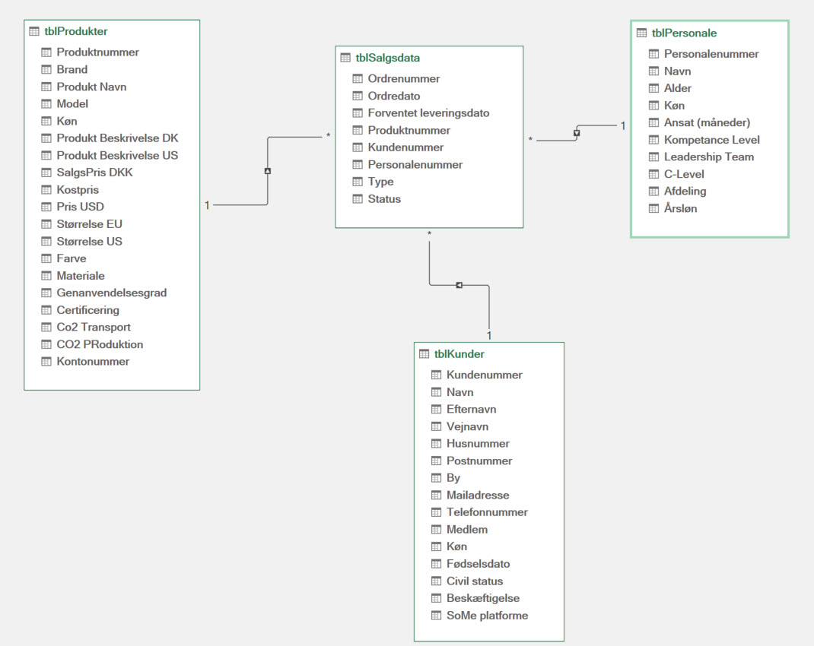

<span class="fs-1">
[HOME](../index.md){: .btn .btn-blue }
</span>

# KEAsneakers

## Filer
- [keasneakers_data_studerende.xlsm](./keasneakers_data_studerende.xlsm)
- [Personale.csv](./Personale.csv)

## ER Diagram


## DAX & Diagram forslag
Her er nogle forslag til DAX beregninger og diagrammer.

### Salgsanalyse (Salgsdata)
- Analyser samlet salg over tid (månedligt/årligt).
- DAX-formel for samlet salg:

```dax
Total Sales = SUM(Salgsdata[Salgsbeløb])
```

- Lav et linjediagram for at vise salgstrends over tid.

### Kundeanalyse (Kunder)
- Segmenter kunder baseret på købshistorik, geografi, eller andre demografiske data.
- DAX-formel for kundesegmentering: 

```dax
Customer Segment = CALCULATE(COUNTROWS(Kunder), Kunder[Segment] = "Specifikt Segment")
```

- Brug et søjlediagram til at vise fordelingen af kundesegmenter.

### Produktanalyse (Produkter)
- Analyser hvilke produkter der sælger bedst, og hvilke der underpræsterer.
- DAX-formel for top-sælgende produkter:

```dax
Top Products = TOPN(10, SUMMARIZE(Produkter, Produkter[ProduktNavn], "Total Sales", SUM(Salgsdata[Salgsbeløb])), [Total Sales], DESC)
```

- Brug et søjlediagram eller et pie chart til at illustrere salgsfordelingen mellem forskellige produkter.

### Personale Performance Analyse (Personale)
- Analyser salgsperformance for hvert medlem af salgsteamet.
- DAX-formel for salgsperformance:

```dax
Sales by Employee = SUMX(RELATEDTABLE(Salgsdata), Salgsdata[Salgsbeløb])
```

- Brug et søjlediagram til at sammenligne performance mellem forskellige medarbejder

### Årlig Vækstrate
- Beregn den årlige vækstrate i salg.
- DAX-formel:

```dax
Yearly Growth Rate = DIVIDE([Total Sales This Year] - [Total Sales Last Year], [Total Sales Last Year])
```

### Gennemsnitligt Salg per Kunde
- Find det gennemsnitlige salgsbeløb per kunde.
- DAX-formel:

```dax
Average Sale per Customer = DIVIDE([Total Sales], DISTINCTCOUNT(Kunder[KundeID]))
```

### Aldersbaseret Kundeanalyse
- Segmenter kunder baseret på alder, hvis du har aldersdata.
- DAX-formel:

```dax
Customers by Age Group = CALCULATE(COUNTROWS(Kunder), Kunder[Alder] >= 20 && Kunder[Alder] < 30)
```

### Lagerstatus for Produkter
- Beregn den aktuelle lagerstatus for hvert produkt.
- DAX-formel:

```dax
Current Stock = SUM(Produkter[StartLager]) - SUM(Salgsdata[AntalSolgt])
```

### Return on Investment (ROI)
- Hvis du har omkostningsdata, kan du beregne ROI for forskellige produkter eller markedsføringskampagner.
- DAX-formel: 

```dax
ROI = (Net Profit / Total Investment) * 100
```

### Måned-til-Dato og År-til-Dato Analyser
- Beregn salg for den aktuelle måned eller år til dato.
- DAX-formler:

```dax
MTD Sales = TOTALMTD(SUM(Salgsdata[Salgsbeløb]), 'Date'[Date])
YTD Sales = TOTALYTD(SUM(Salgsdata[Salgsbeløb]), 'Date'[Date])
```

### Procentdel af Totalt Salg
- Beregn hvert produkts eller kategoris bidrag til det samlede salg.
- DAX-formel:

```dax
Percent of Total Sales = DIVIDE(SUM(Salgsdata[Salgsbeløb]), [Total Sales])
```