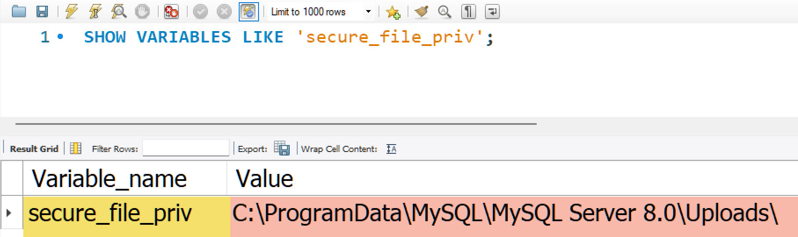
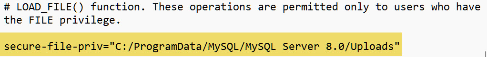

<span class="fs-1">
[HOME](../index.md){: .btn .btn-blue }
</span>

# Indhold
- [Stored Procedure](#stored-procedure)
- [Trigger](#trigger)
- [e-handelsplatform](#e-handelsplatform)
- [secure-file-priv](#secure-file-priv)


# Stored Procedure
En **Stored Procedure** i MySQL er en *foruddefineret* sekvens af SQL-kommandoer, som gemmes i databasen. 

Den kan afvikles efter behov for at udføre en særlig opgave, som kan involvere at *læse*, *skrive*, *opdatere* eller *slette* data i databasen. 

Stored Procedures er nyttige for at genbruge SQL-kode, sikre konsistent implementering af operationer og reducere netværkstrafik mellem en applikation og databaseserveren.

I Stored Procedures kan du anvende variable.

## Oprettelse
Her er et grundlæggende eksempel på en Stored Procedure i MySQL.

Vi har en database med en tabel **brugere**, som indeholder kolonnerne:
- id
- navn
- email

Vi vil oprette en **Stored Procedure**, der indsætter en ny bruger i denne tabel.

```sql
DELIMITER $$

CREATE PROCEDURE TilfojBruger(IN brugerNavn VARCHAR(50), IN brugerEmail VARCHAR(50))
BEGIN
  INSERT INTO brugere (navn, email) VALUES (brugerNavn, brugerEmail);
END $$

DELIMITER ;
```

Denne kode ændrer først DELIMITER til "$$", så MySQL forstår, at hele blokken indtil "$$" skal behandles som en enkelt kommando. 

Derefter oprettes en Stored Procedure ved navn **TilføjBruger**, som tager to **inputparametre**: 

- brugerNavn
- brugerEmail

Indenfor **BEGIN** og **END** blokken udføres en **INSERT** kommando, som tilføjer en ny bruger med de givne parametre til brugere tabellen. 

Efter proceduren sættes DELIMITER tilbage til **;**.

## Afvikling
For at afvikle denne Stored Procedure og tilføje en ny bruger, skal du bruge følgende SQL-kommando:

```sql
CALL TilfojBruger('Tue Hellstern', 'tueh@kea.dk');
```

Dette kald til TilfojBruger Stored Procedure vil indsætte en ny bruger med navnet "**Tue Hellstern**" og e-mailen "**tueh@kea.dk**" i brugere tabellen.

Du kan hente den samlede SQL-fil her: [demo_sp.sql](./filer/demo_sp.sql)

Stored Procedures kan være meget mere komplekse og indeholde logik for fejlhåndtering, transaktioner og meget mere, men dette eksempel giver en grundlæggende forståelse af, hvordan man opretter og bruger dem i MySQL.


# Trigger
En **Trigger** i MySQL er en databasefunktion, der **automatisk** udfører en foruddefineret SQL-instruktion eller et sæt af instruktioner i reaktion på bestemte hændelser i databasen. 

Disse hændelser kan være:
- INSERT
- UPDATE
- DELETE

Triggers er nyttige til at **automatisere** databehandling, sikre **dataintegritet**, og **implementere komplekse forretningsregler** direkte på **databaseniveau**.

## Oprettelse
Vi har en tabel **ordrer** med kolonnerne:

- id
- ordre_maengde
- ordre_dato

en anden tabel **ordre_log** designet til at logge hver gang en **ny ordre** bliver tilføjet til **ordrer** tabellen. 

Vi ønsker at oprette en Trigger, der automatisk indsætter en logpost i **ordre_log** tabellen hver gang en ny ordre indsættes i **ordrer** tabellen.

## Oprettelse af tabeller
```sql
CREATE TABLE ordrer (
    id INT AUTO_INCREMENT PRIMARY KEY,
    ordre_maengde DECIMAL(10,2),
    ordre_dato DATE
);

CREATE TABLE ordre_log (
    log_id INT AUTO_INCREMENT PRIMARY KEY,
    ordre_id INT,
    log_dato TIMESTAMP DEFAULT CURRENT_TIMESTAMP
);
```

## Oprettelse af Trigger
```sql
DELIMITER $$

CREATE TRIGGER efterOrdreIndsaettelse
AFTER INSERT ON ordrer
FOR EACH ROW
BEGIN
    INSERT INTO ordre_log (ordre_id) VALUES (NEW.id);
END $$

DELIMITER ;
```

I dette eksempel er **efterOrdreIndsaettelse** navnet på Triggeren.

Triggeren er sat til at køre **AFTER INSERT** på ordrer tabellen, hvilket betyder, at den udføres lige efter en ny post er succesfuldt indsat.

FOR **EACH ROW** angiver, at Trigger-handlingen skal udføres for hver række, der påvirkes af den oprindelige operation (*i dette tilfælde, for hver ny ordre der indsættes*).

Indenfor **BEGIN** og **END** blokken, indsættes en ny post i **ordre_log** tabellen. 

**NEW.id** refererer til **id** kolonnen af den række, der lige er blevet indsat i ordrer tabellen.

## Test af Trigger
For at teste Triggeren, kan du indsætte en ny ordre i ordrer tabellen:

```sql
INSERT INTO ordrer (ordre_maengde, ordre_dato) 
VALUES (100, '2024-02-28');
```

Efter denne indsættelse, vil **Triggeren automatisk** tilføje en tilsvarende post i **ordre_log** tabellen, der logger denne hændelse. 

Du kan hente SQL-filen her: [demo_trigger.sql](./filer/demo_trigger.sql)

Triggers i MySQL tillader automatisk udførelse af komplekse operationer og sikrer dataintegritet ved at reagere på ændringer i databasen.

# e-handelsplatform
Demoeksempel på en database for en simpel e-handelsplatform. Denne demo indeholder:

**To tabeller**
- **produkter**
    - produkt_id
    - navn
    - pris
    - lagerbeholdning
- **ordrer**
    - ordre_id
    - produkt_id INT
    - antal INT
    - ordre_dato

**En Stored Procedure**
- Til at tilføje en ny ordre.

**En Trigger**
- Til automatisk at opdatere lagerbeholdningen i **produkter** tabellen, når en **ny ordre tilføjes**.

## Oprettelse af Tabeller
```sql
CREATE DATABASE IF NOT EXISTS eHandelsDemo;
USE eHandelsDemo;

CREATE TABLE produkter (
    produkt_id INT AUTO_INCREMENT PRIMARY KEY,
    navn VARCHAR(60) NOT NULL,
    pris DECIMAL(10, 2) NOT NULL,
    lagerbeholdning INT DEFAULT 0
);

CREATE TABLE ordrer (
    ordre_id INT AUTO_INCREMENT PRIMARY KEY,
    produkt_id INT,
    antal INT,
    ordre_dato TIMESTAMP DEFAULT CURRENT_TIMESTAMP,
    FOREIGN KEY (produkt_id) REFERENCES produkter(produkt_id)
);
```

## Indsæt data
```sql
insert into produkter (navn, pris, lagerbeholdning)
values 	('Hammer', 98.75, 20),
		('Boremaskine', 1646, 15),
		('Sav', 75.25, 200),
		('Skruetrækker', 18.75, 120);
    
insert into ordrer (produkt_id, antal)
values 	(1, 5),
		(2, 10),
        (3, 1),
        (4, 20),
        (4, 5),
        (3, 3),
        (2, 1),
        (1, 2),
        (2, 3),
        (4, 10),
        (3, 25);
```

## Oprettelse af Stored Procedure
Denne Stored Procedure vil tage **produkt_id** og **antal** som parametre for at tilføje en **ny ordre**.

```sql
DELIMITER $$

CREATE PROCEDURE TilføjOrdre(IN produktID INT, IN antal INT)
BEGIN
    INSERT INTO ordrer (produkt_id, antal) VALUES (produktID, antal);
END $$

DELIMITER ;
```

## Oprettelse af Trigger
Denne Trigger vil **automatisk** **opdatere** lagerbeholdning i produkter tabellen, når en **ny ordre** tilføjes.

```sql
DELIMITER $$

CREATE TRIGGER OpdaterLagerEfterOrdre
AFTER INSERT ON ordrer
FOR EACH ROW
BEGIN
    UPDATE produkter
    SET lagerbeholdning = lagerbeholdning - NEW.antal
    WHERE produkt_id = NEW.produkt_id;
END $$

DELIMITER ;
```

## Samlet SQL-kode
Nedenstående SQL-kodefil inkluderer oprettelsen af database, tabeller, indsættelse af data, Stored Procedure, og Trigger som beskrevet ovenfor. 

Hent SQL-fil her: [ehandelsplatform.sql](./filer/ehandelsplatform.sql)


# secure-file-priv
**secure-file-priv** er en indstilling i MySQL, der begrænse hvilke filer serveren kan læse fra og skrive til, når den udfører filbaserede operationer som f.eks. import.

Denne indstilling øger databaseserverens sikkerhed ved at forhindre uautoriseret adgang til filsystemet uden for de specifikke godkendte stier.

Når **secure-file-priv** er sat, kan MySQL-serveren kun importere filer fra og eksportere filer til den specificerede mappe. 

- Hvis indstillingen er **tom**, er filimport og -eksportoperationer deaktiveret
- Hvis indstillingen **ikke er angivet** i konfigurationsfilen (*my.cnf eller my.ini*), kan serveren potentielt få adgang til filer i hele filsystemet, afhængigt af serverens andre sikkerhedsindstillinger og operativsystemets tilladelser.

Her er nogle eksempler på, hvordan **secure-file-priv** kan anvendes:

- **Forhindre enhver filoperation**: Sæt **secure-file-priv** til en tom streng for at deaktivere evnen til at importere fra og eksportere til filer helt.
- **Begrænse filoperationer til en bestemt mappe**: Sæt **secure-file-priv** til stien til en mappe, hvor du ønsker at tillade filoperationer. MySQL-serveren vil kun kunne importere og eksportere filer fra denne mappe. Det betyder altså at det er her du skal placere de CSV filer du vil importere.

Du kan konfigurere secure-file-priv i din **my.cnf** eller **my.ini** fil under **[mysqld]** sektionen, for eksempel:

```sql
[mysqld]
secure-file-priv=/sti/til/mappen
```

Du kan se din nuværende indstilling ved at afvikle denne SQL kode:

```sql
SHOW VARIABLES LIKE 'secure_file_priv';
```



## my.ini folder
Min my.ini fil på Windows er placeret i mappen: **C:\ProgramData\MySQL\MySQL Server 8.0\my.ini**

**Her skal du rette/tilføje:**

*secure-file-priv="C:/ProgramData/MySQL/MySQL Server 8.0/Uploads"*

**Den mappe du vil importere fra,**



Denne funktion er særligt vigtig for at forhindre **SQL-injektionsangreb**, der forsøger at udnytte filbaserede operationer til at få adgang til eller manipulere filer på serveren. Ved at begrænse filadgangen kan du reducere risikoen for uautoriseret adgang til følsomme data eller systemfiler.

Se mere her: [https://dev.mysql.com/doc/refman/8.0/en/server-system-variables.html#sysvar_secure_file_priv](https://dev.mysql.com/doc/refman/8.0/en/server-system-variables.html#sysvar_secure_file_priv)