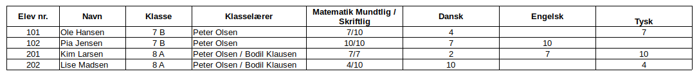
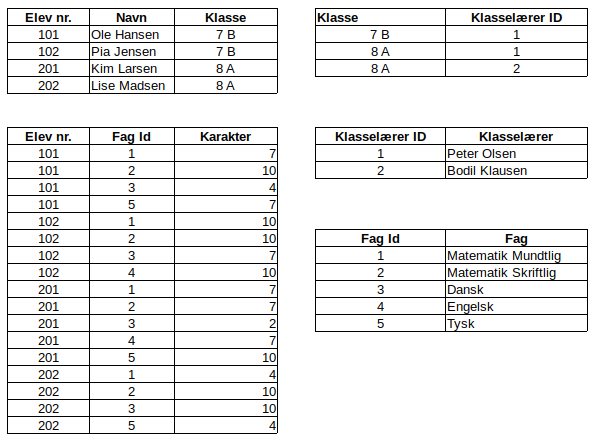
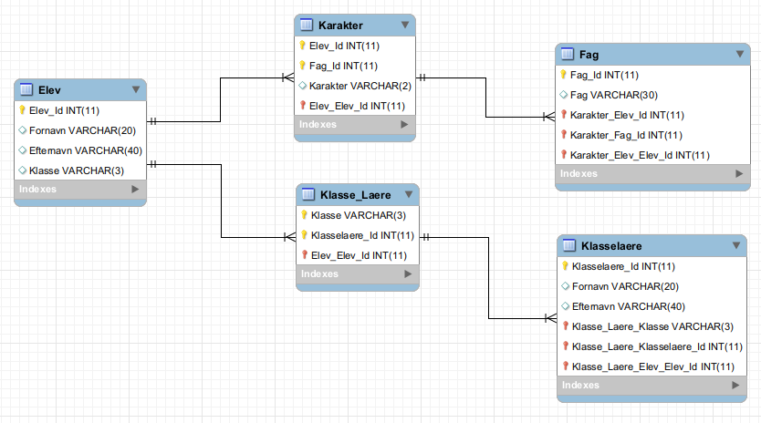
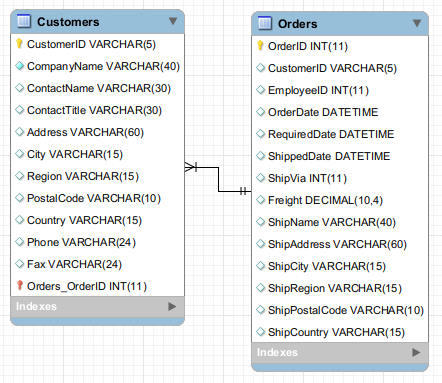
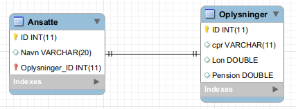
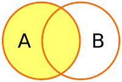
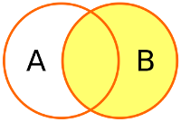
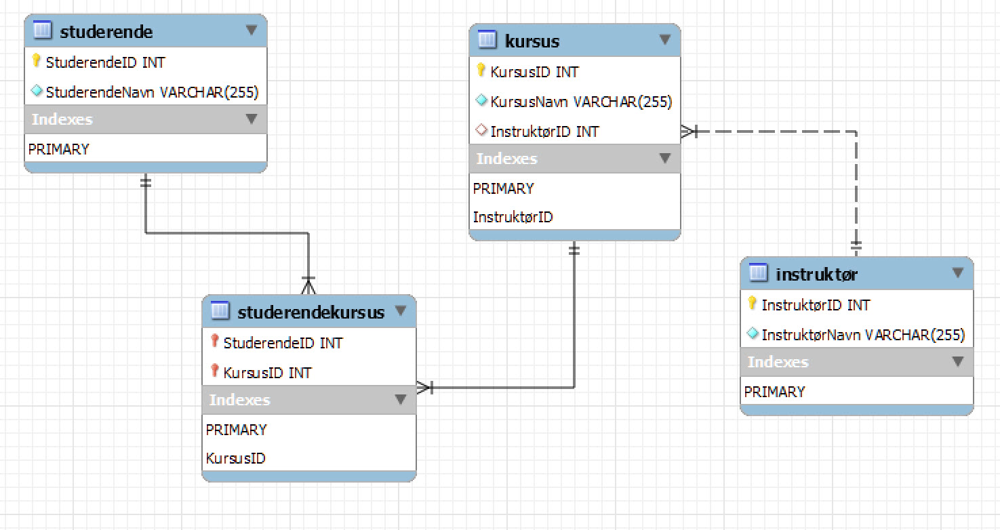
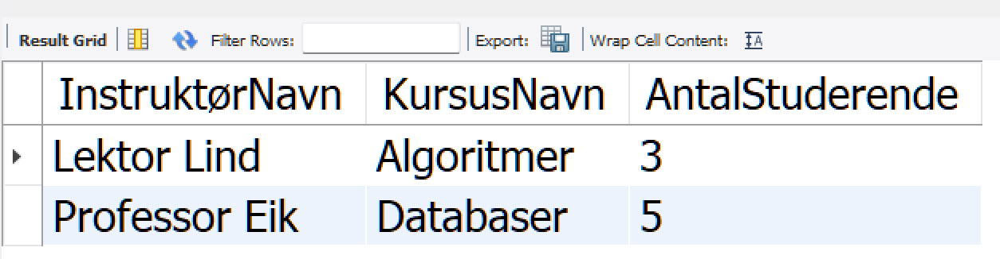

<span class="fs-1">
[HOME](../index.md){: .btn .btn-blue }
</span>

# Dataanalyse og Databaser
Dataanalyse og Databaser indeholder disse områder:

- **Programmering til Dataanalyse**
    - Grundlæggende Python eller R for dataanalyse
    - Avanceret datahåndtering og manipulation med pandas (*Python*) eller dplyr (*R*)
    - Datarensning og forberedelse
- **Databaser og Datahåndtering**
    - Grundlæggende i databaser (*SQL*)
    - Dataopbevaring og -håndtering
    - Big Data teknologier og værktøjer  (**f.eks. [Hadoop](https://hadoop.apache.org), [Spark](https://spark.apache.org)**
- **Data Visualisering**
    - Principper for effektiv data visualisering
    - Brug af *værktøjer* Power BI, eller biblioteker i Python (*matplotlib, seaborn*) for visualisering
- **Machine Learning og Predictive Analytics**
    - Supervised vs. Unsupervised
    - Regression, klassifikation, og klusteringsalgoritmer
    - Anvendelse af machine learning i økonomi og finans
- **Dataetik og Databeskyttelse**
    - Principper for dataetik
    - Lovgivning om databeskyttelse (*f.eks. [GDPR](https://gdpr.dk))*
    - Anonymisering og pseudonymisering af data
- **Anvendt Dataanalyse i Økonomi**
    - Finansiel modelbygning og risikoanalyse
    - Markedsanalyse og forbrugeradfærdsanalyse
    - Investering og porteføljestyring ved hjælp af kvantitative metoder
- **Business Intelligence og Beslutningsstøttesystemer**
    - Grundlæggende i Business Intelligence
    - Data Warehousing og **OLAP** (*Online Analytical Processing*) kan f.eks. være [Apache Kylin](https://kylin.apache.org)
    - Dashboards og rapporteringsværktøjer

# Database
De data du kommer til at arbejde med vil i mange tilfælde ligge i en Database.

Du kan enten tilgå dem direkte eller ved at data er eksporteret ud af databasen, f.eks. som en eller flere CSV/Excel filer.

For at arbejde effektiv med data er det nødvendigt at forstå hvordan en database er opbygget - Hvordan de forskellige tabeller "*hænger*" sammen og hvordan man kan kombinere data fra flere forskellige tabeller.

## Databaseoperationer
Databaseoperationer, især i relationelle databaser som MySQL, PostgreSQL, Oracle, osv., kan typisk deles op i flere kategorier baseret på det formål, de tjener. 

### Transaktionshåndtering
Transaktioner er vigtige for at sikre dataintegritet og konsistens, især i systemer, hvor flere operationer skal udføres sammen som en enkelt enhed.

- **BEGIN TRANSACTION**: Starter en transaktion.
- **COMMIT**: Gemmer ændringer foretaget i transaktionen til databasen.
- **ROLLBACK**: Annullerer alle ændringer foretaget i transaktionen, hvis der opstår en fejl.

### DDL (Data Definition Language)
DDL-operationer definerer og modificerer databasens struktur.

- **CREATE**: Bruges til at skabe nye tabeller, databaser, indekser osv.
- **ALTER**: Modificerer strukturen af en eksisterende databaseobjekt.
- **DROP**: Sletter databaseobjekter.

### DML (Data Manipulation Language)
- DML-operationer håndterer manipulation og håndtering af data inden for tabeller.

Indeholder
- **INSERT**
- **UPDATE**
- **DELETE** 
- osv.

### DCL (Data Control Language)
DCL-operationer kontrollerer adgangen til data i databasen.

- **GRANT**: Giver brugere rettigheder til databasen.
- **REVOKE**: Fjerner brugeres rettigheder fra databasen.

### TCL (Transaction Control Language)
TCL-operationer håndterer transaktioner i databasen.

Indeholder
- **COMMIT**
- **ROLLBACK**
- **SAVEPOINT** 
- osv.

## Database program
Det er databasen MySQL vi skal bruge og programmet MySQL Workbench.

- [Download MySQL Server](https://dev.mysql.com/downloads/mysql/)
- [Download MySQL Workbench](https://dev.mysql.com/downloads/workbench/)

## Northwind
*The Northwind database is a sample database used by Microsoft to demonstrate the features of some of its products, including SQL Server and Microsoft Access. The database contains the sales data for Northwind Traders, a fictitious specialty foods exportimport company.*

[SQL script der opretter Northwind](./image/Northwind.sql)

### Northwind ER-diagram
E/R-diagrammer (Entitets/Relations-diagram) er et værktøj til at modellere databaser. 
E/R diagrammer viser alle entiteter i en database samt relationerne imellem dem. Informationerne herfra benyttes, når databasen oprettes.


## Normalisering
Formået med normalisering er at undgå redundans og gøre databasen lettere at vedligeholde.

*Redundans er er gentagelser - En information står flere gange*

Der findes **6 normalformer** og en "*stramning*" af den tredje ved navn Boyce-Cood normalformen.

Typisk fortager man kun en **normalisering op til den tredje normalform**.

**1. Normalform (NF1)**

**Definition:** *En relation er på første normalform, hvis ingen af dens domæner har elementer, der i sig selv er mængder.*

* Tabellen har et nøglefelt (*behøver ikke at være unikt*)
* Der må kun være en værdi af samme type i hver post
* Alle poster skal være lige lange dvs. have samme antal felter


**2. Normalform (NF2)**

**Definition:** *En relation er på anden normalform, hvis den er på første normalform, og hvis enhver ikke-nøgle-attribut er fuldt funktionelt afhængig af enhver kandidatnøgle i relationen.*

- Tabellen skal opfylder 1. Normalform
- Der skal være en primærnøgle


**3. Normalform (NF3)**

**Definition:** *En relation er på tredje normalform, hvis den er på anden normalform og det gælder, at ingen ikke-nøgle-attribut er transitivt afhængig af nogen kandidatnøgle i relationen.*

- Tabellen skal opfylder 2. Normalform
- Hvis der er mere end et felt der kan sættes som nøgle for andre felter skal tabellen opdeles i flere


### Eksempel - Skole
Udgangspunktet er et regneark der bruges til at register elever og deres karakter.

**NF 0**



*Hvad er problemet?*

**NF 1**


**NF 2**


**NF 3**




**ER-Diagram**

Over Skole i normalform 3. Med angivelse af datatyper og relationer melle de 5 tabeller.



Du kan bruge Workbench til at tegne dit ER-diagram. Jeg vil dog altid anbefale at du starter med tegne ER-Diagrammet på et stykke papir.


## Relationer
MySQL er en relationel database, hvilket betyder at data er opdelt i tabeller som det er muligt at oprette relationer i mellem.

Hver tabel har en primærnøgle, som består af et eller flere felter i tabellen. Primærnøglen skaber en unik identifikation af den enkelte række i tabellen. 

En fremmednøgle er et felt i en tabel, som peger på en primærnøgle i en anden tabel og dermed skaber relation mellem de to tabeller. 

Der findes **tre typer af relationer**:

- **En til Mange**
- **En til En**
- **Mange til Mange**

### En til Mange

Det er denne relations type der typisk er flest af i en database. 

I Northwind databasen har vi en typisk **En til Mange** relation mellem tabellerne **Customers** og **Orders**.

Hver kunde står kun en gang i **Customeres** tabellen, men da hver kunde har en eller flere ordre står kunden flere gange i tabellen **Orders**.

Det vil sige at relationen går fra primær nøglen **CustomerID** (*En siden*) i tabellen **Customeres** til fremmednøglen i, CustomerID i tabellen **Orderes** (*Mange siden*).




### En til En

Denne relations type bruges kun brugt af to grunde:

- Sikkerhed
- Opdeling af en meget stor tabel

Årsagen er at man ligeså godt kunne have alle data i en tabel.

**Eksempel**



Et eksempel kunne være fortrolige oplysninger som:

- Cpr nummer
- Løn
- Pension

Der er gemt i en selvstændig tabel som så er relateret til en tabel med det mere "almindelige" oplysninger som navn, mobilnummer, e-mail osv.

### Mange til Mange

Det er **ikke** muligt at oprette en Mange til Mange relation i MySQL databasen.

En Mange til Mange relation skal løses ved at indskyde en ekstra tabel og så oprette to stk. En til Mange relationer.

I Northwind databasen er der mange ordre og der er mange produkter - hver ordre består af et eller flere produkter.

Der er altså en **Mange til Mange** relation mellem tabellerne **Orders** og **Products**.

Dette løses var at oprette en ekstra tabel - Order_details - Da denne relationen melle de to tabeller **ikke** kan oprettes direkte.


## JOIN
Du skal bruge SQL kommandoen **JOIN** for hente data fra flere tabeller.

Der findes 4 forskellige **JOIN** typer:

- INNER JOIN  
- LEFT JOIN  
- RIGHT JOIN
- FULL JOIN (*ikke understøttet i MySQL*)
- SELF JOIN

### INNER JOIN

Henter fællesmængden fra de to tabeller - Altså der hvor værdierne er ens.


### LEFT JOIN
Henter alle data fra den venstre tabel (*table1*) og de data der matcher fra den anden tabel (*tabel2*).



Kaldes også **LEFT OUTER JOIN**

### RIGHT JOIN
Henter alle data fra den højre tabel (*table2*) og de data der matcher fra den anden tabel (*tabel1*).



Kaldes også **RIGHT OUTER JOIN**


### FULL JOIN
Der findes også en **FULL JOIN**, der henter alle data fra begge tabeller.

**Bemærk** at MySQL **IKKE** understøtter **FULL JOIN**


### SELF JOIN
En **SELF JOIN** joiner en tabel med sig selv.
Tabellen **Employees** i Northwind databasen har et eksempel på dette.

Der er ef felt **ReportsTo** der referer til primærnøglen **EmployeeID** i sammen tabel.


## VIEW
Et **VIEW** kan betragtes som en virtuel tabel. 
Et **VIEW** har kolonner og poster som en tabel, men den bliver oprettet via en SQL sætning på basis af en eller flere andre tabeller.

Et **VIEW** kan erstatte en kompliceret SQL sætning.
Det er altså nemmere for brugeren at hente data fra et **VIEW**.

Et **VIEW** vil altid vises de **nyeste** data.

```sql
    CREATE VIEW view_navn AS
    SELECT kolonne_1, kolonne_2,
    FROM tabel
    WHERE betingelse;
    
    -- Eksempel fra Northwind
    create view Salg_Pr_Kunde AS
    select 
        Customers.CustomerID,
        Customers.CompanyName,
        sum(Order_Details.UnitPrice * Order_Details.Quantity) as Salg
    from Customers
    join Orders
        on Customers.CustomerID = Orders.CustomerID
    join Order_Details
        on Orders.OrderID = Order_Details.OrderID
    group by Customers.CustomerID, Customers.CompanyName;
```
Du finder **VIEW** i en selvstændig mappe i MySQL.

# Normalform eksempel
For at illustrere processen fra 1. normalform (1NF) til 3. normalform (3NF), har vi en database, der holder styr på studerendes kurser og instruktører.

Dette eksempel vil tage dig gennem hvert trin, inklusive design af et ER-diagram og SQL-kode til at oprette tabeller samt indsættelse af data.

## 1NF
Tabellen **Studiekursus** indeholder følgende kolonner:
- StuderendeID
- StuderendeNavn
- KursusID
- KursusNavn
- InstruktørID
- InstruktørNavn

Hver række repræsenterer en *studerendes tilmelding til et kursus sammen med information om kurset og instruktøren*.

For at **opfylde 1NF**, skal hver kolonne indeholde **atomiske værdier uden gentagelser i rækkerne**.

## 2NF
For at opfylde **2NF**, opdeler vi dataene i flere tabeller for at undgå partielle afhængigheder:

### Studerende tabellen
- StuderendeID (*PK*)
- StuderendeNavn
### Kursus tabellen
- KursusID (*PK*)
- KursusNavn
- InstruktørID (*FK*)
### Instruktør tabellen
- InstruktørID (*PK*)
- InstruktørNavn
### StuderendeKursus tabellen
For at håndtere **mange-til-mange relationen** mellem studerende og kurser, indeholdender:
- StuderendeID (*FK*)
- KursusID (*FK*)

## 3NF
For at opnå 3NF, sikrer vi, at alle felter i en tabel kun afhænger af nøglen. 

Antag at **InstruktørNavn** afhænger af **InstruktørID**, som allerede findes i Kursus tabellen, skaber dette en transitiv afhængighed.

Derfor, beholdes **Instruktør tabellen** som den er, men sikrer at Kursus tabellen ikke indeholder direkte instruktør information, bortset fra **InstruktørID**.

## SQL Kode
SQL-kode til oprettelse af **tabellerne**

```sql
CREATE TABLE Studerende (
    StuderendeID INT AUTO_INCREMENT PRIMARY KEY,
    StuderendeNavn VARCHAR(60) NOT NULL
);

CREATE TABLE Instruktør (
    InstruktørID INT AUTO_INCREMENT PRIMARY KEY,
    InstruktørNavn VARCHAR(60) NOT NULL
);

CREATE TABLE Kursus (
    KursusID INT AUTO_INCREMENT PRIMARY KEY,
    KursusNavn VARCHAR(50) NOT NULL,
    InstruktørID INT,
    FOREIGN KEY (InstruktørID) REFERENCES Instruktør(InstruktørID)
);

CREATE TABLE StuderendeKursus (
    StuderendeID INT,
    KursusID INT,
    PRIMARY KEY (StuderendeID, KursusID),
    FOREIGN KEY (StuderendeID) REFERENCES Studerende(StuderendeID),
    FOREIGN KEY (KursusID) REFERENCES Kursus(KursusID)
);
```

SQL-kode til at **indsætte data**

```sql
-- Indsæt data i Studerende
INSERT INTO Studerende (StuderendeNavn) VALUES ('Anna'), ('Bertil'), ('Carla');

-- Indsæt data i Instruktør
INSERT INTO Instruktør (InstruktørNavn) VALUES ('Professor Eik'), ('Lektor Lind');

-- Indsæt data i Kursus
INSERT INTO Kursus (KursusNavn, InstruktørID) VALUES ('Databaser', 1), ('Algoritmer', 2);

-- Indsæt data i StuderendeKursus
INSERT INTO StuderendeKursus (StuderendeID, KursusID) VALUES (1, 1), (2, 1), (3, 2);
```

## Er-diagram


Dette eksempel illustrerer hvordan man transformerer data fra **1NF** gennem **2NF** til **3NF**, opretter de nødvendige tabeller i MySQL og indsætter nogle eksempeldata.

Hver trin sikrer, at databasen er normaliseret for at reducere redundans og forbedre dataintegriteten.

## Yderligere SQL kode
Denne SQL kode viser, **InstruktørNavn** og tilhørende **KursusNavn** og **antallet** af **studerende**.



```sql
SELECT 
    Instruktør.InstruktørNavn,
    Kursus.KursusNavn,
    COUNT(Studerende.StuderendeID) AS AntalStuderende
FROM 
    StuderendeKursus
JOIN 
    Studerende ON StuderendeKursus.StuderendeID = Studerende.StuderendeID
JOIN 
    Kursus ON StuderendeKursus.KursusID = Kursus.KursusID
JOIN 
    Instruktør ON Kursus.InstruktørID = Instruktør.InstruktørID
GROUP BY 
    Kursus.KursusID, Instruktør.InstruktørID
ORDER BY 
    Instruktør.InstruktørNavn, Kursus.KursusNavn;
```

## VIEW
Denne SQL kode kan med fordel oprettes som et VIEW.

```sql
CREATE VIEW InstruktørKursusAntal AS
    SELECT 
        Instruktør.InstruktørNavn,
        Kursus.KursusNavn,
        COUNT(Studerende.StuderendeID) AS AntalStuderende
    FROM 
        StuderendeKursus
    JOIN 
        Studerende ON StuderendeKursus.StuderendeID = Studerende.StuderendeID
    JOIN 
        Kursus ON StuderendeKursus.KursusID = Kursus.KursusID
    JOIN 
        Instruktør ON Kursus.InstruktørID = Instruktør.InstruktørID
    GROUP BY 
        Kursus.KursusID, Instruktør.InstruktørID
    ORDER BY 
        Instruktør.InstruktørNavn, Kursus.KursusNavn;
```

## SQL kodefil
Du kan hente den samlede SQL kode fil her: [StudDB.sql](../dataanalyse_databaser/filer/StudDB.sql)