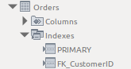

<span class="fs-1">
[HOME](../index.md){: .btn .btn-blue }
</span>

# SQL - Introduktion
## SELECT
**SELECT** er nok den mest brugte SQL kommando.
Den bruges til at hente data ud af din database.

**Syntax SELECT**

```sql
SELECT kolonne_1, kolonne_2,  ...
FROM tabel_navn;
    
SELECT * FROM tabel_navn
```

**Northwind Syntax SELECT**

```sql
select * from Employees;

select
    EmployeeID,
    FirstName,
    LastName
from Employees;
```

### Kommentarer

Det kan være en rigtig god ide at skrive kommentarer til dine SQL koder.
Der er to forskellige muligheder for  kommentarer

- På en enkelt linje - her brugere du: --
- Over flere linjer - her brugere du: /* kommentar */

**Eksempler på en kommentar på en linje**

```sql
--Select all
SELECT * FROM Customers;

SELECT * FROM Customers -- WHERE City='Berlin';
```

Hvis du gerne vil skrive en kommentar der fylder mere end en linje eller det er flere linjer kode du gerne vil ud-kommenter skal du bruge denne metode:

```sql
/* 
Vælg alle kolonner
og alle poster 
i Customers tabellen 
*/

SELECT * FROM Customers;
```

Alt imellem /* og */ bliver ignoreret.
 

### DISTINCT
Bruges sammen med **SELECT** til at returnere unikke værdier. Altså kun en af hver værdi.

**Syntax DISTINCT**

```sql
    SELECT DISTINCT kolonne_1, kolonne_2,  ...
    FROM tabel_navn;
```

**Northwind Syntax DISTINCT**

```sql
    select distinct Country from Customers;
```
### WHERE
Bruges sammen med **SELECT** for at udvælge data.   
Det er kun de data der opfylder dit krav (**WHERE**) der vises.

**Syntax WHERE**

```sql
    SELECT kolonne_1, kolonne_2,  ...
    FROM tabel_navn
    WHERE betingelse;
```

**Northwind Syntax WHERE**

```sql
    select * from Customers
    where Country = 'Denmark';
```

**WHERE** kan også bruges sammen med andre SQL kommandoer end **SELECT**. F.eks. **UPDATE** og **DELETE**

### AND, OR, NOT
Du kan kombinere WHERE med AND, OR og NOT.

AND og OR bruger du til at udvælge data på mere end én betingelse.

* AND viser data der opfylder **alle** betingelser
* OR viser data hvor det bare er **en** af betingelserne der er opfyldt

NOT bruges til at vise data der ikke opfylder betingelsen.

**Syntax AND**

```sql
    SELECT kolonne_1, kolonne_2,  ...
    FROM tabel_navn
    WHERE betingelse_1 AND betingelse_2 AND betingelse_3 ...;
```


**Northwind Syntax AND**

```sql
    SELECT kolonne_1, kolonne_2,  ...
    FROM tabel_navn
    WHERE betingelse_1 AND betingelse_2 AND betingelse_3 ...;
```

**Syntax OR**

```sql
    SELECT kolonne_1, kolonne_2,  ...
    FROM tabel_navn
    WHERE betingelse_1 OR betingelse_2 OR betingelse_3 ...;
```

**Northwind Syntax OR**

```sql
    select * from Customers
    where Country = 'Denmark'
    or Country = 'Sweden';
```

**Syntax NOT**

```sql
    SELECT kolonne_1, kolonne_2,  ...
    FROM tabel_navn
    WHERE NOT betingelse;
```

**Northwind Syntax NOT**

```sql
    select * from Customers
    where not Country = 'USA';
```


### BETWEEN
BETWEEN bruges til at udvælge et "interval".   
Det kan være tal, tekst eller datoer.

**Syntax BETWEEN**

```sql
    SELECT kolonne_1, kolonne_2,  ...
    FROM tabel_navn
    WHERE kolonne_1 BETWEEN værdi_1 AND værdi_2;
```

**BETWEEN** har altid dine start og slut værdier med.

### IN
**IN** giver dig mulighed for at bruge flere værdier i en WHERE sætning.

**Syntax IN**

```sql
    SELECT kolonne_1, kolonne_2,  ...
    FROM tabel_navn
    WHERE kolonne_1 IN (værdi_1, værdi_2, ...);
    
    SELECT kolonne_1, kolonne_2,  ...
    FROM tabel_navn
    WHERE kolonne_1 IN (SELECT sætning);
```

***    
### ORDER BY
Hvis du vil sortere dine data skal du bruge **ORDER BY**.  

**ORDER BY** sorterer i stigende orden som standard - **ASC**.  
For at sortere i faldende orden skal du bruge **DESC**.

**Syntax ORDER BY**

```sql
    SELECT kolonne_1, kolonne_2,  ...
    FROM tabel_navn
    ORDER BY ASC
    
    SELECT kolonne_1, kolonne_2,  ...
    FROM tabel_navn
    ORDER BY DESC
```

**Syntax ORDER BY Northwind**

```sql
    select * from Order_Details
    order by UnitPrice ASC;

    select * from Order_Details
    order by UnitPrice DESC;
```

## Funktioner

MySQL har mange funktioner som du kan bruge, nogle eksempler er:

- DAY()
- MONTH()
- YEAR()

**Eksempel fra Northwind**

```sql
SELECT 
    OrderID,
    OrderDate,
    DAY(OrderDate) as Dag,
    MONTH(OrderDate) as Måned,
    YEAR(OrderDate) as År
FROM Orders;
```

Du kan finde en oversigt her [Link](https://dev.mysql.com/doc/refman/8.0/en/func-op-summary-ref.html)

## Beregninger

Du har også mulighed for at fortage beregninger på dine data, det kan være simple beregninger som det at gange to kolonner med hinanden eller det kan være beregninger hvor du brugere nogle funktioner.

**SQL Beregninger**

- Plus: +
- Minus: -
- Gange: *
- Division: /
- Modulus: %

**Eksempel fra Northwind**

```sql
SELECT
    OrderID,
    ProductID,
    UnitPrice,
    Quantity,
    Discount,
    UnitPrice * Quantity as Pris_Uden_Rabat
FROM Order_Details;
```

### Brug af Funktioner

Du kan bruge forskellige beregnings funktioner på dine data.

```sql
-- AVG
SELECT AVG(UnitPrice)
FROM Products;

-- MIN
SELECT MIN(UnitPrice)
FROM Products;

-- MAX
SELECT MAX(UnitPrice)
FROM Products;

-- COUNT 
SELECT COUNT(ProductID)
FROM Products;

-- SUM
SELECT
    SUM((UnitPrice * Quantity) - (UnitPrice * Quantity * Discount)) AS Sale
FROM Order_Details;
```


## GROUP BY
GROUP BY-sætningen bruges ofte sammen med en beregnings funktioner som f.eks. AVG, MIN, MAX, COUNT og SUM til at gruppere dit resultat.

Det kan f.eks. være det totale salg på en kunde eller et produkt.

```sql
SELECT
    Order_Details.OrderID,
    COUNT(Order_Details.Quantity) AS Antal,
    SUM((UnitPrice * Quantity) - (UnitPrice * Quantity * Discount)) AS Sale
FROM Order_Details
GROUP BY Order_Details.OrderID;

SELECT
    Employees.LastName,                            
    COUNT(Orders.OrderID) AS NumberOfOrders
FROM Orders INNER JOIN Employees
ON Orders.EmployeeID = Employees.EmployeeID
GROUP BY LastName:
```

### HAVING
Hvis du vil "udvælge" data på basis af en gruppering (GROUP BY) kan du IKKE bruge WHERE.

Dette eksempel fra Northwind vil **ikke** virke, da der bruges **WHERE**.

```sql
SELECT 
    Country,
    COUNT(CustomerID)
FROM Customers
GROUP BY Country
WHERE COUNT(CustomerID) > 5;
```

Når der er fortaget en gruppering på *"CustomerID"* skal du bruge SQL kommandoen **HAVING** for at det virker.

Samme eksempel fra Northwind, men med **HAVING**

```sql
SELECT 
    Country,
    COUNT(CustomerID)
FROM Customers
GROUP BY Country
HAVING COUNT(CustomerID) > 5;
```

Det er muligt at bruge **WHERE** sammen med **GROUP BY** det skal bare være så du udvælger på data der ikke er grupperet på.

**Eksampel fra Northwind**

```sql
SELECT 
    Country,
    COUNT(CustomerID)
FROM Customers
WHERE Country IN ('UK', 'USA', 'Italy')
GROUP BY Country
HAVING COUNT(CustomerID) > 5;
```

### INDEX
Du kender et index fra en bog, hvor der typisk er et index bageret i bogen. Det gør det nemmere og hurtigere at finde et bestemt ord/emne.

Det sammen gælder indexer i SQL, de gør det hurtigere at finde data.

Som standard oprettes der et index når du opretter en primær nøgle. Dette index er et unikt index - *det er jo en primær nøgle.*

Du opretter et index med SQL kommandoen **CREATE INDEX**

```sql
CREATE INDEX index_navn
ON tabel_navn (felt_navn);

CREATE INDEX FK_CustomerID
ON Orders (CustomerID);
```

Brugeren kan ikke se de indexer der er oprette, men du kan se dem under den enkelte tabel i mappen **Indexes**



Det er også muligt at oprette et index hvor du kombinere flere kolonner.

**Eksempel fra Northwind**

```sql
CREATE INDEX Emp_name
ON Employees (LastName, FirstName);
```

### UNIQUE INDEX
Det er muligt at oprette et unikt index, ligesom det index der oprettes ved primær nøglen. Det kan f.eks. bruges til at sikre at en kunde ikke oprettes to gange - kunne f.eks. være kundes CVR nummer.

```sql
CREATE UNIQUE INDEX index_navn
ON tabel_navn (felt_navn);

CREATE UNIQUE INDEX UniqProduct
ON Products (ProductName);
```

### DROP INDEX
Du kan fjerne et index med kommandoen **DROP INDEX** kombineret med **ALTER TABLE**

```sql
ALTER TABLE tabel_navn
DROP INDEX index_navn;

ALTER TABLE Employees
DROP INDEX Emp_name;
```

### Hvilke felter
*Hvilke felter skal du så oprette indekser på?*

Som udgangspunkt bliver der oprettet et unikt index på dine primærnøgle. Ud over det vil det typisk være en fordel at oprette indekser på de felter der er **fremmede nøgler**.

Dernæst kan du med fordel oprette indekser på de felter hvor der søges meget. Det kan være svært at vide hvilke felter det er, en mulighed er at spørgere brugerne eller bruge et analyse værktøj til at finde disse felter.

Der er dog en ulempe ved oprettelsen af indekser - Det at gemme data bliver **langsommere**. årsagen er at indekserne skal opdateres med de nye data.

Hvis man skal indsætte eller opdatere store mængder data kan det være en fordel at slette dine indekser først og så oprette dem igen, når indsættelsen af data er færdig.


## CASE
En CASE sætning opsætter forskellige betingelser som data så "holdes" op imod og der returneres en værdi i forhold til det.

En CASE sætning virker som en IF-THEN-ELSE sætning.

Når en værdi er SAND, falder indenfor en CASE, så returneres resultatet.

Hvis ingen betingelser er sande, returnerer den værdien i ELSE-klausulen.

```sql
CASE
    WHEN betingelse_1 THEN resultat_1
    WHEN betingelse_2 THEN resultat_2
    WHEN betingelse_n THEN resultat_n
    ELSE resultat
END;
```

**Eksempel fra Northwind**

```sql
SELECT 
    OrderID, 
    Quantity,
CASE
    WHEN Quantity > 30 THEN 'Antal er større end 30'
    WHEN Quantity = 30 THEN 'Antal er 30'
    ELSE 'Antal er under 30'
END AS 'Antal ordre'
FROM Order_Details;
```
