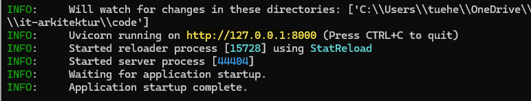
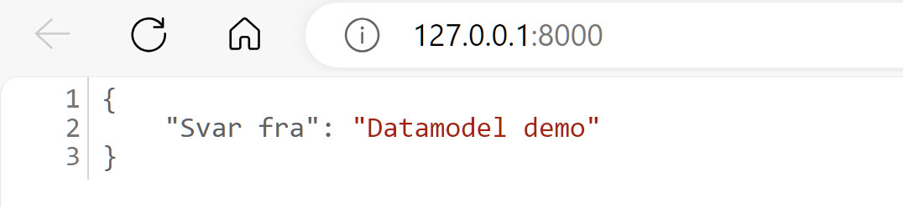
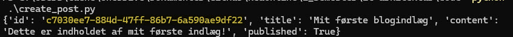
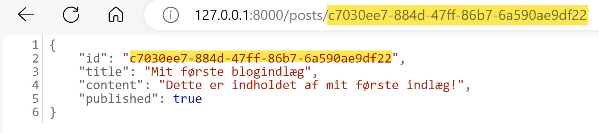
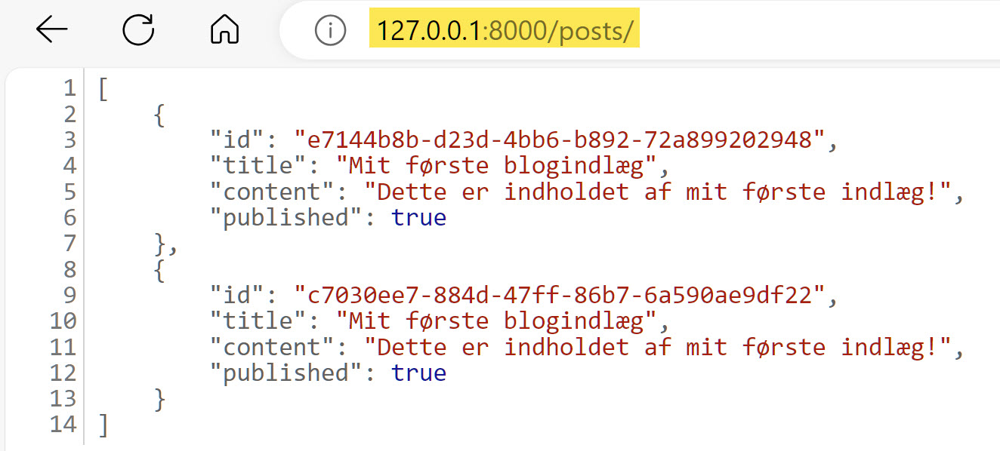

<span class="fs-1">
[HOME](./index.md){: .btn .btn-blue }
</span>

# FastAPi
FastAPI is a modern, fast (high-performance), web framework for building APIs with Python 3.7+ based on standard Python type hints.

The key features are:
- **Fast**: Very high performance, on par with NodeJS and Go (thanks to Starlette and Pydantic). One of the fastest Python frameworks available.
- **Fast to code**: Increase the speed to develop features by about 200% to 300%.
- **Fewer bug**s: Reduce about 40% of human (developer) induced errors.
- **Intuitive**: Great editor support. Completion everywhere. Less time debugging.
- **Easy**: Designed to be easy to use and learn. Less time reading docs.
- **Short**: Minimize code duplication. Multiple features from each parameter declaration. Fewer bugs.
- **Robust**: Get production-ready code. With automatic interactive documentation.
- **Standards-based**: Based on (and fully compatible with) the open standards for APIs: OpenAPI (previously known as Swagger) and JSON Schema.

# Getting startede
This is a simple example of how to get FastAPI working

## Install FastAPI
You need to install FastAPI

    pip3 install fastapi

## Install Uvicorn
You will also need Uvicorn to run the server

    pip3 install uvicorn

This will install Uvicorn with minimal (*pure Python*) dependencies.

## Simpel main.py
Let's create the simpels possible implementation of FastAPI. Create this Python file - **main.py**:

```python
# Import
from fastapi import FastAPI

# Define an API object
app = FastAPI()

# Map HTTP method and path to python function
@app.get("/")
async def root():
    return {"message": "Hello Kea students. Welcome to the FastAPI page!"}

@app.get("/newendpoint")
async def function_demo_get():
    return {"message": "This is /newendpoint endpoint"}
```
Get the codefile: [main.py](./_code/fastapi/get_started/main.py) 

## Run the server
To run the server, use this command in the samen foldes as your main.py file

    python -m uvicorn main:app --reload


The **--reload** flag tells **Uvicorn** to reload the server whenever new code is added to the application. 

Next, open your browser and navigate to http://127.0.0.1:8000, where you’ll see a JSON response.


## Interactive API docs
FastAPI has a 2 automatic interactive API documentation

First one is - docs

    http://127.0.0.1:8000/docs


Second one is - redocs

     http://127.0.0.1:8000/redocs    


# Demo - Blog Post
Demo der giver mulighed for at opretter en simpel RESTful API for en blog, hvor man kan oprette, læse, opdatere og slette blogindlæg. 

Vi vil bruge en in-memory database repræsenteret ved en simpel Python-liste for at holde tingene simple og fokusere på API-logikken.

## Opsæt FastAPI med en simpel datamodel

```python
from fastapi import FastAPI, HTTPException
from pydantic import BaseModel
from typing import List, Optional
from uuid import uuid4, UUID

app = FastAPI()

class Post(BaseModel):
    id: Optional[UUID] = None
    title: str
    content: str
    published: bool = True

@app.get("/")
def read_root():
    return {"Svar fra": "Datamodel demo"}

# In-memory "database"
db: List[Post] = []

@app.post("/posts/", response_model=Post)
async def create_post(post: Post):
    post.id = uuid4()
    db.append(post)
    return post

@app.get("/posts/", response_model=List[Post])
async def read_posts():
    return db

@app.get("/posts/{post_id}", response_model=Post)
async def read_post(post_id: UUID):
    for post in db:
        if post.id == post_id:
            return post
    raise HTTPException(status_code=404, detail="Post not found")

@app.put("/posts/{post_id}", response_model=Post)
async def update_post(post_id: UUID, post: Post):
    for idx, db_post in enumerate(db):
        if db_post.id == post_id:
            db[idx].title = post.title
            db[idx].content = post.content
            db[idx].published = post.published
            return db[idx]
    raise HTTPException(status_code=404, detail="Post not found")

@app.delete("/posts/{post_id}", response_model=Post)
async def delete_post(post_id: UUID):
    for idx, db_post in enumerate(db):
        if db_post.id == post_id:
            return db.pop(idx)
    raise HTTPException(status_code=404, detail="Post not found")
```

## Forklaring
- **Datamodel**: Vi bruger Pydantic til at definere datamodellen for et blogindlæg. Hver post har:

    - id
    - title
    - content
    - published status

- **In-memory database**: Vi bruger en simpel liste til at simulere en database.
- **CRUD operations**: Vi implementerer de grundlæggende CRUD (*Create, Read, Update, Delete*) operationer. Dette giver dig mulighed for at oprette nye indlæg, hente alle indlæg eller et specifikt indlæg ved ID, opdatere eksisterende indlæg og slette indlæg.

## Afvikling
For at køre denne API, gem koden i en fil - **fastapi_datamodel.py** -  kør den med **Uvicorn**:

    python -m uvicorn fastapi_datamodel:app --reload



I en browser åbner du http://127.0.0.1:8000



Med denne opsætning kan du bruge API'en til at administrere blogindlæg og få en fornemmelse af, hvordan du kan arbejde med asynkron programmering og RESTful API-principper i FastAPI.

## Opret blog post
For at oprette en blogpost ved hjælp af den API, vi har opbygget, kan du interagere med API'en ved at sende en HTTP POST-anmodning til /posts/ endpoint. Denne anmodning skal indeholde en JSON-krop, der repræsenterer det blogindlæg, du ønsker at oprette.

Her er et eksempel på, hvordan du kan oprette en post ved hjælp af forskellige værktøjer:

### Brug cURL fra kommandolinjen
cURL er et kraftfuldt værktøj til at sende anmodninger til webservere direkte fra kommandolinjen. Her er et eksempel på en cURL-kommando, der opretter en ny blogpost:

```cmd
curl -X 'POST' \
  'http://127.0.0.1:8000/posts/' \
  -H 'accept: application/json' \
  -H 'Content-Type: application/json' \
  -d '{
  "title": "Mit første blogindlæg",
  "content": "Dette er indholdet af mit første indlæg!",
  "published": true
}'
```

Dette sender en POST-anmodning til din lokale FastAPI-server med en JSON-krop, der indeholder titlen, indholdet og publiceringsstatus for blogindlægget.


### Brug Postman
Postman er en populær applikation til API-udvikling, der gør det nemt at oprette, dele og teste HTTP-anmodninger. For at oprette en post med Postman:

- Start Postman og opret en ny anmodning.
- Vælg POST som anmodningstypen.
- Indstil URL'en til http://127.0.0.1:8000/posts/.
- Gå til "Body"-tabben, vælg "raw" og vælg "JSON" fra format-dropdown-menuen.
- Indtast JSON-kroppen for din blogpost, som f.eks.:

```json
{
  "title": "Mit første blogindlæg",
  "content": "Dette er indholdet af mit første indlæg!",
  "published": true
}
```

- Send anmodningen ved at trykke på "**Send**" knappen.

### Brug et Python script
Hvis du vil automatisere oprettelsen af blogposts, kan du bruge Python-script med requests biblioteket:

```python
import requests

url = 'http://127.0.0.1:8000/posts/'
my_post = {
  "title": "Mit første blogindlæg",
  "content": "Dette er indholdet af mit første indlæg!",
  "published": True
}

response = requests.post(url, json=my_post)
print(response.json())
```

Husk at installere requests biblioteket, hvis du ikke allerede har det:

    pip install requests



Du får vist din nyoprettede blog post ved at bruge **ID'et**, her:

*c7030ee7-884d-47ff-86b7-6a590ae9df22*



Du får vist alle blogpost ved at bruge:

    http://127.0.0.1:8000/posts/



Du kan sletter et blogpost ved at bruge dette Python script, ID skal erstattes af det ID du ønsker at slette:

```python
import requests

post_id = 'c7030ee7-884d-47ff-86b7-6a590ae9df22'
url = f'http://127.0.0.1:8000/posts/{post_id}'

response = requests.delete(url)
print(f'Status Code: {response.status_code}')
if response.status_code == 200:
    print('Indlægget er slettet.')
else:
    print('Noget gik galt.')
```

Du kan opdatere et blogpost med denne Python kode:

```python
import requests

post_id = 'yc7030ee7-884d-47ff-86b7-6a590ae9df22'
url = f'http://127.0.0.1:8000/posts/{post_id}'

# De opdaterede data for blogindlægget
updated_post = {
    "title": "Opdateret Titel",
    "content": "Opdateret indhold af blogindlægget.",
    "published": False  # Eller True, afhængig af ønsket status
}

response = requests.put(url, json=updated_post)
if response.status_code == 200:
    print('Indlægget er opdateret.')
    print(response.json())  # Viser det opdaterede indlæg
else:
    print('Noget gik galt. Statuskode:', response.status_code)
```

ID skal erstattes af det ID du ønsker at opdatere


# Links
- [github.com/tiangolo/fastapi](https://github.com/tiangolo/fastapi)
- [www.uvicorn.org](https://www.uvicorn.org/)