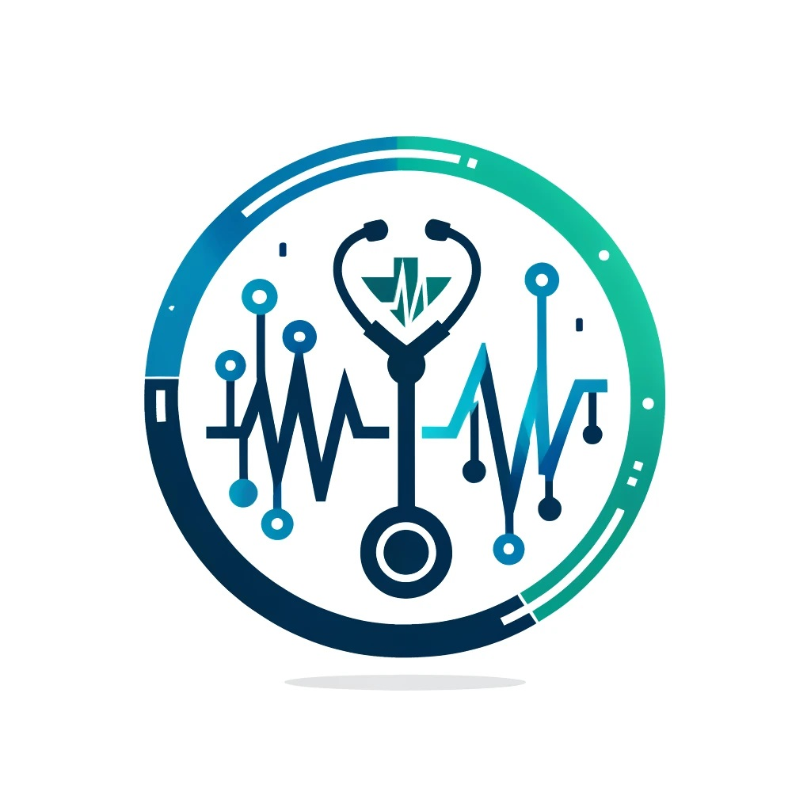

[HOME](../index.md){: .btn .btn-blue }

# Sundhedspleje System
I er en del af IT-teamet i "**HealthTrack**", en fiktiv organisation der tilbyder digitale sundhedsløsninger.

Organisationen ønsker at udvikle et nyt system til styring af **patientoplysninger** og **klinikressourcer**. 

Dette system skal håndtere **patientjournaler**, **aftaler**, **behandlinger** og **ressourceallokering** på tværs af flere klinikker.

# Krav til Data delen
- **Patienter**: Skal have en unik ID, navn, fødselsdato, og kontaktinformation.
- **Læger**: Lægerne skal have en unik ID, navn, specialitet og tildelte patienter.
- **Aftaler**: Aftalerne skal indeholde information om patienten, den ansvarlige læge, tidspunkt, og formål.
- **Behandlinger**: Hver behandling skal registreres med en unik kode, beskrivelse, og hvilken type læge der kan udføre behandlingen.
- **Klinikker**: Systemet skal også håndtere flere klinikker, hver med en adresse og tilgængelige ressourcer (*f.eks. udstyr og personale*).

## Mål
Udvikle en **robust dataarkitektur** der kan understøtte **effektiv datastyring**, hurtig adgang til patientoplysninger og effektiv planlægning og styring af klinikkernes ressourcer.

# Krav til data delen

- **Data Entity/Relationship Diagram (ERD)**
    - Skal vise relationerne mellem entiteter som Patienter, Læger, Aftaler, Behandlinger, og Klinikker.

- **Data Flow Diagram (DFD)**
    - Skal illustrere, hvordan data flyder i systemet fra registrering af en ny patient til planlægning af en aftale og registrering af behandlinger.

- **Logical Data Model**
    - Skal repræsentere de logiske strukturer af dataene, herunder nøgleattributter og relationer uden specifik teknologi eller database-specifikationer.

- **Physical Data Model**
    - Skal detaljere den specifikke implementering i en database inklusive tabeller, kolonner, og datatyper.

- **Matrix Diagrams**
    - Skal vise relationerne mellem forskellige dataenheder (*f.eks. hvilke data der deles mellem læger og klinikker*).

## Løsningsforslag (Datadelen)
- **ERD**
    - Tegn entiteter for hver af de krævede elementer (*Patienter, Læger, osv.*) og forbind dem med relationer som "**har aftaler med**", "**tildelt til**", og "**arbejder i**".

- **DFD**
    - Start med en ekstern enhed (*f.eks. receptionist*), der indtaster data i systemet, og vis derefter, hvordan disse data bevæger sig til databaser og bruges i forskellige interne processer (*f.eks. planlægning*).

- **Logical Data Model**
    - Lav en mere abstrakt version af ERD med fokus på **datatyper** og **relationer**, men uden specifikke databaseelementer.

- **Physical Data Model**
    - Uddyb det logiske model ved at tilføje specifikke databaseelementer som **primære nøgler**, **fremmednøgler**, og **datatyper**.

- **Matrix Diagrams**
    - Brug en tabel til at vise, hvordan forskellige dataelementer (*f.eks. patientoplysninger, lægeoplysninger*) interagerer eller deles mellem forskellige afdelinger eller systemer.

# Krav til applikations delen

- **Patient Management System** (*PMS*) 
    - Håndterer patientoplysninger, herunder registrering, opdatering, og adgang til patientdata.
- **Appointment Scheduler** (*AS*): 
    - Applikation til planlægning og administration af patientaftaler.
- **Treatment and Diagnosis Management** (*TDM*)
    - System til styring af behandlingsregistreringer, diagnosekoder og lægeanvisninger.
- **Resource Management System** (*RMS*)
    - Håndterer ressourceallokering, herunder personale, medicinsk udstyr og rumkapacitet.
- **Central Database** (*CDB*)
    - Opbevarer alle data centralt og sikrer integriteten og sikkerheden af informationen.
- **Reporting Tool** (*RT*)
    - Genererer rapporter om patientbehandlinger, klinikydelser, og ressourceanvendelse.
- **Integration og Kommunikation**
    - Alle systemer skal kunne kommunikere sikkert og effektivt, både internt og eksternt.
- Integration via en API-gateway for at sikre, at data deles korrekt mellem systemer.
- Brug af standardiserede dataformater og protokoller for sundhedsdata.

## Teknologikrav

- **Frontend**
    - React for brugergrænseflader, kommunikerer med backend via RESTful APIs.
- **Backend**
    - Java Spring Boot, tilbyder API endpoints for alle applikationsfunktioner.
- **Database**
    - MySQL/MS-SQL, centraliseret databaseløsning for alle data.
- **Server**
    - Docker containere orkestreret med Kubernetes, hosted på en cloud-infrastruktur.

## Diagram Krav og Beskrivelser
- **Application Communication Diagram**
    - Skal illustrere, hvordan de forskellige systemer (*PMS, AS, TDM, RMS, CDB, RT*) kommunikerer. Inkluder beskrivelse af API-gatewayen og sikkerhedsforanstaltninger som OAuth for autentifikation.
- **Software Architecture Diagram**
    - Vis arkitekturen af hvert enkelt system. 
    - For eksempel, hvordan AS-modulet håndterer forespørgsler, interagerer med databasen, og kommunikerer tilbage til frontend.
- **System Integration Diagram**
    - Diagram over integrationen mellem de forskellige systemer og eksterne tjenester, inklusive brug af API'er og middleware som en ESB eller API management platform.
- **Technology Stack Diagram**
- Detaljeret visning af de teknologier, der anvendes på forskellige lag i applikationen (*frontend, backend, database, serverinfrastruktur*).
- **Deployment Diagram** (*UML*)
    - Fremviser, hvordan applikationens forskellige komponenter deployes på hardware eller cloud-ressourcer, inklusive containere og servere.
- **Component Diagram** (*UML*)
    - Illustrerer de større softwarekomponenter inden for hver applikation, herunder deres grænseflader og relationer til andre komponenter.