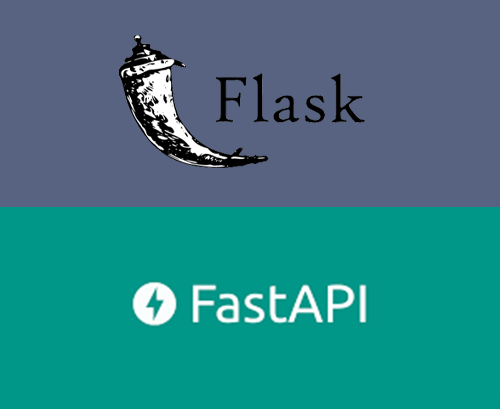
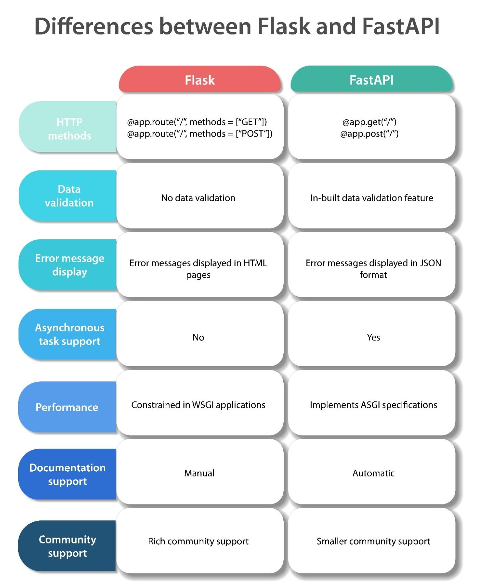
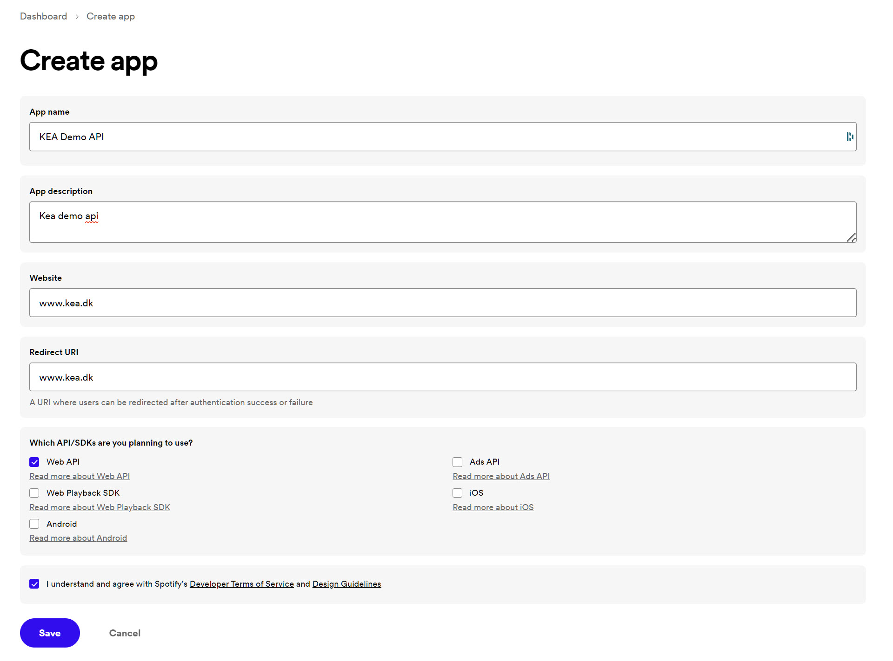
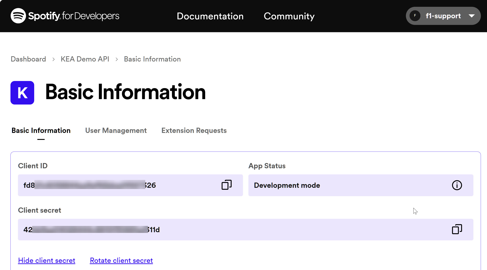

<!-- _backgroundColor: black -->
<!-- _color: white -->
# API<!-- fit -->

---

# What is an API? <!-- fit -->

### Find the best, in your opinion, **description of an API**
### Come up with some **examples of API's**

---

# What is an API? <!-- fit -->
**API** stands for **Application Programming Interface**

## But what is a *Interface*?

---

# Interfaces <!-- fit -->
*Every* device you use has some kind of **interface**. 

We use these interfaces to get the device to **do the thing we want**.

We **don't need to understand** the underlying functionality.

---

## Abstraction <!-- fit -->

API's provide a layer of abstraction for the user. 

Abstraction **hides everything but what is relevant** to the user, making it *simple* to use.

*An API is how applications talk to each other*

---

# API - Application Programming Interface
**API** is a software intermediary that allows two applications to talk to each other.

You can ask an API for **data**, and they API will return what you want, usually in the form of **JSON** or **XML**. You can then use the data in your application.

*Every time you use an app like Facebook, send an SMS, or check the weather on your phone, you’re using an API.*

---

# API's as a way to serve your customers
Some companies are packaging API's as products. 

- **Weather Underground** sells access to its weather data API
    - [www.wunderground.com](https://www.wunderground.com)

- **e-conomic** has an API where the customers can access there data
    - [www.e-conomic.com](https://www.e-conomic.com)

*When a company offers an API to their customers, it just means that they’ve built a set of dedicated URLs that return pure data responses — meaning the responses won’t contain the kind of presentational overhead that you would expect in a graphical user interface like a website.*

---

# OpenAPI
There is the **OpenAPI Specification** (*OAS*), a technical specification that describes certain APIs, and there is the **OpenAPI Initiative** (*OAI*), an organization that enables specifications like OAS to thrive.

[www.openapis.org](https://www.openapis.org)

---

# What is the difference between a Web service and an API?
An **API** is an **interface** that allows you to build on the data and functionality of another application, while a **web service** is a **network-based resource** that fulfills a **specific task**. 

Yes, there's **overlap between the two**: 

- **All** web services are API's
- **Not all** API's are web services
- Web services require a network. APIs can be on- or offline, web services must use a network
- **Web services** are usually associated with **SOA**
- **API's are protocol agnostic**. API's can use any protocols or design styles - **Web services** use SOAP, REST, UDDI, XML-RPC

---

# FastAPI
FastAPI is a modern, **fast** (*high-performance*), **web framework** for **building APIs** with Python 3.7+ based on standard Python type hints.

---

<iframe width="1100" height="1000" src="https://www.youtube.com/embed/0RS9W8MtZe4" title="YouTube video player" frameborder="0" allow="accelerometer; autoplay; clipboard-write; encrypted-media; gyroscope; picture-in-picture; web-share" allowfullscreen></iframe>

---

# Flask <> FastAPI 
## When to use Flask?
- To develop web applications
- To develop quick prototypes

## When to use FastAPI?
- To develop APIs from scratch
- To lower the number of bugs and errors in code

---

---

# Microservices, SOA, and API's combined

<!-- _footer: https://developer.ibm.com/tutorials/1601_clark-trs -->

---

<!-- _backgroundColor: black -->
<!-- _color: white -->
# API DEMO <!-- fit -->

---

# API - restcountries

[Deepnote Python code](https://deepnote.com/workspace/tue_hellstern-9dbbf77c-5ba3-47b4-8076-45f48827bd4a/project/Power-BI-Data-793be997-9faf-4176-bbde-95fd1857ecf2/notebook/API_Countries-1e88bf4178334c87858d543137b09a90)

<!-- _footer: https://pypi.org/project/python-restcountries -->

---

# Spotify API <!-- fit -->
Spotify provides software and app developers access to some of their data about users, playlists, and artists through a Web API.

- [Spotify for Developers](https://developer.spotify.com/dashboard)
- [Python Code Deepnote](https://deepnote.com/workspace/tue_hellstern-9dbbf77c-5ba3-47b4-8076-45f48827bd4a/project/Power-BI-Data-793be997-9faf-4176-bbde-95fd1857ecf2/notebook/Spotify-57eae20546384a4fb3d108540bbc87bb)

---

---

---

# IBM - SOA <!-- fit -->

[SOA for Dummies](https://github.com/officegeek/image/raw/main/pdf/SOA_for_dummies.pdf)

---

# Links
- https://martinfowler.com/microservices
- https://www.ibm.com/cloud/learn/soa
- https://morioh.com/p/422b616d71a2
- https://fastapi.tiangolo.com/