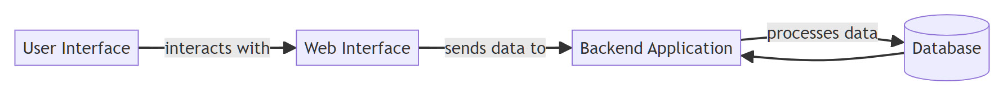
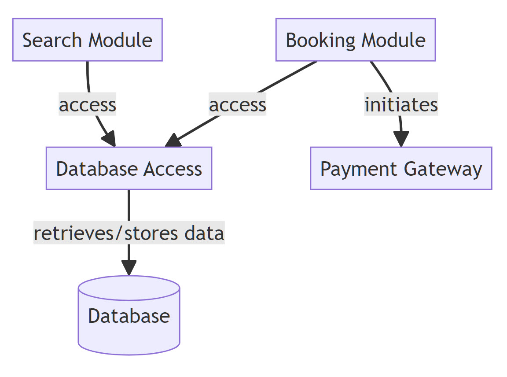
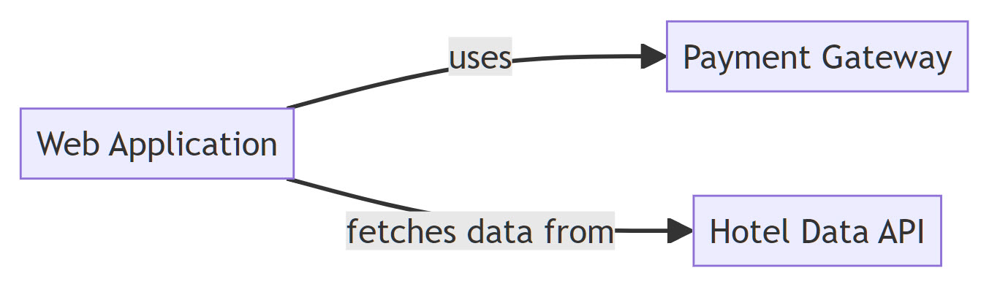
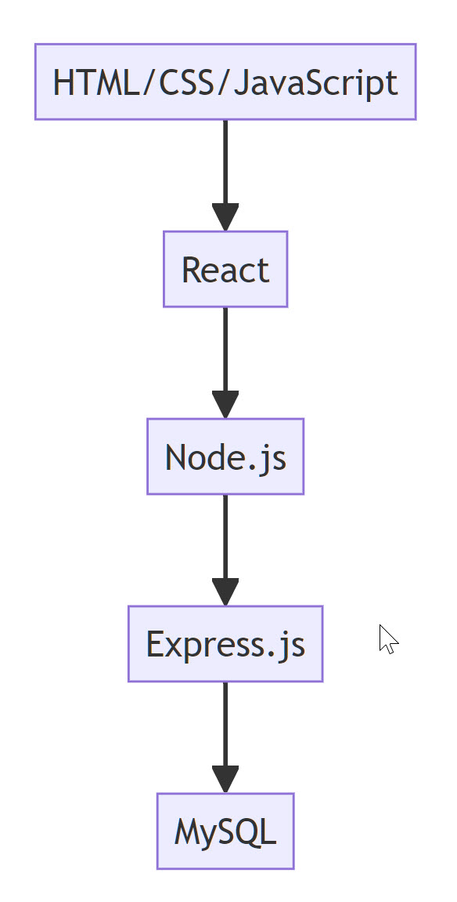
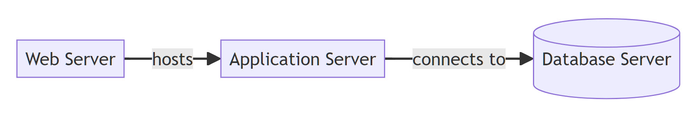
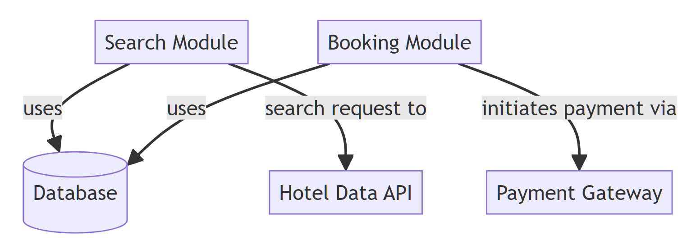

<!-- _class: invert -->

# **Applikations Arkitektur**

---

<!-- _class: invert -->

# **Application Architecture**

- **Beskrivelse af Baseline Application Architecture**
    - Kortlægning og evaluering af eksisterende applikationslandskab.
- **Definition af Target Application Architecture**
    - Udvikling af en fremtidig applikationsstruktur, der understøtter forretningsprocesser optimalt.
- **Integration og middleware**
    - Overvejelser omkring hvordan applikationer kommunikerer internt og med eksterne systemer.

---

<!-- _class: invert -->
# **Application Communication Diagram**

## **Formål**: Illustrerer hvordan forskellige applikationer kommunikerer med hinanden inden for organisationen, herunder hvilke data der udveksles og hvilke grænseflader der anvendes.
## **Anvendelse**: Nyttigt til at identificere afhængigheder mellem applikationer og forstå de overordnede dataflows og kommunikationskanaler.

---

<!-- _class: invert -->
# **Software/Application Architecture Diagram**

## **Formål**: Viser den interne struktur af en enkelt applikation eller system. Det kan inkludere moduler, komponenter, og hvordan de interagerer.
## **Anvendelse**: Bruges til at forstå og dokumentere designbeslutninger omkring systemarkitektur, som er afgørende for både udvikling og vedligeholdelse.

---

<!-- _class: invert -->
# **System Integration Diagram**
## **Formål**: Fremviser, hvordan forskellige systemer eller applikationer integreres og samarbejder, herunder anvendelse af integrationsteknologier som ESB (*Enterprise Service Bus*), API'er (*Application Programming Interfaces*) osv.
## **Anvendelse**: Vigtig for at planlægge og udføre integration mellem nye og eksisterende systemer inden for organisationen.

---

<!-- _class: invert -->
# **Technology Stack Diagram**
## **Formål**: Demonstrerer de teknologier, der anvendes i forskellige lag af applikationsudviklingen, fra frontend til backend, herunder databaser, serverteknologier og klientteknologier.
## **Anvendelse**: Nyttig til at sikre, at teknologiudvalget er i overensstemmelse med virksomhedens strategi og til at informere nye udviklingsprojekter.

---

<!-- _class: invert -->
# **Deployment Diagram** (UML)

## **Formål**: Beskriver fysisk deployment af artefakter på nodes som servere, klientmaskiner eller andre enheder.
## **Anvendelse**: Afgørende for at forstå, hvordan applikationer distribueres, fungerer og interagerer i et live-miljø, hvilket er vigtigt for både udvikling og drift.

---

<!-- _class: invert -->
# **Component Diagram** (UML)

## **Formål**: Illustrerer organisationen af og forholdet mellem softwarekomponenter, deres interaktioner og grænseflader.
## **Anvendelse**: Bruges til detaljeret design og dokumentation af softwarearkitektur, hvilket er essentielt for modulær og genanvendelig kode.

---

<!-- _class: invert -->

# **Bookingsystem for hoteller**
### Simpelt online **bookingsystem** for hoteller. 

### Dette system giver brugere mulighed for at **søge** efter **hoteller**, **booke værelser** og administrere deres **bookinger**. 

### Systemet vil **interagere** med **eksterne systemer** for betalinger og hoteldata.

---

# Application Communication Diagram
Hvordan er de forskellige applikationskomponenter interagerer med hinanden gennem forskellige kommunikationskanaler.

---

# Application Architecture Diagram
Viser de vigtigste softwarekomponenter i systemet og deres relationer.

---

# System Integration Diagram
Viser integrationen mellem systemet og eksterne tjenester.

---

# Technology Stack Diagram
Viser teknologierne anvendt på de forskellige lag af applikationen.

---

# Deployment Diagram (*UML*)
UML diagram der viser, hvordan systemkomponenterne deployes på hardware eller cloud-ressourcer.

---

# Component Diagram (*UML*)
Dette UML diagram viser de større softwarekomponenter inden for hver applikation, deres grænseflader og relationer.

