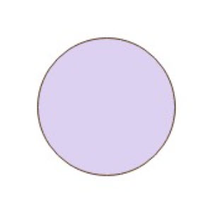

<!-- _class: invert -->

# **Data Arkitektur**

---

<!-- _class: invert -->

# **Data Architecture**

- **Beskrivelse af Baseline Data Architecture**
    - Forståelse af eksisterende datastrukturer og databaser.
- **Definition af Target Data Architecture**
    - Hvordan ønsker I at data skal struktureres fremadrettet? Dette omfatter design af databaser og integration af datakilder.
- **Data Management og Governance**
    - Principper og politikker for datahåndtering og sikkerhed.

---

<!-- _class: invert -->
# **Data Entity/Relationship Diagram** (ERD)

## **Formål**: At illustrere relationer mellem dataenheder. Dette diagram er centralt for at forstå, hvordan forskellige elementer i databasen er relateret og hvordan de interagerer med hinanden.
## **Anvendelse**: Bruges til at skitsere database struktur, inklusive tabeller, nøgler, og relationer, hvilket er essentielt for database design og normalisering.

---

<!-- _class: invert -->
# **Data Flow Diagram** (DFD)

## **Formål**: At vise, hvordan data flyder gennem systemet, mellem forskellige processer og datalagre. Dette hjælper med at identificere, hvordan data indsamles, behandles og distribueres.
## **Anvendelse**: Nyttig til at identificere og designe datahåndteringsprocesser og til at fremhæve integrationen mellem forskellige systemkomponenter.

---

# Data Flow Diagram **Symboler**
Et Data Flow Diagram bruger specifikke symboler og notationer til at repræsentere, hvordan information strømmer gennem et system. 

Disse elementer hjælper med at skildre interaktionerne mellem forskellige processer, data stores, eksterne enheder og datastrømmene selv.

---

# **Processer**
## **Beskrivelse**: En proces viser en handling eller en aktivitet, hvor data bliver manipuleret. Typisk repræsenteret ved en **afrundet firkant** eller en **cirkel**.
## **Funktion**: Processer **transformerer input data til output data**. De er de aktive komponenter i et DFD, som f.eks. beregninger, dataændringer eller enhver operation, der ændrer formen, strukturen eller karakteren af dataene.

---

# **Datastrømme**
## **Beskrivelse**: En datastrøm viser retningen af data mellem elementerne i diagrammet. Denne er repræsenteret ved en **pil**.
## **Funktion**: Datastrømme illustrerer, **hvordan data bevæger sig** fra den ene del af systemet til den anden. De kan flyde mellem processer, eksterne enheder, og datalagre.

---

# **Datalagre**
## **Beskrivelse**: Et datalager eller en dataopbevaring repræsenteres ofte som **to parallelle linjer** eller en åben boks og bruges til at vise, hvor data gemmes indenfor systemet.
## **Funktion**: Datalagre er **passive elementer**, hvor data kan **samles og opbevares** for senere brug. De repræsenterer **databaser**, arkiver, filsystemer, eller andre medier, hvor information opbevares.

---

# **Eksterne enheder**
## **Beskrivelse**: Også kendt som "*terminaler*" eller "*eksterne agenter*", disse er kilder eller destinationer for data uden for det system, som er under analyse. De repræsenteres typisk med **rektangler**.
## **Funktion**: Eksterne enheder er entiteter **uden for systemet**, der enten sender data til eller modtager data fra systemet. Dette kan inkludere brugere, andre systemer, organisationer eller enhver gruppe, der interagerer med systemet.

---

<!-- _class: invert -->

# **DFD 4 niveauer**
DFD'er er en fantastisk måde at visualisere interaktionerne mellem processer og data i et system på, og de forskellige niveauer giver mulighed for gradvist at dykke ned i mere og mere detaljeret information efter behov. 

Dette hjælper både udviklere og interessenter med at få en bedre forståelse af systemets funktioner og informationsflow.

DFD'er er organiseret i 4 niveauer, som hver har sit formål og detaljeringsgrad.

Typisk er det dog kun **de 3 øverste niveauer** der anvendes i praksis.

---

<!-- _class: invert -->
# **Kontekst Diagram (Niveau 0)**
## **Formål**: Dette er det højeste niveau i et DFD og viser systemet som en helhed med alle hovedprocesser, eksterne enheder (*enten eksterne systemer eller bruger*e), og datastrømmene mellem disse eksterne enheder og systemet.
## **Indhold**: Typisk indeholder dette diagram kun én stor proces (*selve systemet*), som illustreres som en stor boks. Omkring denne boks vises eksterne aktører og de datastrømme, der går ind og ud af systemet.

---

---

---

<!-- _class: invert -->
# **Level 1 DFD**
## **Formål**: Dette niveau bryder den enkelte proces vist i Kontekst Diagrammet ned i flere underprocesser, hvilket giver et mere detaljeret blik på de vigtigste funktioner indenfor systemet.
## **Indhold**: Diagrammet viser flere bokse (hver repræsenterer en proces), der er forbundet med pilene, der repræsenterer datastrømme. Det viser, hvordan data flyder mellem de interne processer og muligvis til og fra eksterne enheder eller data stores.

---

---

---

<!-- _class: invert -->
# **Level 2 DFD**
## **Formål**: Dette niveau giver endnu mere detalje ved at opdele hver af de processer, der er identificeret i Level 1 DFD, i mere specifikke handlinger.
## **Indhold**: Her ses ofte mange flere processer og datalagre, og diagrammet kan blive ret komplekst. Hver proces fra Level 1 DFD er opdelt i mindre processer, og datastrømmene mellem disse mere detaljerede processer bliver tydeligt vist.

---

---

<!-- _class: invert -->
# **Level 3 DFD og derudover**
## **Formål**: Disse DFD'er går ind i endnu større detalje og kan specifikt illustrere handlinger indenfor en enkelt proces i Level 2 DFD.
## **Indhold**: Denne detaljeringsgrad **anvendes sjældent** i generelle projektoversigter, da de kan blive ekstremt detaljerede og kun er nødvendige, når komplekse individuelle processer skal analyseres og forstås fuldt ud.

---

<!-- _class: invert -->
# **Logical Data Model**

## **Formål**: At repræsentere strukturen af domænespecifikke data (*uafhængig af databaseteknologier*) på et konceptuelt eller logisk niveau. Dette diagram giver en mere abstrakt forståelse af organisationens informationsstruktur.
## **Anvendelse**: Effektivt til at kommunikere forhold mellem dataobjekter og forretningsregler til både tekniske og ikke-tekniske stakeholders.

---

---

<!-- _class: invert -->
# **Physical Data Model**

## **Formål**: At repræsentere, hvordan modellen implementeres i databasen, inklusive specifikke tabeller, kolonner, datatyper, og indekser.
## **Anvendelse**: Bruges til at designe den faktiske database struktur og er afgørende for database performance optimering.

---

---

<!-- _class: invert -->

# **Bookingsystem for hoteller**
### Simpelt online **bookingsystem** for hoteller. 

### Dette system giver brugere mulighed for at **søge** efter **hoteller**, **booke værelser** og administrere deres **bookinger**. 

### Systemet vil **interagere** med **eksterne systemer** for betalinger og hoteldata.

---

---

---

---

