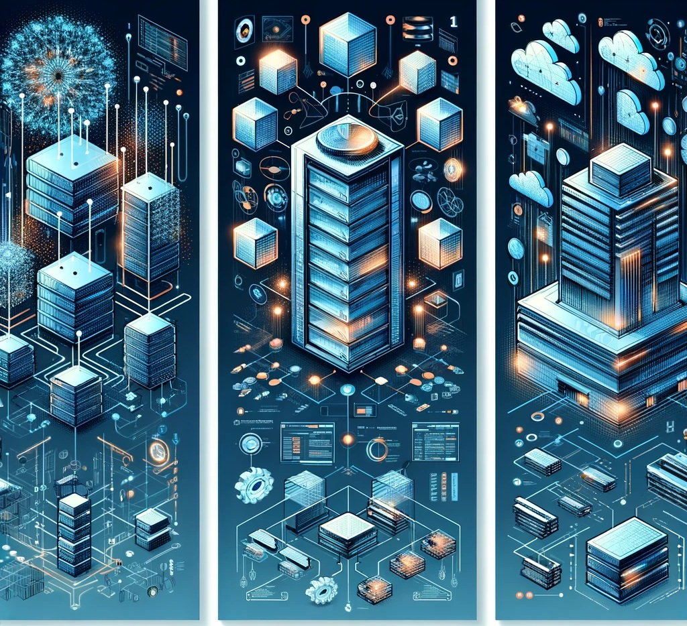

<!-- _class: invert -->

# **De Tre Arkitekturdokumenter**

## **Data**
## **Applikations**
## **Teknologi**

---

<!-- _class: invert -->

# **Data-Arkitekturdokument**

# **Formål**

At give en oversigt over organisationens dataarkitektur, herunder **datakilder**, **databehandling** og **datalagringssystemer**.

---

# **Dokumentstruktur**

## Introduktion
- Formålet med dokumentet
- Omfang af dataarkitekturen
- Interessenter

## Datakilder
- Liste over alle datakilder
- Beskrivelse af hver datakilde
- Data-eje og ansvar

---

## Data Modeller
- Konceptuel datamodel
- Logisk datamodel
- Fysisk datamodel
- Entitet-Relation Diagrammer (*ERD*)

## Dataopbevaring
- Beskrivelse af lagringssystemer (*SQL-databaser, NoSQL-databaser, data lagre osv.*)
- Strategier for datafordeling og replikering

---

## Datahåndtering
- Politikker for datagovernance
- Håndtering af datakvalitet
- Datasikkerhedsforanstaltninger

## Integration og ETL-Processer
- Overblik over dataintegrationsstrategier
- Værktøjer og teknologier anvendt til dataekstraktion, transformation og indlæsning (*ETL*)

---

## Fremtidige anbefalinger
- Forslag til forbedringer
- Fremtidige teknologiovervejelser

## Bilag og Referencer
- Ordliste
- Referencedokumenter

---

<!-- _class: invert -->

# **Applikations-Arkitekturdokument**
# **Formål**

At beskrive applikationsarkitekturen, herunder **applikationsdesign**, **komponenter** og **interaktioner** i systemet.

---

# **Dokumentstruktur**

## Introduktion
- Formålet med dokumentet
- Omfang af applikationsarkitekturen
- Overblik over applikationen

## Arkitekturoverblik
- Arkitekturdesignprincipper
- Overordnet arkitekturdiagram

---

## Komponentarkitektur
- Detaljeret beskrivelse af hver applikationskomponent
- Komponentdiagrammer
- Interaktion mellem komponenter

## Brugergrænsefladedesign
- Layout af hovedskærmene/interfaces
- Brugeroplevelsesflows

---

## Sikkerhedsarkitektur
- Autentifikations- og autorisationsmekanismer
- Strategier for datakryptering

## Eksterne grænseflader
- Integration med andre systemer
- Anvendte API'er og tjenester

---

## Udrulningsarkitektur
- Udrulningsdiagrammer
- Infrastrukturkrav

## Ydeevne og Skalérbarhed
- Ydeevne benchmarks
- Skalérbarhedsstrategier

## Fremtidige anbefalinger
- Forslag til arkitektoniske forbedringer
- Bilag og Referencer
- Ordliste
- Referencedokumenter

---

<!-- _class: invert -->

# **Teknologi-Arkitekturdokument**
# **Formål**

At beskrive den teknologiske infrastruktur, der understøtter udrulning og drift af systemet.

---

# **Dokumentstruktur**

## Introduktion
- Formålet med dokumentet
- Omfang af teknologiarkitekturen

## Infrastrukturoverblik
- Diagram over den fysiske og virtuelle infrastruktur
- Beskrivelse af hardware- og netværksressourcer

---

## Teknologistak
- Detaljeret beskrivelse af teknologistakken
- Begrundelse for teknologivalg

## Sikkerhedsinfrastruktur
- Overblik over sikkerhedsforanstaltninger og teknologier
- Planer for katastrofegenopretning og forretningskontinuitet

## Overvågning og Styring
- Værktøjer og teknikker til systemovervågning
- Strategier for hændelsesrespons

---

## Cloudarkitektur (*hvis relevant*)
- Overblik over anvendte cloud-tjenester
- Cloud servicemodeller (*IaaS, PaaS, SaaS*)

## Fremtidige anbefalinger
- Teknologitendenser og deres potentielle indvirkning
- Opgraderings- og migrationsplaner
- Bilag og Referencer
- Ordliste
- Referencedokumenter