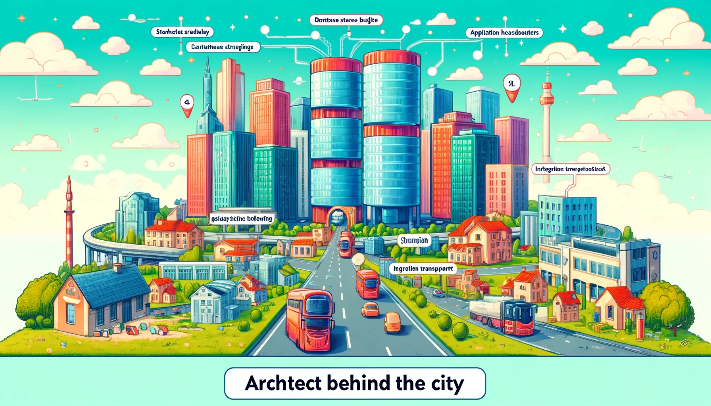
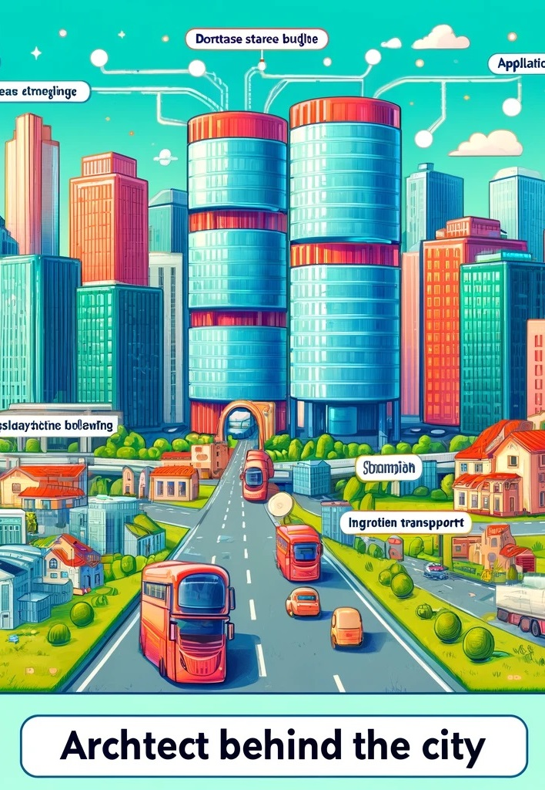
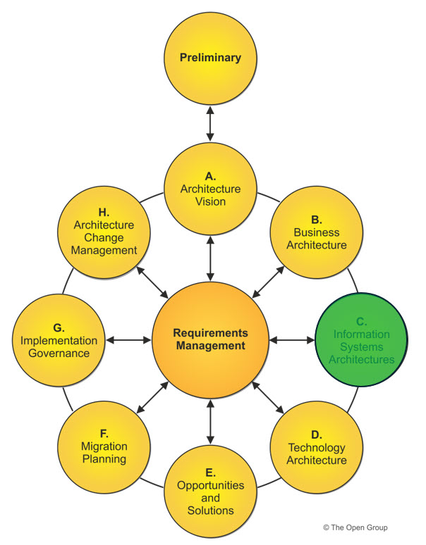
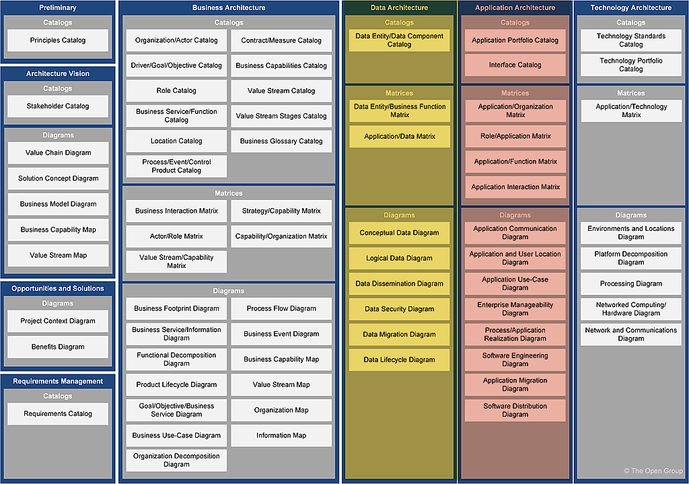

<!-- _class: invert -->
# **Information Systems Arkitektur**

---

---

<!-- _class: invert -->

## I er **arkitekter**, der skal designe en del af en "*data/applikations*-**by**", hvor hver bygning repræsenterer en form for *opbevaring*-**data**, *transport*-**process** eller *funktion*-**applikation**.

## Hvordan skal disse **bygninger** (*data og applikationer*) **interagerer** og støtter hinanden i en større **infrastruktur**.

---

<!-- _class: invert -->

# **I grupper på 3-5 personer.**
## Hver gruppe vælger en type **bygning** I vil designe. Det kan være en *database*-**lagerbygning**, et *applikations*-**hovedkvarter** eller et *integrations*-**transportcenter**.

## I grupperne **diskuterer**, i hvad jeres bygning skal indeholde, hvordan den **interagerer** med andre bygninger og hvilken rolle den spiller i byen (**systemet**).

---

<!-- _class: invert -->

## I tegner jeres bygning og forbereder en **kort præsentation**, hvor I forklarer jeres **designvalg** og **interaktioner** med byens andre elementer.

## Hver gruppe præsenterer deres "**bygning**" for klassen, og andre kan stille spørgsmål eller komme med forbedringer.

---

<!-- _class: invert -->

# **Refleksion**
## Hvordan arbejder forskellige **data**- og **applikations**-komponenter **sammen** i større systemer.

## **Vigtigheden** af, hvordan data og applikationer er **struktureret** og **integreret**.

## **Hvad startede I med at designe?**

## **Dokumentation? - Diagrammer?**

---

# **Information Systems Arkitektur**
- **Data Arkitektur**
- **Applikations Arkitektur**

## Typisk er det bedst at **starte** med **Data**- og **derefter** **Applikation-Arkitektur**

---

