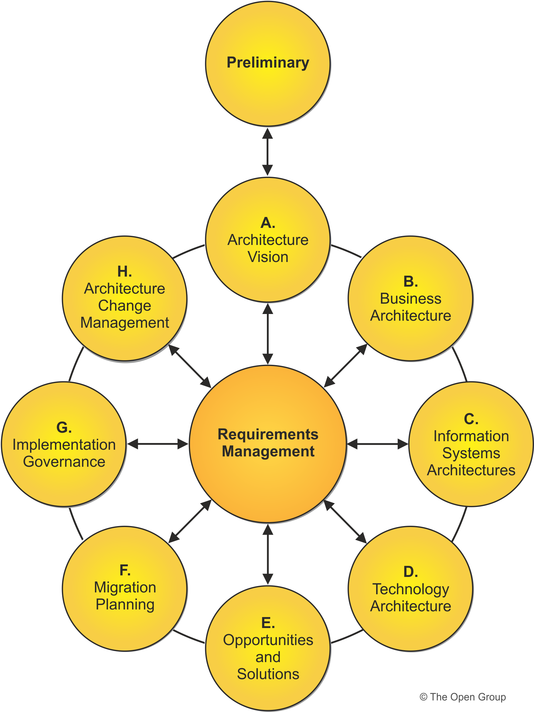
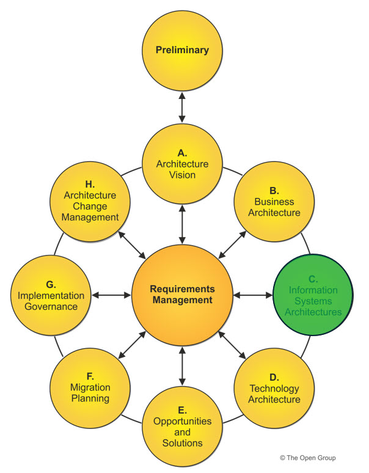
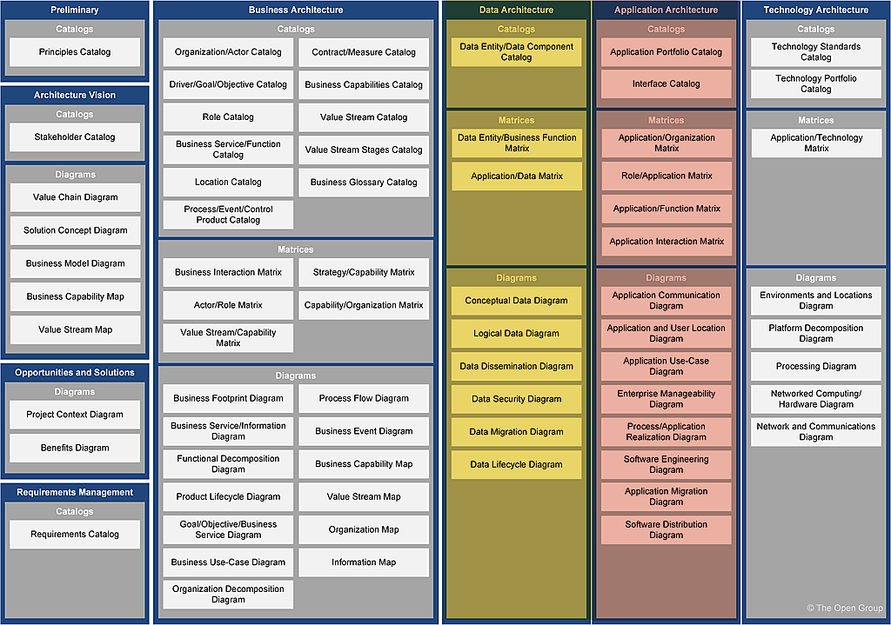
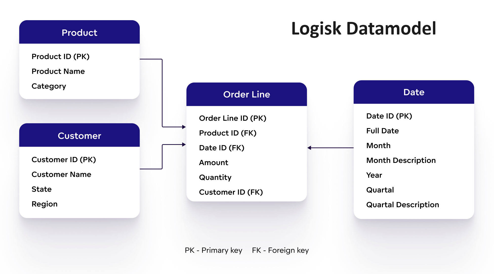
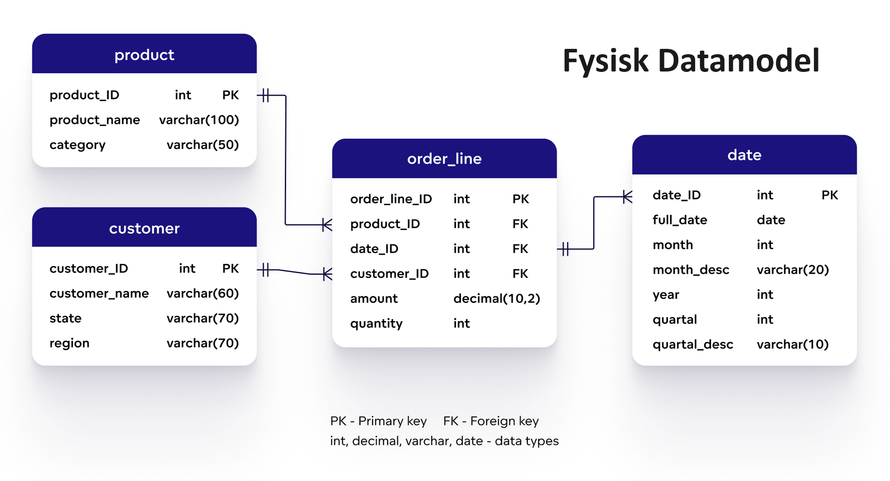
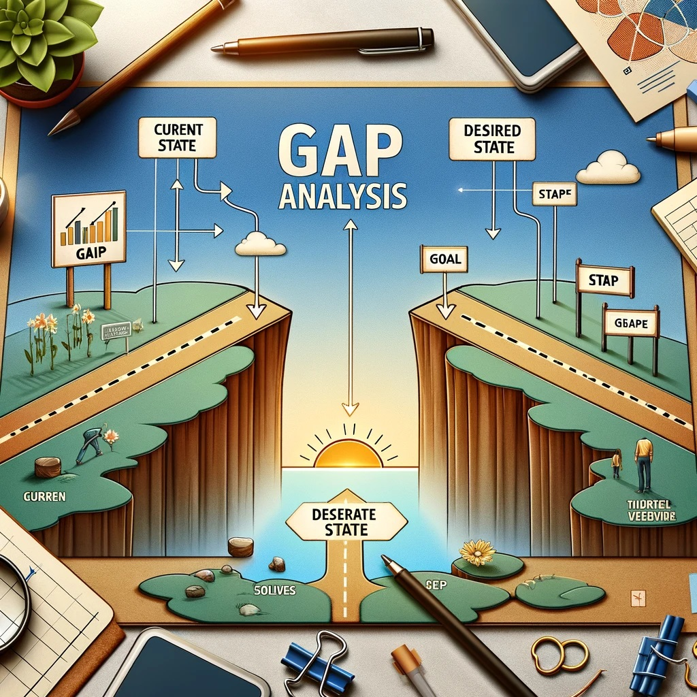

<!-- _class: invert -->
# **IT Arkitektur**  <!-- fit -->

---

<!-- _class: invert -->
# **TOGAF**
**TOGAF**, der står for "**The Open Group Architecture Framework**," er et framework til enterprise-arkitektur som tilbyder en omfattende tilgang til design, planlægning, implementering og styring af en virksomheds IT-arkitektur. 

**TOGAF** er udviklet af "**The Open Group**", en global konsortium, der fremmer åbne standarder og certificeringer inden for IT

---

---

<!-- _class: invert -->
# Information Systems Arkitektur

---

# Information Systems Arkitektur
- **Data Arkitektur**
- **Applikations Arkitektur**

## **Typisk er det bedst at starte med Data og derefter Applikation arkitektur**

---

---

<!-- _class: invert -->
# **Data Arkitektur**

---

---

---

<!-- _class: invert -->
# **Applikations Arkitektur**

---

<!-- _class: invert -->

# **Gap Analyse**  <!-- fit -->
En Gap-analyse er en metode, der bruges til at vurdere forskellen mellem en virksomheds **faktiske** præstation og dens **ønskede** præstation. 

---
<!-- _class: invert -->

# **Gap processen involverer typisk tre hovedtrin**

I hvert trin skal "beskrives" for Business, Data, Application og Technology.

1. ## **Definering af nuværende tilstand**: Fastlæg virksomhedens nuværende kapaciteter, ressourcer og processer - **AS-IS**
2. ## **Definering af ønsket tilstand**: Beskriv hvad virksomheden ønsker at opnå, inklusiv mål og objektiver for fremtiden - **TO-BE**
3. ## **Identificering af gaps**: Analyser forskellen mellem den nuværende og ønskede tilstand for at identificere områder, der kræver forbedring eller udvikling.

---

<!-- _class: invert -->
# **"Lukke" Gaps**
Der vil typisk være flere måder at lukke Gaps på. Det er vigtig at der fortages en grundig analyse af fordele og ulemper ved hver af disse.

- ## **Big Bang** - Sluk det "gamle", Tænd det nye
- ## **Evolution** - Gradvis flytning, én applikation/service ad gangen
- ## **Komponentopdeling** - Opdel eksisterende applikationer i mindre, efterfulgt af Evolution
- ## **Co-eksistens** - Applikationer kører i både AS-IS og TO-BE udgaver indtil AS-IS kan lukkes ned 

---

Læse

- https://www.dataversity.net/conceptual-vs-logical-vs-physical-data-modeling/
- https://www.gooddata.com/blog/physical-vs-logical-data-model 
- https://online.visual-paradigm.com/knowledge/visual-modeling/conceptual-vs-logical-vs-physical-data-model
- 