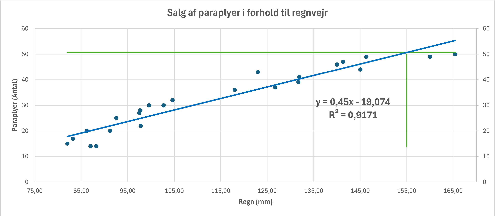

# Linear Regression
Lineær regression er en statistisk metode, der bruges til at modellere forholdet mellem en afhængig variabel og en eller flere uafhængige variabler ved at tilpasse en lineær ligning til observerede data.

Lineær regression anvendes i mange forskellige feltet, f.eks. *økonomi* og *biologi*. Det er en grundlæggende metode inden for *prædiktiv modellering* og *maskinlæring*.

# Teori
De grundlæggende elementer i lineær regression kan opsummeres således:

1. **Afhængig variabel** (*Y*): Dette er den variabel, hvis værdi vi forsøger at forudsige eller forklare.
2. **Uafhængige variabler** (*X*): Disse er variablerne, som vi tror påvirker eller bestemmer værdien af den afhængige variabel. I simpel lineær regression er der kun én uafhængig variabel, mens der i multipel lineær regression er to eller flere.
3. **Lineær ligning**: Modellen udtrykker et lineært forhold mellem de afhængige og uafhængige variabler. I sin enkleste form (*simpel lineær regression*) har ligningen formen: 

    **Y = &#x3B1; + &#x3B2;X**

	
    

hvor:

- **Y** er den afhængige variabel.
- **X** er den uafhængige variabel.
&#x3B1; a (*skæringen med y-aksen*) er konstanten, der repræsenterer værdien af **Y**, når **X** er **0**.
- &#x3B2; (*hældningskoefficienten*) angiver ændringen i **Y** for en enhedsændring i **X**.
4. **Mindste kvadraters metode**: Dette er den mest almindelige metode til at finde de bedste estimater for koefficienterne 
&#x3B1; og &#x3B2;. Målet er at minimere summen af kvadraterne af forskellene mellem de observerede værdier og de værdier, der forudsiges af modellen.

5. **"Kvaliteten" af tilpasning**: For at vurdere, hvor godt modellen passer til dataene, bruges forskellige statistikker, såsom R-kvadrat, som måler andelen af variansen i den afhængige variabel, der kan forklares af de uafhængige variabler.

# Excel
- [paraplyer.xlsx](./paraplyer.xlsx)
- [gradedata.xlsx](./gradedata.xlsx)

Du kan oprette et diagram i Excel der viser den lineær regression mellem X og Y.

- **Åben Excel filen** (*paraplyer.xlsx*): Data er i to kolonner i Excel filen
- **Lav et scatterplot**: Vælg dataene og indsæt et punktdiagram (*scatterplot*).
- **Tilføj trendlinje**:
    - Klik på et af punkterne i diagrammet.
    - Vælg 'Tilføj Trendlinje' i diagramværktøjer.
    - Vælg 'Lineær' og marker 'Vis ligning på diagram' og 'Vis R-kvadreret værdi på diagram'.
- **Analyser**: Excel vil nu vise ligningen på diagrammet, som kan bruges til at forudsige **Y** baseret på **nye** **X** værdier.

# Python

## Deepnote