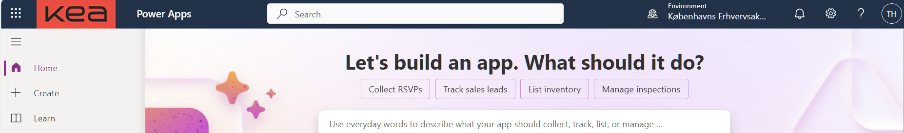

[HOME](../index.md){: .btn .btn-blue }

# Power Apps
Microsoft Power Apps er en del af Microsofts Power Platform, som gør det muligt for brugere at bygge brugerdefinerede applikationer uden behov for avanceret kodningsfærdigheder. 

Det tilbyder en brugervenlig grænseflade og **træk-og-slip-funktionalitet**, hvilket gør det lettere at skabe prototyper og apps til forretningsbehov.

Power Apps understøtter integration med andre Microsoft-tjenester som **Power BI** og **Power Automate**, samt med forskellige databaser og systemer, hvilket giver fleksibilitet i appudviklingen. Dette værktøj er særligt nyttigt for virksomheder, der ønsker at hurtigt udvikle og implementere forretningsapplikationer tilpasset deres specifikke processer og behov.

# LinkedIn Learning
- Microsoft Power Apps Essential Training: The Basics - Tid 1:33
- Microsoft Power Apps Essential Training: Beyond the Basics - Tid 2:30
- Power Apps: Building Data-Driven Apps - Tid 2:00
- Microsoft Power Apps: AI Builder - Tid 1:15

# Kea Adgang
Du skal/kan bruge disse link for at oprette Power Apps på Kea:
- [make.powerapps.com](https://make.powerapps.com)

Loginin med dit brugernavn@power.kea.dk og dit password. Brugernavnet og Password er det samme, som du bruger på dit KEA-login.

# App typer
Canvas Apps og Model-driven Apps er to primære typer af applikationer, som du kan udvikle med Microsoft Power Apps. 

De har forskellige formål og forskellige tilgange til app-udvikling, afhængigt af behov og den specifikke anvendelseskontekst.

## Canvas Apps
Canvas Apps giver dig et blank lærred, hvor du har fuld kontrol over appens brugerinterface. Du kan designe din app ved at trække og slippe elementer, ligesom du ville gøre i et grafisk designprogram.

Dette giver en høj grad af frihed til at skabe brugerdefinerede brugeroplevelser og tilpasse appens udseende og funktionalitet nøjagtigt til dine brugeres behov.

Canvas Apps er ideelle til situationer, hvor den visuelle præsentation og brugeroplevelsen er højt prioriteret. De er velegnede til at bygge applikationer, der kræver en specifik layout, integration med forskellige datakilder, eller når du har brug for at bygge en app hurtigt uden nødvendigvis at dykke dybt ned i datamodellering. 

Eksempler kunne være kundeundersøgelsesapps, event management apps, og interaktive rapporteringsværktøjer.

## Model-driven Apps
Model-driven Apps er datadrevne og fokuserer mere på logik og data end på den nøjagtige placering af UI-elementer.

De genereres automatisk ud fra din datastruktur og forretningsprocesser, som er defineret i Dataverse. Dette sikrer en ensartet og responsiv brugeroplevelse på tværs af enheder uden meget behov for manuel UI-tilpasning.

Model-driven Apps er bedst egnet til mere komplekse forretningsapplikationer, hvor datamodellering, sikkerhed, og forretningslogik er i centrum. 

De bruges ofte til interne virksomhedsapplikationer som CRM-systemer, case management-systemer, og andre applikationer, hvor interaktionen primært er drevet af data og forretningsprocesser.

## Forskelle mellem Canvas Apps og Model-driven Apps
- **Brugergrænseflade**: I Canvas Apps designer du brugergrænsefladen fra bunden, mens Model-driven Apps genererer brugergrænsefladen baseret på din datamodel og forretningsprocesser.

- **Datahåndtering**: Model-driven Apps er stærkt bundet til Dataverse, Microsofts cloud-baserede lagring og datamodelleringsværktøj, hvilket giver omfattende datamodelleringsmuligheder og sikkerhedskontrol. Canvas Apps kan også integrere med Dataverse men tilbyder mere fleksibilitet til at forbinde til en bred vifte af datakilder, herunder tredjepartstjenester og -platforme.

- **Udviklingsmetode**: Canvas Apps tilbyder en mere intuitiv drag-and-drop-tilgang, som er tilgængelig for ikke-tekniske brugere. Model-driven Apps kræver en forståelse af datamodellering og forretningsprocesser, hvilket kan være mere komplekst men også mere magtfuldt for at opfylde forretningsbehov.

Begge typer apps spiller en væsentlig rolle i Power Apps-økosystemet og kan endda bruges sammen i hybridapplikationer for at udnytte styrkerne ved begge tilgange.

Valget mellem Canvas Apps og Model-driven Apps afhænger af dine specifikke projektbehov, de data du arbejder med, og den brugeroplevelse, du ønsker at skabe.

# Opgaver
- [Canvas Apps](./OpgaverCanvasApp.md)
- [Model-driven Apps](./OpgaverModelApp.md)

# Links
- [Power Apps Community](https://powerusers.microsoft.com)
- [learn.microsoft.com/en-us/power-apps](https://learn.microsoft.com/en-us/power-apps)
- [learn.microsoft.com/da-dk/power-apps](https://learn.microsoft.com/da-dk/power-apps)
- [Officiel Microsoft Power Apps dokumentation](https://docs.microsoft.com/en-us/powerapps)
[Power Apps vejledninger og kurser](https://learn.microsoft.com/en-us/training/powerplatform/power-apps)
- [Connect to Excel from Power Apps](https://learn.microsoft.com/en-us/power-apps/maker/canvas-apps/connections/connection-excel)
- [Forståelse af Power Apps formularer og dataforbindelser](https://docs.microsoft.com/en-us/powerapps/maker/canvas-apps/working-with-forms)
- [Create a Power app with Azure Database for MySQL - Flexible Server](https://learn.microsoft.com/en-us/azure/mysql/flexible-server/tutorial-create-power-app-with-mysql)
- [Power Apps Community](https://powerusers.microsoft.com/en-us/community)
- [Power Apps Blog](https://powerapps.microsoft.com/en-us/blog/)
- [Create a canvas app with data from an Excel file](https://learn.microsoft.com/en-us/power-apps/maker/canvas-apps/get-started-create-from-data)
