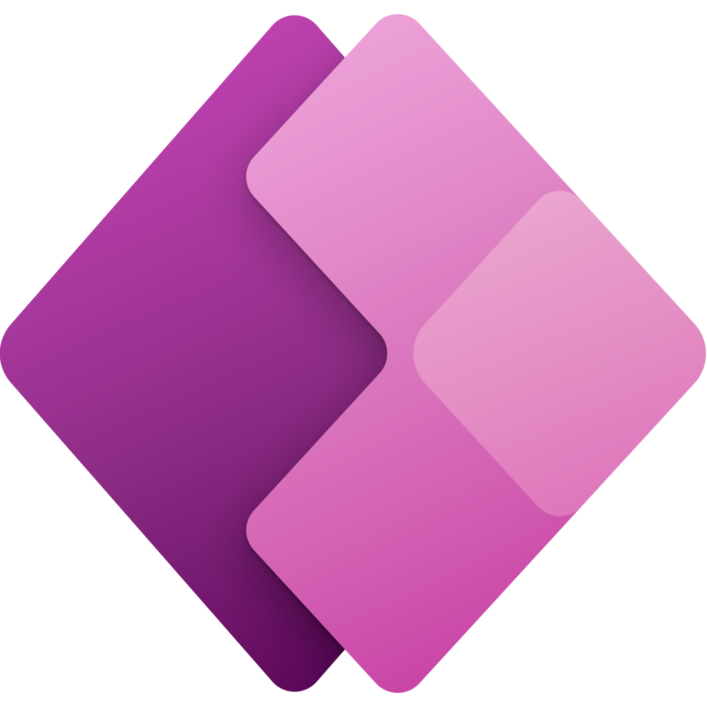
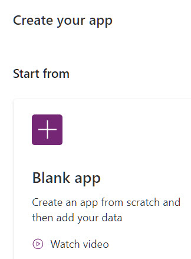

<!-- _color: white -->
<!-- _backgroundColor: black -->

# Power Apps Introduktion  <!-- fit -->
## **Tue Hellstern**

[kea.officegeek.dk/2_semester/powerapps](https://kea.officegeek.dk/2_semester/powerapps)

[make.powerapps.com](https://make.powerapps.com)

---

---

<!-- _color: white -->
<!-- _backgroundColor: black -->

# Typer

## **Canvas**
Canvas Apps giver dig et blank *lærred*, hvor du har fuld kontrol over appens brugerinterface. *Det er denne type I skal bruge på Admire Casen.*
## **Model-driven**
Model-driven Apps er datadrevne og fokuserer mere på logik og data end på den nøjagtige placering af UI-elementer.

---
<!-- _color: white -->
<!-- _backgroundColor: black -->

<iframe src="https://eus-streaming-video-rt-microsoft-com.akamaized.net/69d03790-aa46-4bb5-b887-a5d371a7f598/79a5bf73-969b-4909-90b7-cf0a7e54_6750.mp4" height="100%"></iframe>

---

<!-- _color: white -->
<!-- _backgroundColor: black -->

# Microsoft Opgave
## Build a Power Apps canvas app for a real estate solution with data from Excel

[https://learn.microsoft.com/en-us/training/modules/build-canvas-app-real-estate-excel/?source=recommendations](https://learn.microsoft.com/en-us/training/modules/build-canvas-app-real-estate-excel/?source=recommendations)

