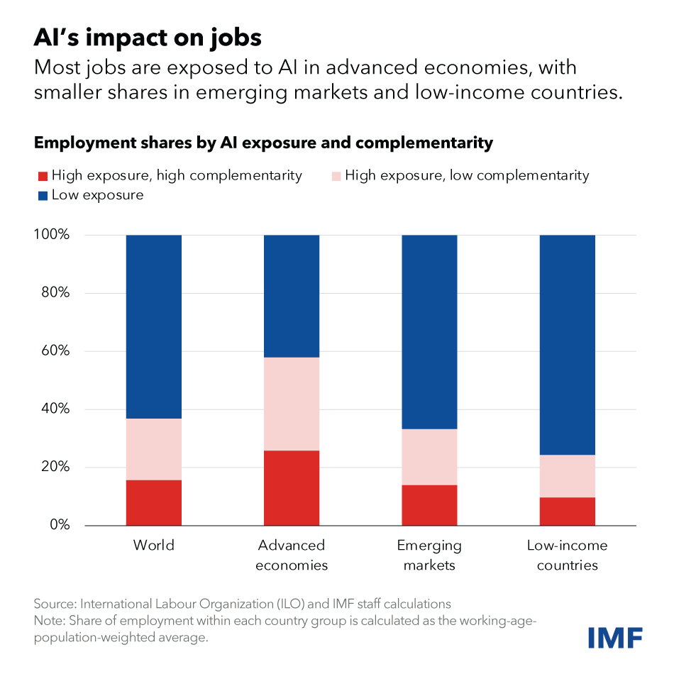
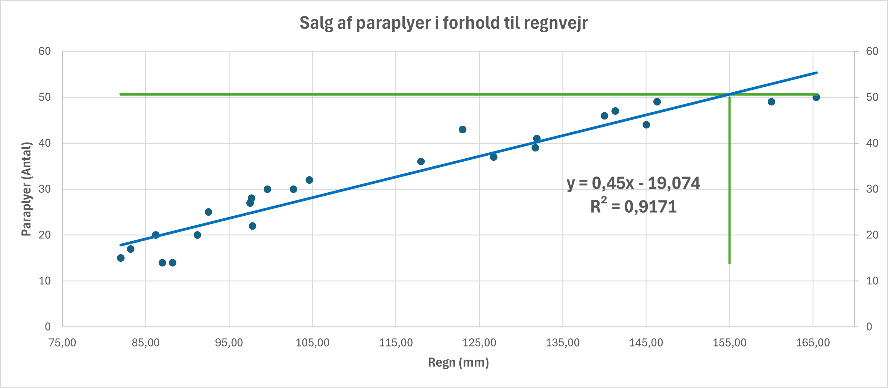

<!-- _color: white -->
<!-- _backgroundColor: black -->

# 02-02-2024  <!-- fit -->
# 2. semester

---

## ChatGPT<!-- fit -->

---

---
<!-- _color: white -->
<!-- _backgroundColor: black -->

# Research shows that **AI can help less experienced workers enhance their productivity more quickly**

---

# Python
Python er et høj niveau, tolket programmeringssprog med en **klar og letforståelig syntaks**, designet til at være let at læse og skrive. 

Python er kendt for et **omfattende standardbibliotek**.

Det er et alsidigt sprog, der anvendes i en bred vifte af applikationer, fra webudvikling til dataanalyse og kunstig intelligens, hvilket gør det til et **populært valg for både begyndere og erfarne udviklere**.

---

<!-- _color: white -->
<!-- _backgroundColor: black -->

# ChatGPT?
## **"Jeg læser på en uddannelse der hedder "Økonomi og IT", hvorfor skal jeg lære at programmere i Python?"**

- Dataanalyse og databehandling
- Automatisering
- Finansiel modellering
- Maskinlæring og kunstig intelligens
- Tværfaglig kompetence
- Fremtidige jobmuligheder
- Fleksibilitet og bred anvendelighed

---

# Deepnote
Deepnote er en **cloud-baseret platform** designet til dataanalyse og maskinlæring, som giver dig mulighed for at køre Python-kode i en interaktiv, delt notebook grænseflade. 

### **Det tilbyder en række fordele over en lokal installation af Python**

- **Ingen installationskrav**
- **Samtidig samarbejde**
- **Adgang fra hvor som helst**
- **Skalerbarhed**
- **Integrerede datakilder og værktøjer**
- **Versionering og deling**

---

# Linear Regression
Lineær regression er en **statistisk metode**, der bruges til at modellere forholdet mellem en **afhængig variabel** og en eller flere **uafhængige variabler** ved at tilpasse en **lineær ligning** til observerede data.

Lineær regression anvendes i mange forskellige feltet, f.eks. økonomi og biologi. Det er en **grundlæggende metode inden for prædiktiv modellering og maskinlæring**.

---

