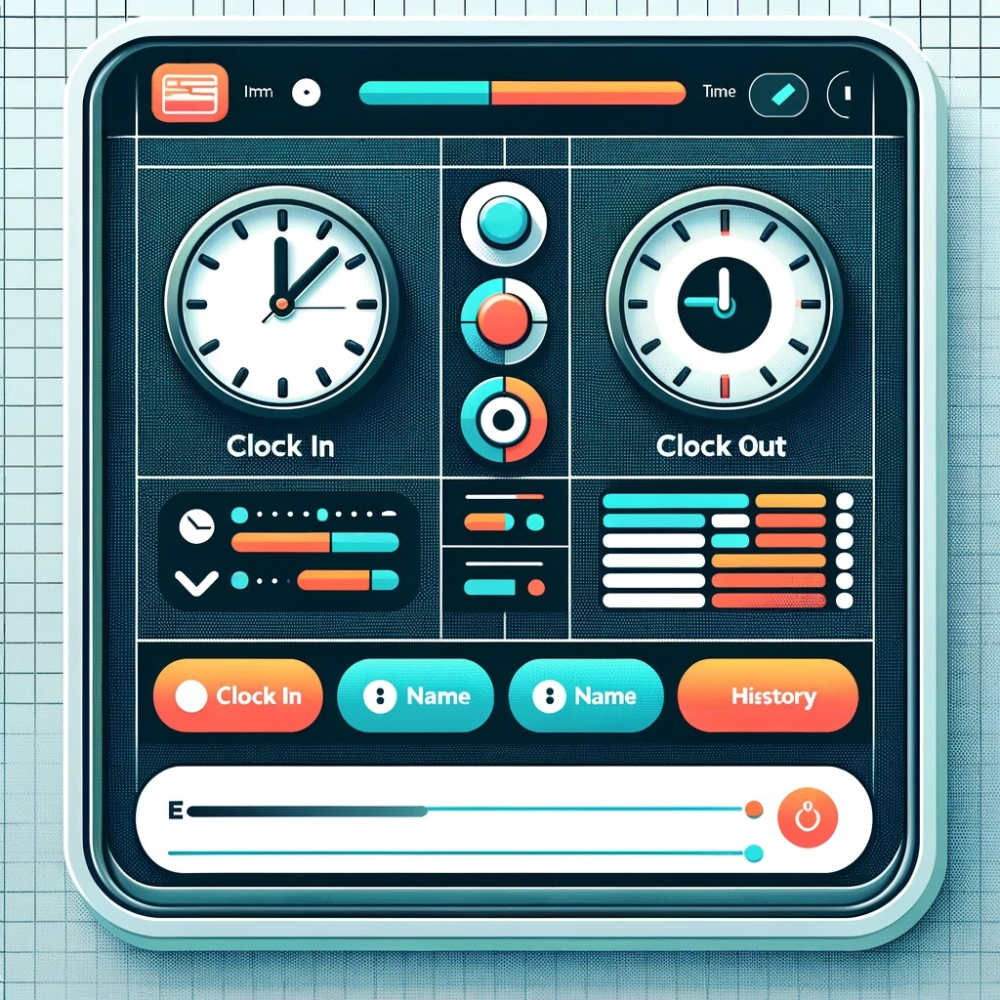

<!-- _color: white -->
<!-- _backgroundColor: black -->

# 26-02-2024  <!-- fit -->
# 2. semester
# **Teknisk kravspecifikation for IT-projekter**<!-- fit -->

---

<!-- _color: white -->
<!-- _backgroundColor: black -->

### **Kravspecifikation**<!-- fit -->

---

<!-- _color: white -->
<!-- _backgroundColor: black -->

# **SMART**<!-- fit -->

- **S**pecifik
- **M**ålbar
- **A**cceptabel
- **R**ealistisk
- **T**idsbestemt

---

<!-- _color: white -->
<!-- _backgroundColor: black -->

# Opgave <!-- fit -->
# **EU Tidsregistrering** <!-- fit -->
## **Frem til 11:45** <!-- fit -->

---

<!-- _color: white -->
<!-- _backgroundColor: black -->
# Regler om tidsregistrering <!-- fit -->
### **I 2019 Fastslog EU, at arbejdsgiveren har pligt til at registrere alle medarbejderes arbejdstid hver dag med fokus på et objektivt grundlag for dialog mellem arbejdsgiver og medarbejder. Denne lov har fokus på at beskytte medarbejderen for overarbejde.**

### Fra den **1. juli 2024** skal alle danske arbejdstagere registrere deres arbejdstid.

---

<!-- _color: white -->
<!-- _backgroundColor: black -->

### I er en del af et **softwareudviklingsteam**, der er blevet bedt om at udvikle en **Smart App** til dette.

### Appen har til formål at **hjælpe** arbejdstagere med nemt at **registrere** deres arbejdstid oprette rapporter og integrere med andre dele af virksomhedens software.

---

<!-- _color: white -->
<!-- _backgroundColor: black -->

# **Opgaver**

1. **Definer Mål**
Brug SMART-kriterierne til at definere klare og målbare mål for appen. 
2. **User Stories**
Skriv mindst 4 user stories, der illustrerer, hvordan forskellige brugere vil interagere med appen.
3. **Feedback**
Præsenter user stories for klassen eller en anden gruppe. Modtag feedback og foreslå forbedringer baseret på feedbacken.

---

<!-- _color: white -->
<!-- _backgroundColor: black -->

# Links
- https://bm.dk/nyheder/nyheder/2024/01/nye-regler-for-registrering-af-ansattes-arbejdstid/
- https://www.ret-raad.dk/ny-lov-om-tidsregistrering-hvad-skal-du-vide/
- https://www.danskerhverv.dk/presse-og-nyheder/nyheder/2024/januar/lov-om-andring-af-arbejdstidsloven-er-nu-vedtaget/