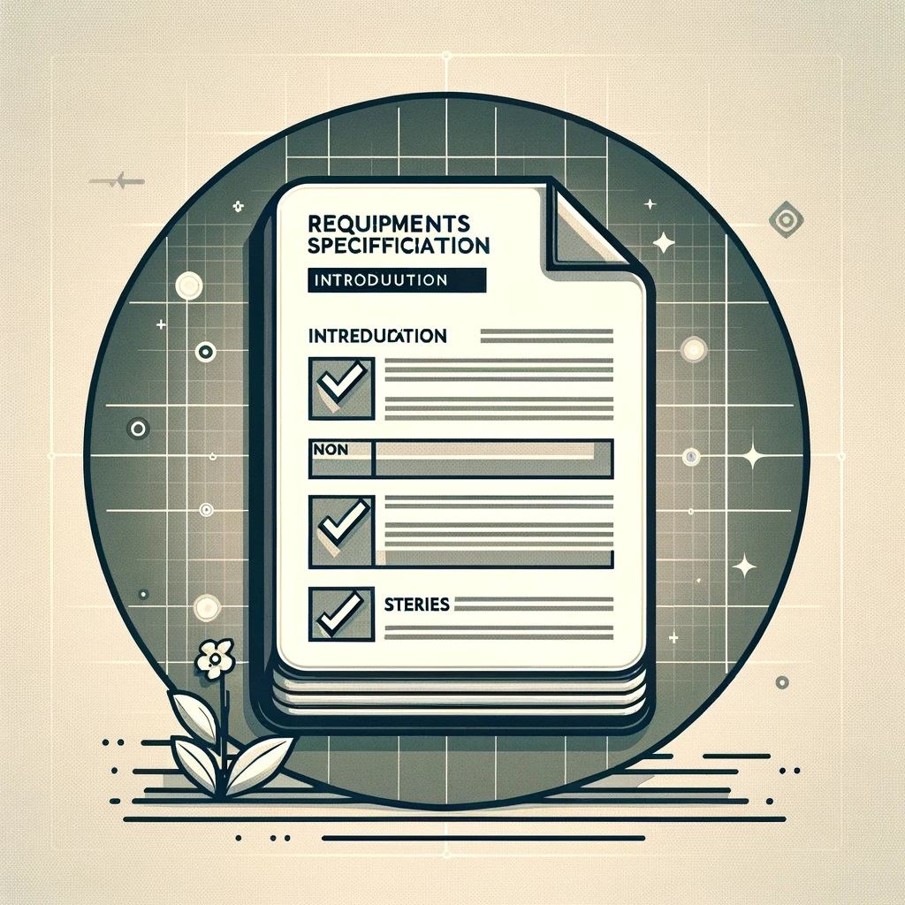
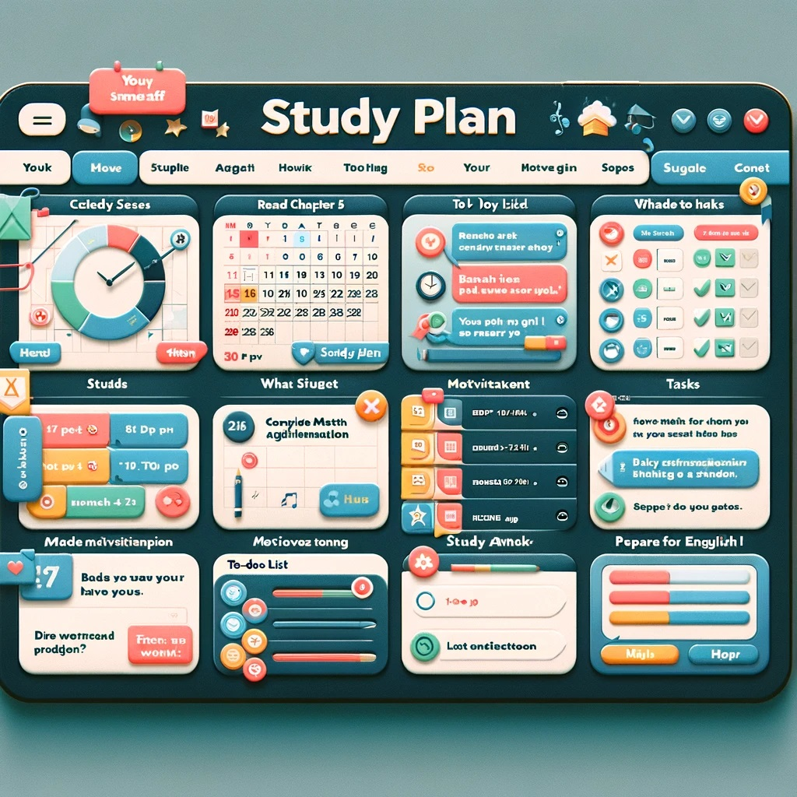

<!-- _color: white -->
<!-- _backgroundColor: black -->

# 26-02-2024  <!-- fit -->
# 2. semester
# **Teknisk kravspecifikation for IT-projekter**<!-- fit -->

---

<!-- _color: white -->
<!-- _backgroundColor: black -->

### **Kravspecifikation**<!-- fit -->

---

<!-- _color: white -->
<!-- _backgroundColor: black -->

# **SMART**<!-- fit -->

- **S**pecifik
- **M**ålbar
- **A**cceptabel
- **R**ealistisk
- **T**idsbestemt

---

<!-- _color: white -->
<!-- _backgroundColor: black -->

# Opgave <!-- fit -->
# **Studieplanlægger** <!-- fit -->
## **Frem til 11:45** <!-- fit -->

---

<!-- _color: white -->
<!-- _backgroundColor: black -->

I er en del af et **softwareudviklingsteam**, der er blevet bedt om at udvikle en "**Smart Studieplanlægger**" app til studerende.

Appen har til formål at **hjælpe** studerende med bedre at **organisere** deres studietid, kursusopgaver, eksamensforberedelser, gruppeprojekter og lign.

---

# **Opgaver**

1. **Definer Mål**
Brug SMART-kriterierne til at definere klare og målbare mål for "*Smart Studieplanlægger*" appen. 
2. **User Stories**
Skriv mindst 4 user stories, der illustrerer, hvordan forskellige brugere vil interagere med appen.
3. **Feedback**
Præsenter user stories for klassen eller en anden gruppe. Modtag feedback og foreslå forbedringer baseret på feedbacken.