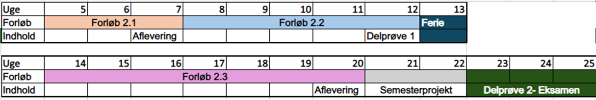

<!-- _color: white -->
<!-- _backgroundColor: black -->
# 2. Semester <!-- fit -->
# 29-01-2024  <!-- fit -->

---

# Oversigt over semesteret  <!-- fit -->

---

# Forløb 2.1
Samfundsøkonomiske aspekter og digitale trends er det overordnede tema på **forløb 2.1**. 

Formålet med forløbet er, at give den studerende en grundlæggende – såvel teoretisk som praktisk -  viden om hvordan en virksomhed anvender **Samfundsøkonomiske** aspekter og **digitale trends**, til at **optimere virksomhedens drift** på såvel kort som på lang sigt. 

**Forløb 2.1** afsluttes med en opgave som er en bunden forudsætning. 
**Dvs. opgaven skal bestås for at man kan komme til eksamen.**

---

# Forløb 2.2 Uge 8 - 11 
Projektstyring og IT er det overordnede tema på forløb 2.2. 

Formålet med forløbet er at give den studerende grundlæggende viden om **hvordan en virksomhed planlægger og styrer projekter både økonomisk og organisatorisk**. 

Der vil blandt andet være fokus på **planlægning**, **prioritering**, **risikovurdering** og **økonomi i it-projekter** samt **interessenthåndtering** og **kommunikation**. 

I forløbet vil der ligeledes være en introduktion til **IT-arkitektur** med henblik på at forstå opbygningen af et it-system. 

**Uge 12: Eksamensuge**
Delprøve 1 **aflevering 22-03-2024** - 30% af karakteren

---

# Forløb 2.3 Uge 14 – 20
Relationer mellem forretning og IT er det overordnede tema på forløb 2.3. 

Formålet med forløbet er at give den studerende viden, færdigheder og kompetencer inden for **forretningsarkitektur**. Arkitekturen udarbejdes med udgangspunkt i virksomhedens strategi og gennem analyse af værdistrømme, kapabiliteter, organisation og domæne begreber, dannes en portefølje af transformations-projekter. 

Derudover fokuseres der på virksomhedens **IT-arkitektur** og platforme fra et teknologisk perspektiv med særligt fokus på **datahåndtering** samt hvordan virksomhedens **IT-økonomi** er struktureret og styret. 

**Forløb 2.3** indeholder en opgave som er en bunden forudsætning. *Dvs. opgaven skal bestås for at man kan komme til eksamen.*

---

# Uge 21 – 22 - Eksamenscase
Delprøve 2 - Semesterprojekt - 70% af karakteren

- 21-05-2024 - Præsentation og start på opgaven
- 31-05-2024 - Afleveringsfrist i WISEflow
- Uge 24 - Mundtlig eksamen

---

# Forløb 2.1 <!-- fit -->
- 3 uger
- Fokus på:
    - *Samfundsøkonomi*
    - *Projektstyring* 
    - *Databehandling*
- Virksomheds case **SimCorp**
- Afsluttes med en **aflevering 16-02-2024**

---

# Grupper <!-- fit -->

- **3 til 5 pr. gruppe**
- Link til gruppedokument: [https://bit.ly/gp_2_2024_1](https://bit.ly/gp_2_2024_1)
- Gruppekontrakt

---

---

# SimCorp

- [www.simcorp.com](https://www.simcorp.com)
- [White Paper](../simcorp/SimCorp_Machine_learning_white_paper.pdf)