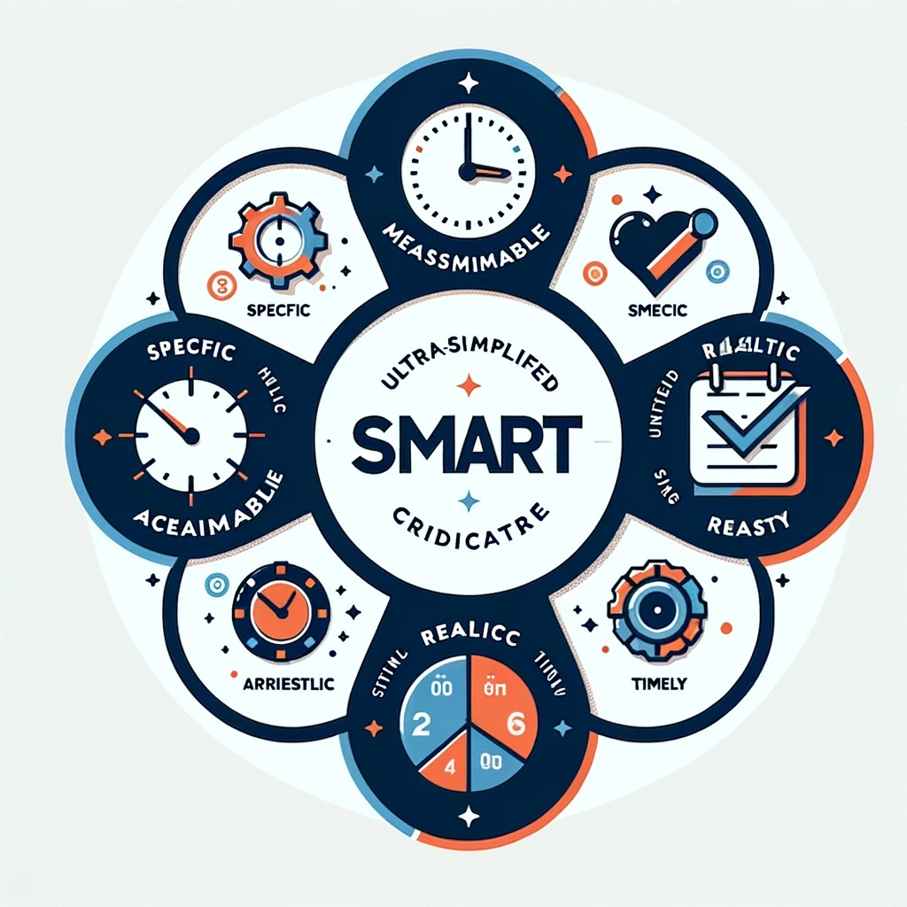

[HOME](../index.md){: .btn .btn-blue }

# Teknisk kravspecifikation for IT-projekter

# SMART
SMART-kriterierne bruges til at formulere en teknisk kravspecifikation for IT-projekter hjælper med at sikre, at kravene er **klare**, **målbare** og **opnåelige**. 

**SMART** står for:

- **S**pecifik
- **M**ålbar
- **A**cceptabel
- **R**ealistisk
- **T**idsbestemt

eller på engelsk:

- **S**pecific
- **M**easurable
- **A**chievable
- **R**ealistic
- **T**imely

# Specifik
## **Brugerkrav og Systemkrav**
Kravene skal være klart definerede og detaljerede. I stedet for **vage** beskrivelser, brug **præcise** angivelser af, hvad systemet skal gøre. 

## Funktionelle krav
Detaljerede beskrivelser af systemets funktioner og tjenester.

Her under **Sikkerhedskrav** som:
- Autentifikation og autorisation
- Datakryptering og beskyttelse af personlige oplysninger
- Compliance med relevante sikkerhedsstandarder og lovgivning (*f.eks. GDPR*)

## Ikke-funktionelle krav
Performance, sikkerhed, brugervenlighed, pålidelighed, tilgængelighed, og vedligeholdelseskrav.

For eksempel, i stedet for at sige "*systemet skal være hurtigt*", specificer "**systemet skal indlæse sider indenfor 2 sekunder.**"

## Grænseflader
- Brugergrænseflade (*UI*) design og brugeroplevelse (*UX*) krav
- System-til-system interfacekrav, inklusiv API-specifikationer

# Målbar:
## **Performance og Ikke-funktionelle Krav**
Det skal være muligt at måle, om kravene er opfyldt. 

*For eksempel, hvis der er et krav om systemtilgængelighed på 99,9%, skal dette kunne bekræftes gennem test eller overvågning.*

## **Testkrav**
Definer klare kriterier for accepttest, så det kan måles, om leverede løsninger opfylder kravspecifikationerne.

- Teststrategi og testtilfælde
- Kriterier for accepttest

# Acceptabel
## **Stakeholder Involvering**
Sikre, at kravene er accepterede og godkendte af alle relevante stakeholders, herunder udviklingsteamet, forretningspartnere og slutbrugere. **Dette omfatter at have klare prioriteter for kravene, så der er enighed om, hvad der er mest vigtigt**.

# Realistisk
## **Tekniske Restriktioner og Ressourcer**
Kravene skal være realistiske og opnåelige inden for de givne tekniske begrænsninger og tilgængelige ressourcer. Dette indebærer en vurdering af de valgte teknologier, teamets færdigheder og projektbudgettet.

- Teknologivalg (*programmeringssprog, databaser, hardware, frameworks, biblioteker*)
- Kompatibilitetskrav (*browsere, operativsystemer, enheder*)
- Tredjeparts integrationer og afhængigheder

# Tidsbestemt
## **Projektomfang og Milepæle**
Der skal være klare deadlines for opfyldelse af kravene, herunder milepæle og leveringsdatoer. Dette hjælper med at sikre, at projektet holder sig indenfor tidsplanen og giver mulighed for regelmæssig statusvurdering.

# Brug SMART-kriterierne
For at integrere **SMART-kriterierne** effektivt i **tekniske kravspecifikationer**, bør du:

- Starte med klare og specifikke mål for projektet, som kan brydes ned i specifikke krav
- Fastlægge, hvordan succes vil blive målt, både for det overordnede projekt og for individuelle krav
- Sikre accept fra alle stakeholders ved at inkludere dem i processen med at definere og godkende kravene
- Vurder realisme ved at tage højde for eksisterende teknologier, teamkompetencer og andre ressourcer
- Planlægge med tidsrammer for hvert krav og for projektet som helhed, med klare deadlines og checkpunkter

# **Opgave** - Studieplanlægger
I er en del af et softwareudviklingsteam, der er blevet bedt om at udvikle en "**Smart Studieplanlægger**" app til studerende. Appen har til formål at hjælpe studerende med bedre at organisere deres studietid, kursusopgaver, eksamensforberedelser, gruppeprojekter og lign.

## Opgave 1 - Definer Mål
### **Definer Målene med SMART-kriterier**
Brug SMART-kriterierne til at definere klare og målbare mål for "*Smart Studieplanlægger*" appen. 

Dette kunne inkludere funktioner som:
- automatisk planlægning baseret på deadlines
- påmindelser om opgaver
- integration med skolens kursusdatabaser (*Fronter*)
- tilpassede studieanbefalinger
- overførsel til Outlook/Office 365
- osv.

**HUSK** hvert mål skal være:

- **S**pecifik: *Hvad præcist appen skal gøre*
- **M**ålbar: *Hvordan succes vil blive målt*
- **O**pnåelig: *Sikre, at målene er realistiske med de ressourcer, der er til rådighed*
- **R**elevant: *Målene skal være relevante for de studerendes behov*
- **T**idsbestemt: *Fastlæg en frist for, hvornår disse mål skal være opnået*

## Opgave 2 - User Stories
### **Skriv User Stories**
- Ud fra de definerede **SMART**-mål, skriv mindst 4 user stories, der illustrerer, hvordan forskellige brugere vil interagere med appen.
- Prioriter disse User Stories

### Inkluder
- En titel for hver story for at opsummere dens essens
- Beskrivelse af brugeren (*persona*) for hver story
- Brugerens **behov** og den **værdi**, appen tilbyder, formuleret som: 

"**Som en** [*type bruger*], **ønsker jeg** [*et behov eller en funktion*], **så jeg kan** [*opnået fordel*]."

- Acceptkriterier, der specificerer de betingelser, som skal opfyldes, for at user storyen anses for at være fuldført
- Nedbryd **én** af disse User Stories i task

## Opgave 3 - Feedback
### **Feedback og Revision**
- Præsenter user stories for klassen eller en anden gruppe
- Modtag feedback og foreslå forbedringer baseret på feedbacken
- Revider jeres user stories og SMART-mål baseret på den modtagne feedback

# Links
- [Officielle Scrum Guides og Dokumentation - scrumguides.org](https://scrumguides.org). Tilbyder den officielle Scrum Guide gratis, hvilket er en essentiel læsning for alle, der arbejder med Scrum.
- [www.agilealliance.org](https://www.agilealliance.org). En organisation dedikeret til fremme af agile udviklingsmetoder, som ofte afholder webinars og tilbyder ressourcer om agile praksis.
- [Scrum.org Blog](https://www.scrum.org)
- [The Mountain Goat Software Blog - https://www.mountaingoatsoftware.com/blog](https://www.mountaingoatsoftware.com/blog). En fremragende kilde til indsigt i agile metoder og praktisk rådgivning om brug af user stories og SMART-kriterier.
- [Learn Scrum in simple terms](https://github.com/imalitavakoli/learn-scrum)