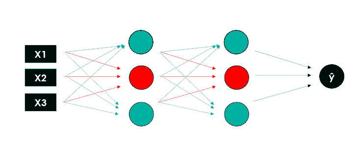
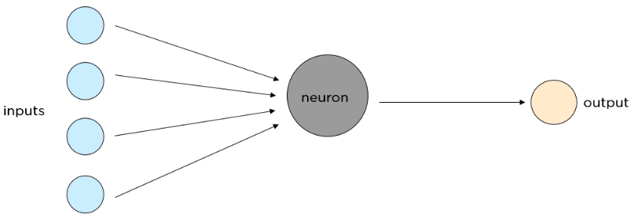

[HOME](../index.md){: .btn .btn-blue }

  

    Table of contents
  

  {: .text-delta }
1. TOC
{:toc}

# Deep Learning
**Deep Learning** is a type of machine learning that imitates the way humans gain certain types of knowledge, and it got more popular over the years compared to standard models. 

While traditional algorithms are linear, Deep Learning models, generally Neural Networks, are stacked in a hierarchy of increasing complexity and abstraction (*therefore the “deep” in Deep Learning*).

# Neural Networks
**Neural Networks** are based on a collection of connected units (*neurons*), which, just like the synapses in a brain, can transmit a signal to other neurons, so that, acting like interconnected brain cells, they can learn and make decisions in a more human-like manner.

A neural network has three main layers.
- **Input Layer**: This layer is responsible for accepting the inputs
- **Hidden Layer**: This layer processes the input data to find out hidden information and performs feature extraction
- **Output Layer**: This layer gives the desired output

There are two main libraries for building Neural Networks: **TensorFlow** (*developed by Google*) and **PyTorch** (*developed by Facebook*). 

They can perform similar tasks, but the **TensorFlow** is more production-ready while **PyTorch** is good for building rapid prototypes because it is easier to learn.

# TensorFlow
TensorFlow is an end-to-end open source platform for machine learning. It has a comprehensive, flexible ecosystem of tools, libraries and community resources that lets researchers push the state-of-the-art in ML and developers easily build and deploy ML powered applications.

# Video fra TensorFlow
## Intro to Machine Learning
<iframe width="560" height="315" src="https://www.youtube.com/embed/KNAWp2S3w94" title="YouTube video player" frameborder="0" allow="accelerometer; autoplay; clipboard-write; encrypted-media; gyroscope; picture-in-picture" allowfullscreen></iframe>

## TensorFlow 2.0 and Keras
<iframe width="560" height="315" src="https://www.youtube.com/embed/wGI_VtE9CJM" title="YouTube video player" frameborder="0" allow="accelerometer; autoplay; clipboard-write; encrypted-media; gyroscope; picture-in-picture" allowfullscreen></iframe>

# Simpel Demo
Consider the following sets of **numbers**. **Can you see the relationship between them?**

| X: | -1 | 0 | 1 | 2 | 3  | 4  |
| Y: | -2 | 1 | 4 | 7 | 10 | 13 |

As you look at them, you might notice that the value of **X** is **increasing** by **1** as you read left to right and the corresponding value of **Y** is **increasing** by **3**.

You probably think that Y equals 3X plus or minus something. 

Look at the **0** on **X** and see that **Y** is **1**, and you'd come up with the relationship

**Y=3X+1**

*How would you train a neural network to do the equivalent task?*

*By feeding it with a set of X's and a set of Y's, it should be able to figure out the relationship between them.*

## Jupyter Lab file
[Simpel_ML.ipynb](./Simpel_ML.ipynb)