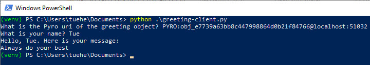

<span class="fs-1">
[HOME](./index.md){: .btn .btn-blue }
</span>

# Pyro
Pyro is a library that enables you to build applications in which objects can talk to each other over the network, with minimal programming effort.

Essentially, Pyro can be used to distribute and integrate various kinds of resources or responsibilities: computational (hardware) resources (cpu, storage, printers), informational resources (data, privileged information) and business logic (departments, domains).

An example would be a high performance compute cluster with a large storage system attached to it. Usually this is not accessible directly, rather, smaller systems connect to it and feed it with jobs that need to run on the big cluster. Later, they collect the results. 

Pyro could be used to expose the available resources on the cluster to other computers. Their client software connects to the cluster and calls the Python program there to perform its heavy duty work, and collect the results (*either directly from a method call return value, or perhaps via asynchronous callbacks*).

[Pyro 4 Manuel](https://pyro4.readthedocs.io/en/stable/index.html)

## Simple Example
This example will show you in a nutshell what it’s like to use Pyro in your programs. 

We’re making a simple **greeting service** that will return a personalized greeting message to its **callers**. 

First you need to install Pyro

    pip3 install pyro

*Consider using a virtuel enveiroment!*

Let’s see the server code - **greeting-server.py**:

```python
# greeting-server.py
import Pyro4

@Pyro4.expose
class GreetingMaker(object):
    def get_fortune(self, name):
        return "Hello, {0}. Here is your message:\n" \
               "Always do your best".format(name)

daemon = Pyro4.Daemon()                # make a Pyro daemon
uri = daemon.register(GreetingMaker)   # register the greeting maker as a Pyro object

print("Ready. Object uri =", uri)      # print the uri so we can use it in the client later
daemon.requestLoop()                   # start the event loop of the server to wait for calls
```

Open a console window and start the greeting server:

    python greeting-server.py


You get a Pyro id, in my case it is: **PYRO:obj_e7739a63bb8c447998864d0b21f84766@localhost:51032**

You need this later.

The client code that invokes the server:

```python
# greeting-client.py
import Pyro4

uri = input("What is the Pyro uri of the greeting object? ").strip()
name = input("What is your name? ").strip()

greeting_maker = Pyro4.Proxy(uri)         # get a Pyro proxy to the greeting object
print(greeting_maker.get_fortune(name))   # call method normally
```

Start this client program - **from a different console window**

    python greeting-client.py



The client code called the greeting maker that was running in the server elsewhere, and printed the resulting greeting string.

## Pyro files
- [greeting-server.py](./code/Pyro4_Demo/greeting-server.py)
- [greeting-client.py](./code/Pyro4_Demo/greeting-client.py)

# Pyro excamples
Pyro has created 2 excamples:

- [Building a Warehouse](https://pyro4.readthedocs.io/en/stable/tutorials.html#building-a-warehouse)
- [Building a Stock market simulator](https://pyro4.readthedocs.io/en/stable/tutorials.html#building-a-stock-market-simulator)

**Pick one and go true the setup procedure!**


