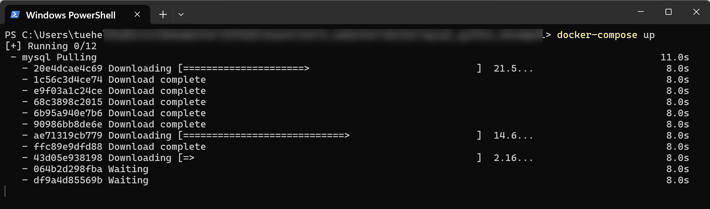

<span class="fs-1">
[HOME](./index.md){: .btn .btn-blue }
</span>

# Docker 4. semester 2024


# Docker eksempel i 6 trin
To Docker-containere skal kommunikerer med hinanden, via en *simpel* Python applikation, der involverer en **MySQL-database i én container** og en **Python-applikation i en anden**, der tilgår denne database. 

Følgende 6 trin guider dig gennem oprettelsen af dette setup ved brug af **Docker Compose**, som er et værktøj til at definere og køre multi-container Docker-applikationer.

## Trin 1 - Installér Docker og Docker Compose
Docker og Docker Compose skal være installeret på din computer.

Docker Compose følger typisk med når du installere Docker Desktop på Windows og Mac.

## Trin 2 - Opret din projektstruktur
Mappestruktur for dette projekt.

```cmd
projekt/
├── db
│   └── init.sql
├── app
│   └── app.py
└── docker-compose.yml
```

- **db/init.sql** indeholder SQL-kommandoer til at initialisere databasen.
- **app/app.py** er den Python-applikation, der tilgår MySQL-databasen.
- **docker-compose.yml** definere, hvordan dine containers skal bygges og interagere.

## Trin 3 - Definer MySQL-databasen
I **db/init.sql**, tilføj SQL-kommandoer til at oprette din database og tabeller.

```sql
CREATE DATABASE if not exists dockerdemo;
USE dockerdemo;

CREATE TABLE if not exists users (
    id INT AUTO_INCREMENT PRIMARY KEY,
    name VARCHAR(50) NOT NULL,
    klasse VARCHAR(20) NOT NULL
);

INSERT INTO users (name) 
VALUES ('Ole', 'DA4'), ('Lis'. 'DA2'), ('Kim', 'DA4');
```

## Trin 4 - Opret Python-applikation
I **app/app.py**, skriv en denne Python-applikation, der forbinder til Docker containeren med MySQL-databasen og henter data fra denne:

```Python
# Install
#pip install mysql-connector-python
#<full path to python> -m pip install mysql-connector-python

# Moduler
import mysql.connector
import os

# Miljøvariabler for databaseforbindelse
db_host = os.getenv('DB_HOST', 'localhost') # 127.0.0.1
db_user = os.getenv('DB_USER', 'root')
db_password = os.getenv('DB_PASSWORD', 'Naimo6868/?') # MySQL Database password
db_database = os.getenv('DB_DATABASE', 'dockerdemo')

# Opret databaseforbindelse
connection = mysql.connector.connect(
    host=db_host,
    user=db_user,
    password=db_password,
    database=db_database
)

# Hent data - SQL
cursor = connection.cursor()
cursor.execute("SELECT * FROM studerende")
rows = cursor.fetchall()

for row in rows:
    print(row)

# Oprydning - Luk forbindelse
cursor.close()
connection.close()
```

**Bemærk** at Database forbindelses oplysninger normalt skal være i en INI fil af sikkerheds årsager.

## Trin 5 - Opret docker-compose.yml
Definer din **Docker Compose-konfiguration**. Dette vil sætte både MySQL- og Python-applikationen op til at køre i separate containere.


docker-compose.yml
```yml
version: '3.8'
services:
  mysql:
    image: mysql:5.7
    environment:
      MYSQL_ROOT_PASSWORD: example
    volumes:
      - ./db/init.sql:/docker-entrypoint-initdb.d/init.sql
    ports:
      - "3306:3306"

  app:
    build: ./app
    depends_on:
      - mysql
    environment:
      DB_HOST: mysql
      DB_USER: root
      DB_PASSWORD: example
      DB_DATABASE: dockerdemo
```

I app-delen skal build: **./app** angive stien til din applikations mappe. 

Hvis du **ikke** har en Dockerfile i app-mappen, skal du oprette en med følgende indhold.

docker
```yml
FROM python:3.8
WORKDIR /usr/src/app
COPY . .
RUN pip install mysql-connector-python
CMD ["python", "./app.py"]
```

## Trin 6 - Kør din Docker Compose-konfiguration
Naviger til din projektmappe i en terminal og kør følgende kommando:

```cmd
docker-compose up
```

Dette vil bygge din applikation og starte begge containers. 



Python-applikationen vil forbinde til MySQL-databasen og vise dataene hentet fra users-tabellen.

Dette eksempel introducerer grundlæggende Docker koncepter, der kommunikerer med hinanden.

# Fejlsøgning

## Sikr dig, at containeren kører
Først og fremmest, sørg for, at din MySQL-container rent faktisk kører. Brug følgende kommando til at tjekke status for dine Docker-containere

```cmd
docker ps
```

Denne kommando viser en liste over alle kørende containere. Tjek, at din MySQL-container er på listen, og at den bruger de korrekte porte.

## Tjek Docker Compose-logfilerne
Brug docker-compose logs kommandoen til at se logfilerne for din MySQL-container. Dette kan give dig indsigt i eventuelle fejl eller problemer, som MySQL-serveren støder på under opstarten.

```cmd
docker-compose logs mysql
```

## Genstart Docker Compose
Nogle gange kan et simpelt genstart af dine Docker Compose-services løse forbindelsesproblemer.

```cmd
docker-compose down
docker-compose up
```

Dette vil stoppe og fjerne de eksisterende containers og derefter oprette og starte dem igen.