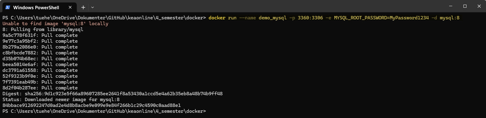
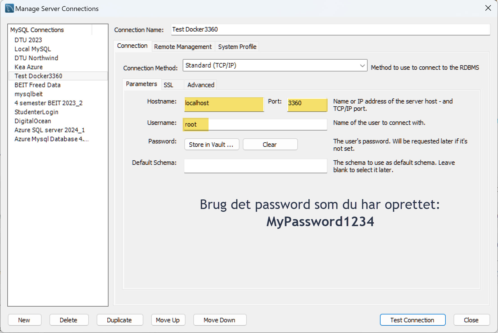
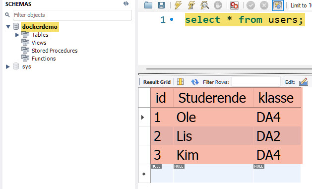
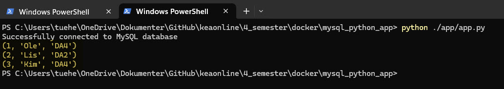

<span class="fs-1">
[HOME](./index.md){: .btn .btn-blue }
</span>

# Docker 4. semester 2024
Docker-containere der kører en MySQL Server og en **Python-applikation**. Når MySQL Docker containeren oprettees skal der afvikles et SQL Script.

Python applikationen (*app.py*) skal hente data fra MySQL containeren.

## Installér Docker og Docker Compose
Først og fremmest skal I have Docker og Docker Compose installeret på jeres computere. 

Docker Desktop inkluderer begge værktøjer for både Windows og Mac:

- [Docker Desktop](https://www.docker.com/products/docker-desktop)
- [Docker installation guide](https://docs.docker.com/engine/install)
- [Docker Compose installation guide](https://docs.docker.com/compose/install)

## Projektstruktur
Mappestruktur for dette projekt.

```cmd
projekt/
├── db
│   └── init.sql
├── app
│   └── app.py
└── docker-compose.yml
└── Dockerfile
```

- **db/init.sql** indeholder SQL-kommandoer til at initialisere databasen.
- **app/app.py** er den Python-applikation, der tilgår MySQL-databasen.
- **docker-compose.yml** definere, hvordan dine containers skal bygges og interagere.
- **Dockerfile**  indeholder en samling af kommandoer og instruktioner, som Docker bruger til at bygge et image

# MySQL Docker
Denne kommando opretter en Docker container med MySQL. 

Det er port **3360** der "*udstilles*", *internt* i Docker Container er det stadig **3306** der er MySQL porten. Dette gøres med kommandoen: **-p 3360:3306**

```cmd
docker run --name demo_mysql -p 3360:3306 -e MYSQL_ROOT_PASSWORD=MyPassword1234 -d mysql:8
```
- **Navn**: --name demo_mysql
- **Port**: - p 3360:3306
- **Password**: -e MYSQL_ROOT_PASSWORD=*MyPassword1234*
- **Tag/Version**: -d mysql:8



# Docker commands
Her er nogle af de vigtigste Docker kommandoer:

- **Start Docker**: **docker start navn**
    - docker start demo_mysql
- **Stop Docker**: **docker stop navn**
    - docker stop demo_mysql
- **Slet Docker container**: **docker rm navn**
    - docker rm demo_mysql 
- **Stop og Slet**: **docker stop navn; docker rm navn**
    - docker stop demo_mysql; docker rm demo_mysql

# MySQL Workbench
Det er nu muligt at oprette forbindelse til MySQL Docker (**demo_mysql**) fra MySQL Workbench.



Det vil her være muligt at oprette database osv. fra Workbench.

## init.sql
Du skal oprette et SQL script der automatisk opretter databasen **dockerdemo**, tabellen **users** og indsætter data i denne, når Docker containeren startes.

SQL scriptet skal gemmes som **init.sql** i mappen **db**.

```cmd
projekt/
├── db
│   └── init.sql
└── docker-compose.yml
└── Dockerfile
```

**init.sql**
```sql
CREATE DATABASE if not exists dockerdemo;
USE dockerdemo;

CREATE TABLE if not exists users (
    id INT AUTO_INCREMENT PRIMARY KEY,
    Studerende VARCHAR(50) NOT NULL,
    klasse VARCHAR(20) NOT NULL
);

INSERT INTO users (Studerende, klasse) 
VALUES ('Ole', 'DA4'), ('Lis', 'DA2'), ('Kim', 'DA4');
```

# docker-compose
Oprettelse af din Docker Compose-konfiguration. Denne vil sætte MySQL op til at køre i en containere.

## MySQL - init.sql
I MySQL delen bliver dit SQL script **init.sql** afviklet.

**docker-compose.yml**
```yml
version: '3.8'

services:

  mysql:
    image: mysql
    container_name: demo_mysql
    environment: 
        MYSQL_ROOT_PASSWORD: MyPassword1234
    volumes: 
        - "./db/init.sql:/docker-entrypoint-initdb.d/init.sql"
    ports:
        - "3360:3306"
```

Din filer skal nu være placeret på denne måde.

```cmd
projekt/
├── db
│   └── init.sql
└── docker-compose.yml
└── Dockerfile
```

## Test - MySQL container
Du kan teste dette med denne Docker kommando:

```cmd
docker-compose up
```

*Husk*: Din **Docker demon** skal kører - Start Docker desktop.

Du kan forbinde til denne container med din Workbench, husk det er **port 3360**.



# Python app
Opret en simpel Python App, **app.py**, der forbinder til MySQL-databasen og udfører en simpel forespørgsel i databasen. Placer den i mappen - **app** 

**app.py**
```python
import mysql.connector

def connect_to_mysql():
    while True:
        try:
            connection = mysql.connector.connect(
                host="localhost",
                port=3360,
                user="root",
                password="MyPassword1234",
                database="dockerdemo"
            )
            if connection.is_connected():
                print("Successfully connected to MySQL database")
                return connection
        except mysql.connector.Error as e:
            print("Error while connecting to MySQL", e)
            time.sleep(3)

def fetch_data(connection):
    cursor = connection.cursor()
    cursor.execute("select * from users;")
    record = cursor.fetchall()

    for x in record:
        print(x)

if __name__ == '__main__':
    conn = connect_to_mysql()
    fetch_data(conn)
```

Din filer skal nu være placeret på denne måde.

```cmd
projekt/
├── db
│   └── init.sql
├── app
│   └── app.py
└── docker-compose.yml
└── Dockerfile
```

## app.py
Du kan nu afvikle dit Python script.

```cmd
python ./app/app.py
```



# Fejlsøgning

## Sikr dig, at containeren kører
Først og fremmest, sørg for, at din MySQL-container rent faktisk kører. Brug følgende kommando til at tjekke status for dine Docker-containere

```cmd
docker ps
```

Denne kommando viser en liste over alle kørende containere. Tjek, at din MySQL-container er på listen, og at den bruger de korrekte porte.

## Tjek Docker Compose-logfilerne
Brug docker-compose logs kommandoen til at se logfilerne for din MySQL-container. Dette kan give dig indsigt i eventuelle fejl eller problemer, som MySQL-serveren støder på under opstarten.

```cmd
docker-compose logs mysql
```

## Genstart Docker Compose
Nogle gange kan et simpelt genstart af dine Docker Compose-services løse forbindelsesproblemer.

```cmd
docker-compose down
docker-compose up
```

Dette vil stoppe og fjerne de eksisterende containers og derefter oprette og starte dem igen.

# Ressourcer
- [Docker Docs](https://docs.docker.com)
- [Docker Compose](https://docs.docker.com/compose)
- [MySQL Docker Image](https://hub.docker.com/_/mysql)
- [Python Docker Image](https://hub.docker.com/_/python)
- [Docker Desktop](https://www.docker.com/products/docker-desktop)
- [Docker installation guide](https://docs.docker.com/engine/install)
- [Docker Compose installation guide](https://docs.docker.com/compose/install)