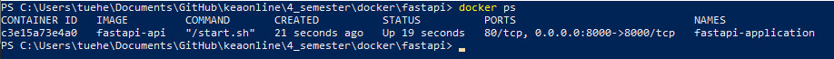

# Compose sample FastAPI application

## Project structure

    ├── compose.yaml
    ├── Dockerfile
    ├── requirements.txt
    ├── app
       ├── main.py
       ├── __init__.py


## compose.yaml

    services:
    api:
        build: .
        container_name: fastapi-application
        environment:
        PORT: 8000
        ports:
        - '8000:8000'
        restart: "no"


## main.py
```python
from fastapi import FastAPI

app = FastAPI()


@app.get("/")
def hello_world():
    return {"message": "OK"}
```

# Deploy with docker compose

    docker-compose up -d --build

## Expected result
Listing containers must show one container running and the port mapping as below.

run: **docker ps**



After the application starts, navigate to http://localhost:8000 in your web browser and you should see the following json response:

    {
    "message": "OK"
    }

# Stop and remove the containers

    $ docker compose down