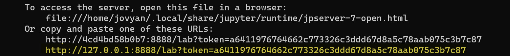
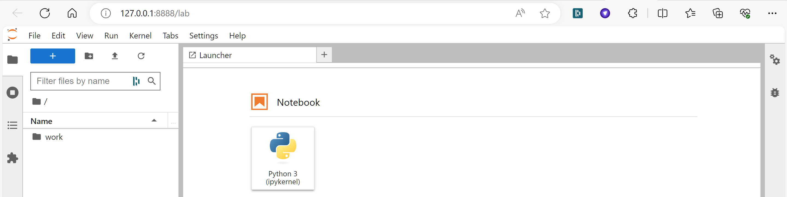

<span class="fs-1">
[HOME](./index.md){: .btn .btn-blue }
</span>

# Jupyter Lab

## Run

```
docker run -p 8888:8888 jupyter/minimal-notebook 
```






## Link
- https://github.com/jupyter/docker-stacks
- https://jupyter.org/
- https://jupyterlab.readthedocs.io/en/stable/getting_started/installation.html
