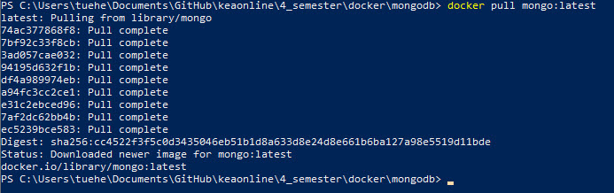
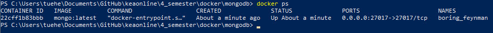
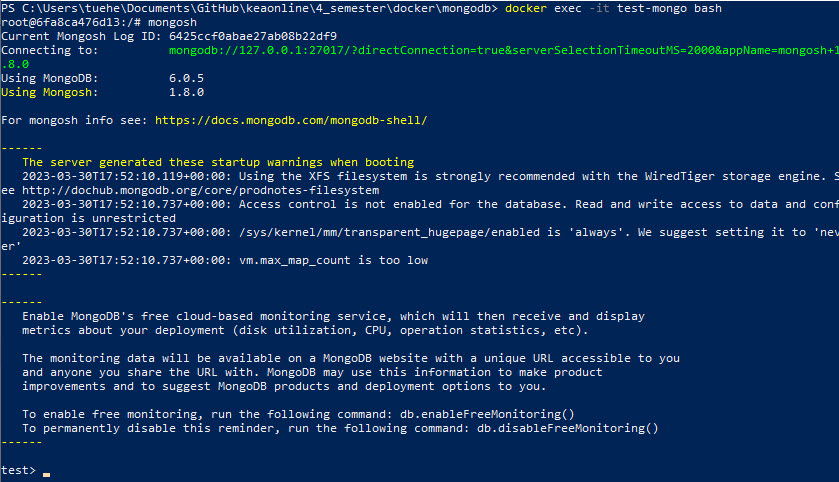
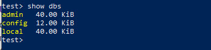

# Run MongoDB as a Docker Container
How to run the open-source document-oriented database MongoDB as docker container.

## Pull the MongoDB container

    docker pull mongo:latest

## Run the container

    docker run -d -p 27017:27017 --name test-mongo mongo:latest

Where **-d** flag runs the container in detach (*background*) mode, **-p 27017:27017**  bound container’s port **27017 to 27017**.

## Verify the state

    docker ps

## Access the MongoDB shell in the running container

    docker exec -it test-mongo bash

run to access MongoDB

    mongosh

## Show
The **show dbs** command will display all your existing databases.

Here, you have the **admin**, **config**, and *local* databases, which are empty initially. 

For details on the different functions that are available from the shell, type **help**. This will provide a list of some of the database methods available, including commands to display the database’s collections and information.
