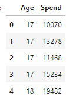
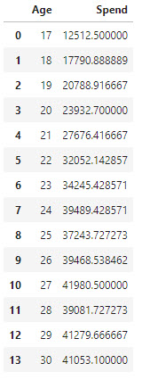
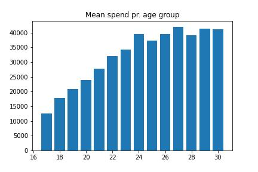
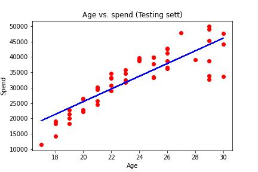

# Webshop - Assignment
Purchases distributed on the different age groups, from a webshop

## Data
Data are in a Excel file: spend_age.xlsx

- [Download - spend_age.xlsx](./spend_age.xlsx)
- [Download Jupyter Lab file  - SpendData.ipynb](./SpendData.ipynb)



## Tasks
It is your task to make the following:

### Spend pr. group
You have to create a "Table" with the mean spend pr. Age group.

Group by Age:

```python
group_age_spend = df[['Age', 'Spend']].groupby(['Age'], as_index=False).mean().sort_values(by='Age')
group_age_spend
```
Mean spend pr. age group:



```python
plt.title('Mean spend pr. age group')
plt.bar(x='Age', height='Spend', data=group_age_spend)
plt.savefig("./image/spend_3.jpg")
```



## Data Preprocessing
Now that we have imported the dataset, we will perform data preprocessing.

```python
X = df.iloc[:,:-1].values  # Independent variable array
y = df.iloc[:,1].values    # Dependent variable vector
```

## Splitting the dataset
```python
X_train, X_test, y_train, y_test = train_test_split(X,y,test_size=1/3,random_state=0)
```

## Fitting linear regression model into the training set
```python
regressor = LinearRegression()
regressor.fit(X_train, y_train) # Produces the linear eqn for the data
```

## Predicting the test set results
```python
y_pred = regressor.predict(X_test) 
y_pred
```

Show the test "set"

```python
y_test
```

- y_test is the real salary of the test set.
- y_pred are the predicted salaries.

## Visualizing the results
Let’s see what the results of our code will look like when we visualize it.

- Plotting the points (observations)
- Plotting the regression line


## Plot for the Training set
```python
plt.scatter(X_train, y_train, color='red') # Plotting the observation 
plt.plot(X_train, regressor.predict(X_train), color='blue') # Plotting the regression line
plt.title('Age vs. spend (Training set)')
plt.xlabel('Age')
plt.ylabel('Spend')
plt.savefig("./image/spend_4.jpg")
plt.show()
```

### Linear regression


## Plot for the Testing set
```python
plt.scatter(X_test, y_test, color='red') # Plotting the observation 
plt.plot(X_train, regressor.predict(X_train), color='blue') # Plotting the regression line
plt.title('Age vs. spend (Testing sett)')
plt.xlabel('Age') 
plt.ylabel('Spend') 
plt.savefig("./image/spend_5.jpg")
plt.show()
```

