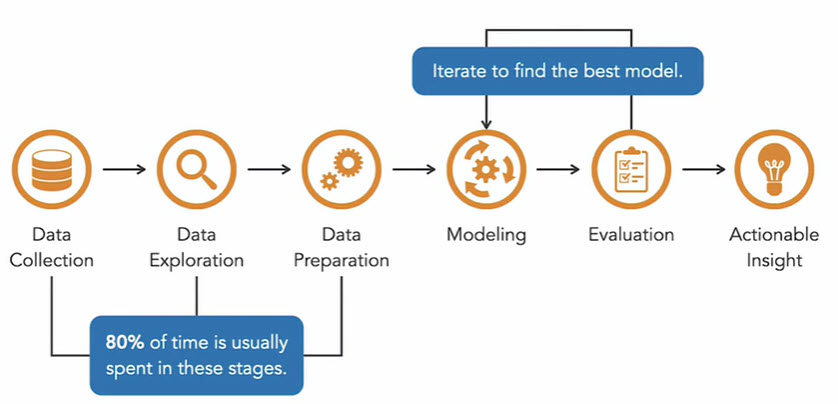
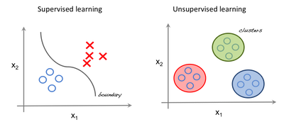

<span class="fs-1">
[HOME](../index.md){: .btn .btn-blue }
</span>

## Dates
- DK
    - 19-04-2023
    - 25-04-2023
- INT
    - 19-04-2023
    - 26-04-2023 

## Link
- Slide
    - [HTML](./slide/Slide_Machine_Learning.html)
    - [PDF](./slide/Slide_Machine_Learning.pdf)
- [ML in Power BI](./mlpowerbIpyc.md)
- [PyCaret](./PyCaret.md)
- [Using Jupyter Lab in a Virtual Environment](https://officegeek.github.io/keaonline/python/Using_Jupyter_Lab_in_Virtual_Environme.html)


# Machine Learning
Machine learning is all around us. From antilock braking systems, to autopilot systems in airplanes and cars, smart speakers, which serve as personal digital assistants, to systems that learn our movie preferences and recommend what to watch next in Netflix.

*Machine Learning is the process of creating models that can perform a certain task without the need for a human explicitly programming it to do something*

# Steps in Machine Learning
There are six major steps in the machine learning process.

1. Data Collection
2. Data Exploration
3. Data Preparation
4. Modeling
5. Evaluation
6. Insights



# Exploratory data analysis - EDA
In statistics, **Exploratory Data Analysis** (*EDA*) is an approach of analyzing data sets to summarize their main characteristics, often using statistical graphics and other data visualization methods.

[EDA](./exploratory_data_analysis.md)

# Definitions
**Artificial Intelligence** (*AI*) refers to the simulation of human intelligence processes by machines, including learning, reasoning and self-correction

**Machine learning** (*ML*) is an application of AI generating systems that can learn and improve without being programmed

**Deep Learning** (*DL*) is a subset of Machine Learning and Artificial Intelligence. The term refers to a particular approach used for creating and training neural networks that are considered highly promising decision-making nodes


# Machine Learning algorithms
- [Supervised Learning](#supervised-learning)
- [Unsupervised Learning](#unsupervised-learning)
- [Reinforcement Learning](#reinforcement-learning)




# Supervised Learning
The area of Machine Learning where you have a set of independent variables which helps you to analyse the dependent variable and the relation between them

Whatever you want to predict is called as Dependent Variable, while variables that you use to predict are called as Independent Variables

You want to predict the **age** of the person 
based on the person’s **height** and **weight**, 
then **height** and **weight** will be the **independent** variables, while **age** will be the **dependent** variable

Supervised learning is the most popular paradigm for machine learning. It is the easiest to understand and the simplest to implement.

## Regression
Regression is the kind of Supervised Learning that learns from the Labelled Datasets and is then able to predict a continuous-valued output for the new data given to the algorithm.

It is used whenever the output required is a number such as money or height etc. 

- Linear Regression 
- Logistic Regression


## Linear Regression
This algorithm assumes that there is a linear relationship between the 2 variables, Input (X) and Output (Y), of the data it has learnt from.

The Input variable is called the Independent Variable and the Output variable is called the Dependent Variable. 

When unseen data is passed to the algorithm, it uses the function, calculates and maps the input to a continuous value for the output.


## Logistic Regression
This algorithm predicts discrete values for the set of Independent variables that have been passed to it.

It does the prediction by mapping the unseen data to the logit function that has been programmed into it. 

The algorithm predicts the probability of the new data and so it’s output lies between the range of 0 and 1.


# Unsupervised Learning
You **don’t have any dependent variable**. You just have collection of variables and try to find out similarity between them and classify them into clusters

## Unsupervised Learning - Examples
- **Customer segmentation**, or understanding different customer groups around which to build marketing or other business strategies
- **Recommender systems**, which involve grouping together users with similar viewing patterns in order to recommend similar content.
- **Anomaly detection**, including fraud detection or detecting defective mechanical parts - predictive maintenance

# Reinforcement Learning
It is the training of machine learning models to make a sequence of decisions.

The *machine* learns to achieve a goal in an uncertain, potentially complex environment. The *machine* employs trial and error to come up with a solution to the problem.

## Facebook - Horizon
Facebook has developed an open-source reinforcement learning **platform — Horizon**. The platform uses reinforcement learning to optimize large-scale production systems.

**Facebook has used Horizon internally**

- To personalize suggestions
- Deliver more meaningful notifications to users
- Optimize video streaming quality

Read more about Horizon
- [Engineering.fb.com/ml-applications/horizon](https://engineering.fb.com/ml-applications/horizon)
- [Research.fb.com/publications/horizon-facebooks-open-source-applied-reinforcement-learning-platform](https://research.fb.com/publications/horizon-facebooks-open-source-applied-reinforcement-learning-platform)

# Machine Learning modules
SciPy is an ecosystem of Python libraries for mathematics, science and engineering. 

It is an
add-on to Python that you will need for machine learning. 

The SciPy ecosystem is comprised of the following core modules relevant to machine learning:
- **NumPy**: A foundation for SciPy that allows you to efficiently work with data in arrays.
- **Matplotlib**: Allows you to create 2D charts and plots from data.
- **Pandas**: Tools and data structures to organize and analyze your data.

To be effective at machine learning in Python you must use thise modules:

- We will prepare your data as **NumPy** arrays for modeling in machine learning algorithms.
- We will use **Matplotlib** (and wrappers of Matplotlib in other frameworks) to create plots
and charts of your data.
- We will use **Pandas** to load, explore, and better understand your data.

## SciPy
SciPy provides algorithms for optimization, integration, interpolation, eigenvalue problems, algebraic equations, differential equations, statistics and many other classes of problems.

## scikit-learn
The scikit-learn library is how you can develop and practice machine learning in Python. It is built upon and requires the SciPy ecosystem. 

The name scikit suggests that it is a SciPy plug-in or toolkit. The focus of the library is machine learning algorithms for classification, regression, clustering and more. It also provides tools for related tasks such as evaluating models, tuning parameters and pre-processing data.

```python
import scipy
import sklearn
```

# Consumer Behavior
**Using AI and Machine Learning to Predict Consumer Behavior**

Companies understand that predicting customer behavior fills the gap in the markets and identifies products that are needed and which could generate bigger revenue.

- [Consumer Behavior](./ConsumerBehavior.md)
- [Consumer Behavior - Jupyter Lab file](./data/Customers.ipynb)

# Bernoulli
Bernoulli Naive Bayes is one of the variants of the Naive Bayes algorithm in machine learning. It is very useful to be used when the dataset is in a binary distribution where the output label is either present or absent (*0 or 1*).

- Is it possible to detect stress from text string on the internet - *In a chat for example* - with machine Learning?
- It it possible to detect hatefully language on Twitter?
- Can you use ML to detect spam?


## Example Spam
This example look's at the text in the csv file: [spam.csv](./spam.csv)

The text is labeled in the column class with:

- ham = Not spam
- spam = Spam

### Test of the algorithm 

```python
import pandas as pd
import numpy as np
from sklearn.feature_extraction.text import CountVectorizer
from sklearn.model_selection import train_test_split
from sklearn.naive_bayes import BernoulliNB

data = pd.read_csv("spam.csv", encoding= 'latin-1')
data = data[["class", "message"]]

x = np.array(data["message"])
y = np.array(data["class"])

cv = CountVectorizer()
x = cv.fit_transform(x)
xtrain, xtest, ytrain, ytest = train_test_split(x, y, test_size=0.33, random_state=42)

model = BernoulliNB(binarize=0.0)
model.fit(xtrain, ytrain)
print(model.score(xtest, ytest))
```

# Links
- [tensorflow.org](https://www.tensorflow.org)
- [scipy.org](https://scipy.org/)