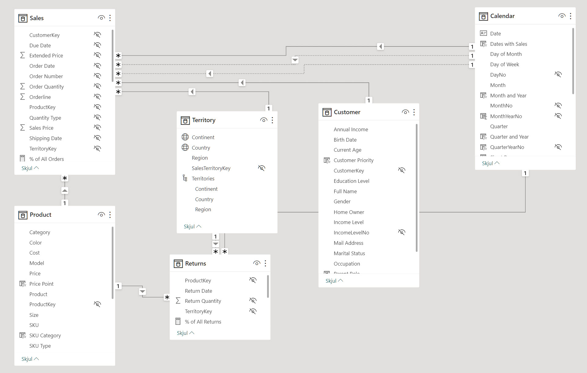
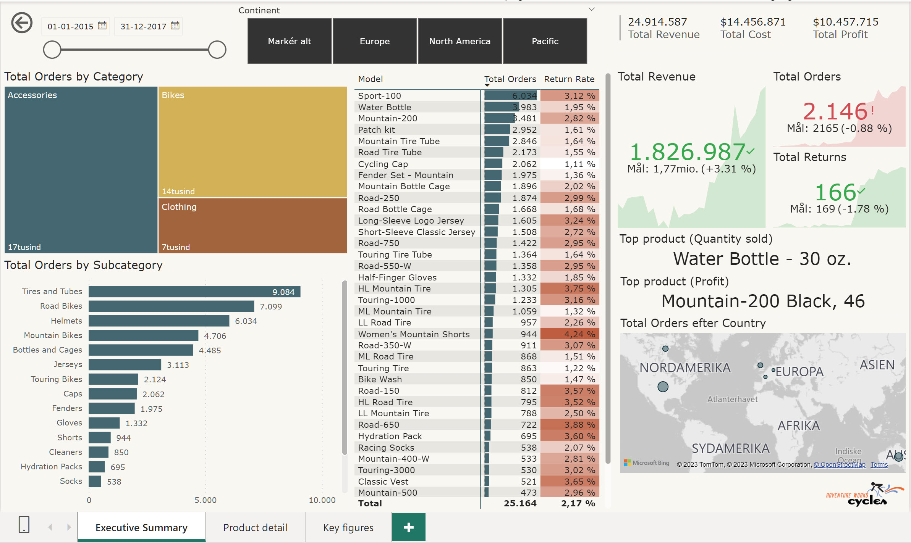
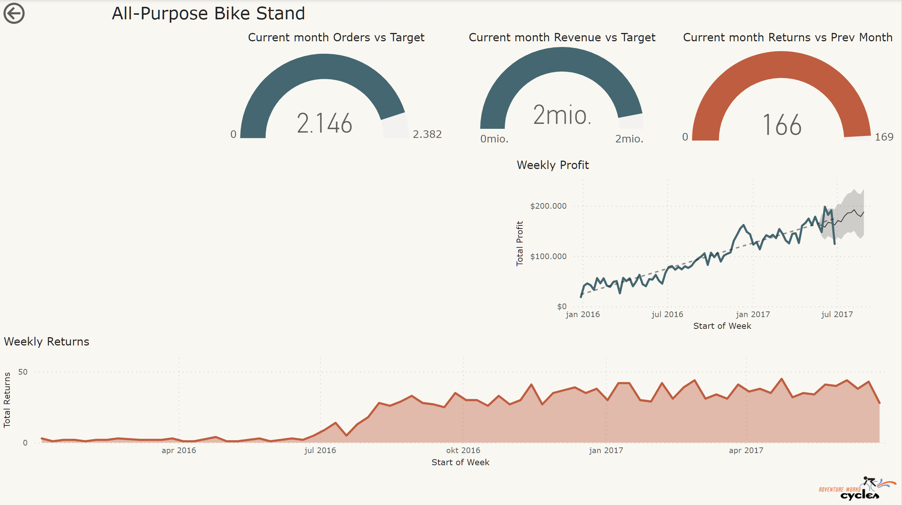

<span class="fs-1">
[HOME](../index.md){: .btn .btn-blue }
</span>

# Adventure Works
**Adventure Works** er en fiktiv multinationel fremstillingsvirksomhed, der bruges som en eksempel database i Microsofts produktdokumentation og træningsmaterialer.

Den omfatter oplysninger om virksomhedens ansatte, produkter, salg, køb og mange andre aspekter af virksomhedens drift. 

Den indeholder typisk data for en række forskellige afdelinger, herunder *Human Resources*, *Production*, *Sales*, *Marketing* og *Finance*.

## ER-Diagram



## Datafiler
Datafiler som en samlet ZIP fil
- [SalesData.zip](./filer/SalesData.zip)

## Power BI Filer
- [AWC Salgsrapport - Datamodellering.pbix](./filer/AWC%20Salgsrapport%20-%20Datamodellering.pbix)
- [AWC Salgsrapport - Visualisering.pbix](./filer/AWC%20Salgsrapport%20-%20Visualisering.pbix)
- [AWC Salgsrapport - DAX.pbix](./filer/AWC%20Salgsrapport%20-%20DAX.pbix)
- [AWC Salgsrapport - Final TUEH.pbix](./filer/AWC%20Salgsrapport%20-%20Final%20TUEH.pbix)

## DAX
**DAX** står for **Data Analysis Expressions** og er et formelsprog, der bruges i Power BI, samt i andre Microsoft dataanalyseværktøjer som Power Pivot i Excel og SQL Server Analysis Services. 

DAX hjælper med at skabe nye informationer fra de data, der allerede er i din model.

DAX er primært et formelsprog, der bruges til at beregne kolonne- og målværdier (*kendt som calculated columns og measures*) i Power BI's datamodeller. 

Det er et kraftfuldt værktøj til at skabe komplekse beregninger, som er nødvendige for avanceret dataanalyse og rapportering. DAX-formler ligner *Excel*-formler, men er designet til at arbejde med relationelle data og udføre mere dynamiske og komplekse beregninger.

### Nøgleegenskaber ved DAX

- **Rækkesammenhæng**: DAX kan udføre beregninger på rækkeniveau i en tabel, hvilket gør det muligt at skabe beregnede kolonner.
- **Filterkontekst**: DAX forstår den aktuelle filterkontekst, som en rapport eller visualisering giver, og beregner resultater inden for denne kontekst.
- **Tidsintelligens**: DAX indeholder funktioner til at håndtere dato- og tidsbaserede data på en intelligent måde, hvilket gør det nemt at udføre beregninger som year-to-date, month-to-date, og lignende sammenligninger over tid.
- **Funktioner**: DAX indeholder en række funktioner, der ligner dem i Excel, men også mange, der er unikke for DAX, som er optimeret til at arbejde med data i en datamodel.

**DAX** er en essentiel del af Power BI, der giver dig mulighed for at tilføje avanceret funktionalitet til rapporter og dashboards, hvilket gør det muligt at udføre dybdegående dataanalyse og opnå indsigt, der ikke er umiddelbart tilgængelige gennem standard visualiseringer og dataopsætninger.

### DAX Formler Adventure Works


```dax
All Orders = CALCULATE( [Total Orders], ALL( Sales))
```

```dax
Average Retail Price = AVERAGE( 'Product'[Price] )
```

```dax
% of All Orders = DIVIDE( [Total Orders], [All Orders] )
```

```dax
Total Orders = DISTINCTCOUNT( Sales[Order Number] )
```

```dax
Total Profit = [Total Revenue] - [Total Cost]
```

```dax
Total Revenue = SUM( Sales[Extended Price])
```

```dax
Total Cost = SUMX( Sales, Sales[Order Quantity] * RELATED( 'Product'[Cost] ))
```

```dax
Quantity Sold = SUM( Sales[Order Quantity])
```

```dax
90-day Rolling Profit = CALCULATE ( [Total Profit] , DATESINPERIOD ( Calendar[Date] , MAX ( Calendar[Date] ) , -90 , DAY ) )
```

```dax
Bulk Orders = CALCULATE( [Total Orders], Sales[Order Quantity] > 1 )
```

```dax
High Ticket Orders = CALCULATE( [Total Orders], FILTER( 'Product', 'Product'[Price] > [Overall Avg Price]))
```

```dax
Order Target = [Prev Month Orders] * 1.1
```

```dax
Overall Avg Price = CALCULATE( [Average Retail Price], ALL( 'Product' ))
```

```dax
Prev Month Orders = IF( MAX( 'Calendar'[Date] ) <= MAX( Sales[Order Date] ), CALCULATE ( [Total Orders], DATEADD (Calendar[Date], -1, MONTH ) ) )
```

```dax
Prev Month Revenue = IF( MAX( 'Calendar'[Date] ) <= MAX( Sales[Order Date] ), CALCULATE( [Total Revenue], DATEADD( 'Calendar'[Date], -1, MONTH )))
```

```dax
Revenue Target = 
IF ( 
    ISBLANK( MAX ( Sales[Extended Price] ) ),
    BLANK(),
    [Prev Month Revenue] * 1.1
)
```

```dax
Total Revenue YTD = TOTALYTD( [Total Revenue], 'Calendar'[Date] )
```

```dax
Weekend Orders = CALCULATE( [Total Orders], 'Calendar'[Type of Day] = "Weekend" )
```

```dax
Revenue Target = 
IF ( 
    ISBLANK( MAX ( Sales[Extended Price] ) ),
    BLANK(),
    [Prev Month Revenue] * 1.1
)
```

```dax
YTD Revenue = 
    VAR IsItFiltered = ISFILTERED ( 'Calendar'[Start of Month] )
    VAR DoesItHaveData = NOT ( ISBLANK ( Sales[Total Revenue] ) )
RETURN
	IF ( 
		IsItFiltered && DoesItHaveData,
		TOTALYTD(
			[Total Revenue],
			'Calendar'[Date]
		)
	)
```

## Power BI Rapport
### Executive Summary


### Product detail
