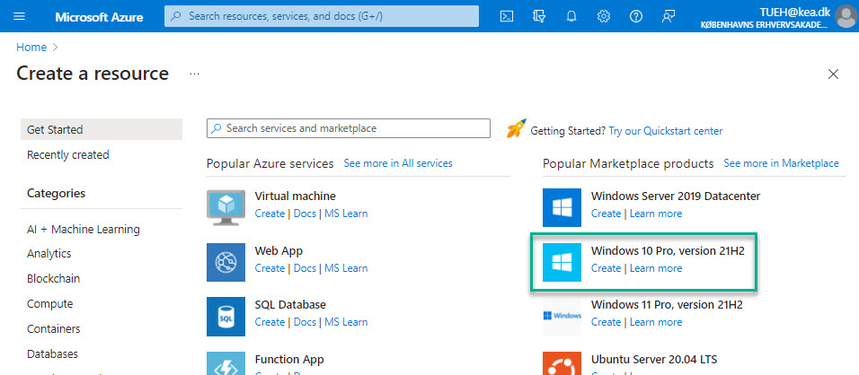
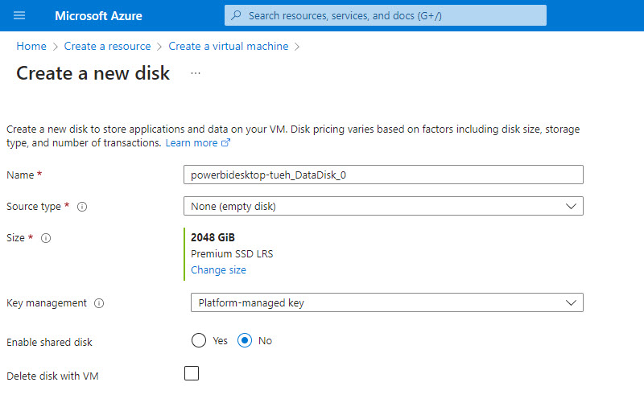
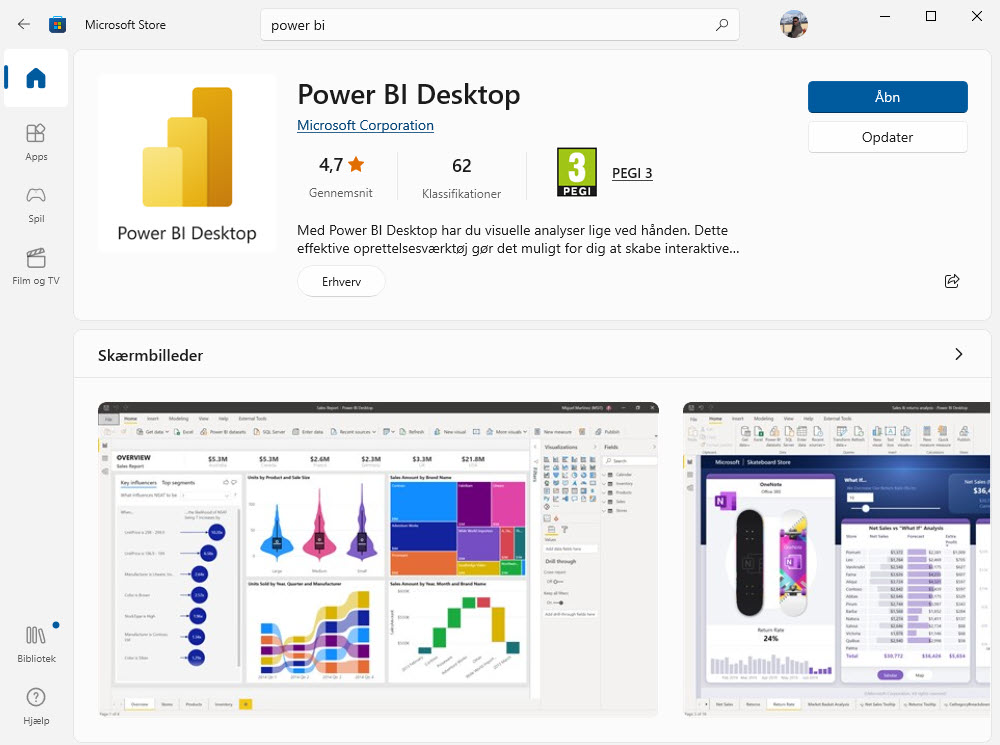

# Run Power Bi Desktop on Azure
If you have a Mac you can run Microsoft Power BI **Desktop** on a Virtuel machine on Azure.

## Create Virtuel Machine
First you have to create a Virtuel Machine on Azure:

- Login: [portal.azure.com](https://portal.azure.com)
- Create a resource
- Select Windows 11 Pro - xxx

- Settings
    - Region: North Europe
    - Image: Windows 11 Pro, xxx
    - Size Standard_B1s
    - Username
    - Password
    - Public inbound ports: RDP (3389)
    - Confirm licens

**Note: Remember the username and password!**

- Disk
    - Create and attach a new disk
    - Size: 2048 GiB

- Next: Networking
- Next: Management
- Next: Monitoring
- Next: Advanced
- Next: Tags
- Next: Review + create
- Create

The Virtuel Machine is now create - *It take some time!*

## Microsoft Remote Desktop for Mac
You can use the Remote Desktop client for Mac to work with Windows apps, resources, and desktops from your Mac computer.

[Microsoft Remote Desktop for Mac](https://learn.microsoft.com/en-us/windows-server/remote/remote-desktop-services/clients/remote-desktop-mac)

Connect to you Azure Virtuel Machine with the Remote Desktop App. 

## Power Bi Destop
Install Microsoft Power Bi Desktop true the Microsoft Store on the Virtuel machine

# Links
- [Microsoft Remote Desktop for Mac](https://learn.microsoft.com/en-us/windows-server/remote/remote-desktop-services/clients/remote-desktop-mac)
- [Power Bi Desktop](https://powerbi.microsoft.com/en-us/desktop/)
