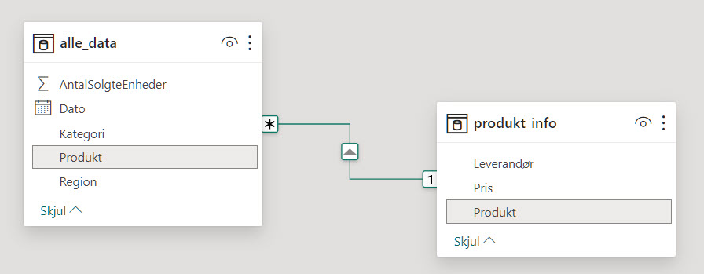
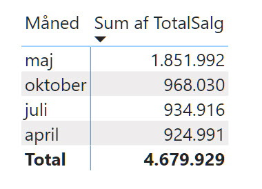
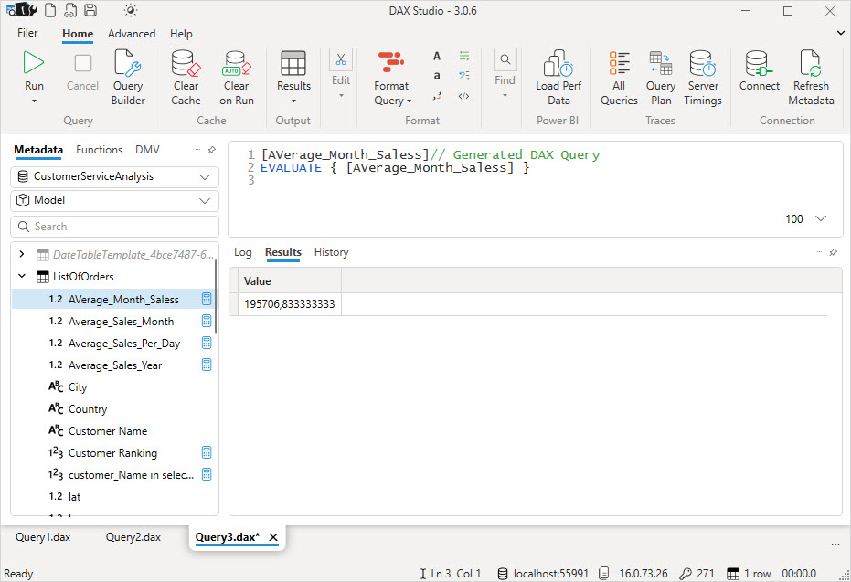

# Introduktion til DAX
**DAX** (*Data Analysis Expressions*) er et sprog af formler og udtryk, der bruges i Power Pivot og Power BI.

**DAX** hjælper med at skabe nye informationer fra eksisterende data gennem avancerede formler. Det er især stærkt i forhold til at arbejde med tidsbaserede data, lave beregninger på tværs af tabeller og skabe komplekse aggregeringer.

# Data
Data er i en CSV filer og en Excel fil, som du kan hente her:

- [alle_data.xlsx](./alle_data.xlsx)
- [produkt_info.csv](./produkt_info.csv)

Du kan også hente Power BI filen, med relationer og DAX Beregninger.

- [Tueh_2.pbix](./Tueh_2.pbix)

Denne fil kan du oploade til Power BI Services og arbejde med den der.

## ER Diagram


# DAX Kommandoer
Her er nogle af de mest brugte DAX-kommandoer.

## RELATED()
Henter data fra en relateret tabel.

**Eksempel**: Hente produktinformation fra en produkt tabel, der er relateret til salgstabellen.

```dax
RELATED(produkt_info[Pris])
```

[Microsoft RELATED](https://learn.microsoft.com/da-dk/dax/related-function-dax)

## SUM(), AVERAGE(), MIN(), MAX()
Grundlæggende aggregeringsfunktioner.

**Eksempel**: Finde det samlede salg, gennemsnitssalg, minimum eller maksimum salg.

```dax
Totalsalg = sum(alle_data[Totalpris])

Avergsalg = AVERAGE(alle_data[Totalpris]

Minimumsalg = MIN(alle_data[Totalpris])

Maximumsalg = MAX(alle_data[Totalpris])
```

## CALCULATE()
Ændrer konteksten af en beregning med **filtre**.

**Eksempel**: Beregne total salg i en bestemt region, her "*København*"

```dax
SalgKøbenhavn = CALCULATE(SUM(alle_data[Totalpris]), alle_data[Region] = "København")
```

## DATESBETWEEN()
Bruges til at returnere en tabel med datoer, der ligger inden for et angivet interval.

**DATESBETWEEN** er særligt nyttig i situationer, hvor du har brug for at fokusere på en specifik periode for dine analyser, og hvor denne periode kan variere eller skal kunne justeres.

```dax
DATESBETWEEN(DateColumn, StartDate, EndDate)
```
- **DateColumn**: En kolonne af datatypen dato eller dato/tid, typisk fra en datotabel.
- **StartDate**: Udtrykket, der definerer startdatoen for intervallet. Dette kan være en fast dato, en formel, der returnerer en dato, eller en reference til en dato i en anden tabel.
- **EndDate**: Ligesom *StartDate*, definerer dette udtryk slutdatoen for intervallet.

```dax
SalgDenneMdr = CALCULATE(
    SUM(alle_data[Totalpris]),
    DATESBETWEEN(
        KalenderTabel_3[Date],
        TODAY()-DAY(TODAY())+1,
        EOMONTH(TODAY(), 0)
    )
)
```

## DATEADD()
Bruges til at tilføje en bestemt antal dage, måneder, kvartaler eller år til en række datoer i en tabel. Den returnerer en tabel med de justerede datoer.

**Eksempel**: Beregne salg for det foregående år eller for en specifik periode.

```dax
DATESADD(DateColumn, NumberOfIntervals, Interval)
```
- **DateColumn**: En kolonne af datatypen dato eller dato/tid, typisk fra en datotabel.
- **NumberOfIntervals**: Et heltal, der angiver, hvor mange intervaller der skal tilføjes til hver dato i DateColumn.
- **Interval**: En streng, der angiver typen af interval, der skal tilføjes. Det kan være "**day**", "**month**", "**quarter**", eller "**year**".

```dax
SalgSidsteMdr = CALCULATE(
    SUM(alle_data[Totalpris]),
    DATESBETWEEN(
        KalenderTabel_3[Date],
        DATESADD(TODAY()-DAY(TODAY()) + 1, -1, MONTH),
        DATESADD(EOMONTH(TODAY(), 0), -1, MONTH)
    )
)
```

## FILTER()
Anvendes til at skabe brugerdefinerede filtre inden for formler.

**Eksempel**: Filtrere salgsdata for at inkludere kun bestemte kategorier.

```dax
HardwareSalg = CALCULATE(sum(alle_data[Totalpris]), FILTER(
    produkt_info, produkt_info[Kategori]= "Hardware"))
```

## TOPN()
Bruges til at returnere de øverste N rækker fra en tabel baseret på en given udtryksværdi.
Resultatet bliver retuneret som en ny tabel.

**Eksempel**: Find de top 5 måneder med det højeste salgsbeløb.

```dax
Top5Mdr = TOPN(
    5, 
    SUMMARIZE(
        alle_data, 
        alle_data[Dato], 
        "TotalSalg", SUM(alle_data[Totalpris])
    ), 
    [TotalSalg], 
    DESC
)
```



# Dato tabel
I Power BI er oprettelsen af en dedikeret datotabel ofte nødvendig for at understøtte forskellige typer af tidsbaserede analyser og beregninger. Her er nogle af de primære årsager til, at det er en god praksis at oprette en sådan tabel.

**Tidsbaserede Beregninger**: En datotabel giver mulighed for at udføre komplekse tidsbaserede beregninger, såsom år-til-dato (*YTD*), måned-til-dato (*MTD*), og lignende sammenligninger over tid.

**Tidsintelligens Funktioner**: Power BI's tidsintelligens funktioner, som *DATEADD*, *DATESBETWEEN*, og *SAMEPERIODLASTYEAR*, kræver en veldefineret datotabel for at fungere korrekt.

**Fleksibilitet og Kontrol**: Ved at oprette din egen datotabel, kan du tilpasse den til dine specifikke behov, inklusive tilføjelse af skudår, helligdage, arbejdsdage, og andre specielle datoer.

**Konsistens på Tværs af Rapporter**: En standardiseret datotabel sikrer, at alle rapporter og dashboards bruger den samme definition af "*måned*", "*kvartal*", "*år*" osv., hvilket fører til konsistente resultater på tværs af forskellige analyser.

**Relationer og Filtrering**: En datotabel kan bruges til at oprette relationer med andre tabeller i din model, hvilket gør det muligt at filtrere og analysere data baseret på tidsdimensioner på en effektiv måde.

Selvom Power BI kan generere en datotabel automatisk, giver en brugerdefineret datotabel ofte mere kontrol og præcision i dine analyser, især når det kommer til specifikke forretningsbehov og avancerede tidsbaserede beregninger.

Der er flere måde du kan oprette en Dato tabel på i DAX

## Calendar()
Genererer en tabel, der indeholder en kolonne med datoer, der starter fra en angivet startdato og slutter ved en angivet slutdato.

- Klik på Modellering
- Ny tabel
- Skriv denne Dax funktion:

```dax
KalenderTabel_1 = CALENDAR("2023-01-01", "2023-12-31")
```

Du kan også specificere Start og Slut datoer ud fra dine data:

```dax
KalenderTabel_2 = CALENDAR(
    FIRSTDATE(alle_data[Dato]), 
    LASTDATE(alle_data[Dato])
)
```

## CalendarAuto()
Opretter en tabel med en enkelt kolonne af datoer, der **starter fra den tidligste dato** og **slutter ved den seneste dato**, som findes i de eksisterende tabeller i din Power BI-model.

Denne funktion er praktisk, når du ønsker at sikre, at din datotabel dækker hele datointervallet i din model uden at skulle specificere eller finde start- og slutdatoer manuelt.

```dax
CALENDARAUTO([fiscal_year_end_month])
```

**fiscal_year_end_month** (*valgfri*): Et **heltal**, der repræsenterer måneden, hvor dit regnskabsår slutter. Hvis dette argument udelades, antages at regnskabsåret slutter i december (*måned 12*).

```dax
KalenderTabel_3 = CALENDARAUTO()
```

# Links

## TutorialsPoint
God oversigt over DAX - [TutorialsPoint Dax Guide](https://www.tutorialspoint.com/dax_functions/dax_functions_quick_guide.htm)

## DAX Studio
DAX studie er et Windows program der gør det nemmere at arbejde med avancerde DAX formler - [daxstudio.org](https://daxstudio.org)



*Findes kun til Windows*

## Microsoft links
- [learn.microsoft.com/en-us/dax](https://learn.microsoft.com/en-us/dax/)
- [learn.microsoft.com/en-us/training/paths/dax-power-bi/](https://learn.microsoft.com/en-us/training/paths/dax-power-bi/)
- [docs.microsoft.com/en-us/dax/dax-overview](https://docs.microsoft.com/en-us/dax/dax-overview)
- [docs.microsoft.com/en-us/power-bi/transform-model/desktop-calculated-columns](https://docs.microsoft.com/en-us/power-bi/transform-model/desktop-calculated-columns)
- [docs.microsoft.com/en-us/dax/aggregation-functions-dax](https://docs.microsoft.com/en-us/dax/aggregation-functions-dax)
- [docs.microsoft.com/en-us/dax/date-and-time-functions-dax](https://docs.microsoft.com/en-us/dax/date-and-time-functions-dax)
- [docs.microsoft.com/en-us/dax/filter-functions-dax](https://docs.microsoft.com/en-us/dax/filter-functions-dax)
- [docs.microsoft.com/en-us/dax/math-and-trig-functions-dax](https://docs.microsoft.com/en-us/dax/math-and-trig-functions-dax)
- [docs.microsoft.com/en-us/dax/text-functions-dax](https://docs.microsoft.com/en-us/dax/text-functions-dax)