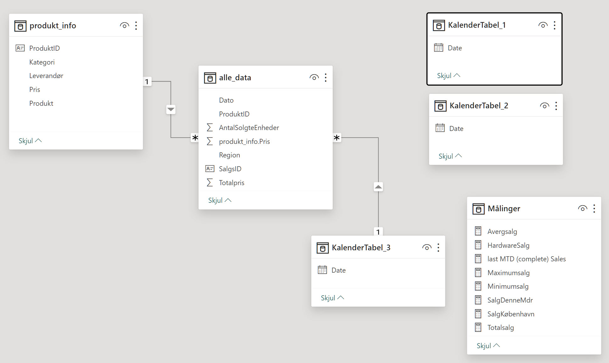

# Introduktion til DAX
**DAX** (*Data Analysis Expressions*) er et sprog af formler og udtryk, der bruges i Power Pivot og Power BI.

**DAX** hjælper med at skabe nye informationer fra eksisterende data gennem avancerede formler. Det er især stærkt i forhold til at arbejde med tidsbaserede data, lave beregninger på tværs af tabeller og skabe komplekse aggregeringer.

# Data
Data er i to CSV filer som du kan hente her:

- [alle_data.csv](./alle_data.csv)
- [produkt_info.csv](./produkt_info.csv)

## ER Diagram


# DAX Kommandoer
Her er nogle af de mest brugte DAX-kommandoer.

## RELATED()
Henter data fra en relateret tabel.

**Eksempel**: Hente produktinformation fra en produkt tabel, der er relateret til salgstabellen.

```dax
RELATED(produkt_info[Pris])
```

## SUM(), AVERAGE(), MIN(), MAX()
Grundlæggende aggregeringsfunktioner.

**Eksempel**: Finde det samlede salg, gennemsnitssalg, minimum eller maksimum salg.

```dax
SUM(Salgsbeloeb)

AVERAGE(Salgsbeloeb)

MIN(Salgsbeloeb)

MAX(Salgsbeloeb)
```

## CALCULATE()
Ændrer konteksten af en beregning med filtre.

**Eksempel**: Beregne total salg i en bestemt region.

```dax
CALCULATE(SUM(Salgsbeloeb), Region = "København")
```

## DATEADD() og DATESBETWEEN()
Tidsbaserede beregninger.

**Eksempel**: Beregne salg for det foregående år eller for en specifik periode.

```dax
CALCULATE(SUM(Salgsbeloeb), DATEADD(Dato, -1, YEAR))

CALCULATE(SUM(Salgsbeloeb), DATESBETWEEN(Dato, "2023-01-01", "2023-01-31"))
```

## FILTER()
Anvendes til at skabe brugerdefinerede filtre inden for formler.

**Eksempel**: Filtrere salgsdata for at inkludere kun bestemte kategorier.

```dax
CALCULATE(SUM(Salgsbeloeb), FILTER(AlleData, Kategori = "Hardware"))
```

## ALL(), ALLEXCEPT()
Fjerner filtre fra den aktuelle kontekst.

**Eksempel**: Beregne total salg uafhængigt af andre anvendte filtre.

```dax
CALCULATE(SUM(Salgsbeloeb), ALL(Region))
```

##  CONCATENATEX()
Sammensætter tekst fra forskellige rækker.

**Eksempel**: Skabe en sammensat liste af produktnavne.

```dax
CONCATENATEX(FILTER(AlleData, Region = "Århus"), Produkt, ", ")
```

## RANKX()
Rangerer data efter en bestemt logik.

**Eksempel**: Rangering af salg efter region.

```dax
RANKX(ALL(Region), CALCULATE(SUM(Salgsbeloeb)))
```

## TOPN()
Bruges til at returnere de øverste N rækker fra en tabel baseret på en given udtryksværdi.

**Eksempel**: Find de top 5 dage med det højeste salgsbeløb. Brug **TOPN()** sammen med **SUMX()** og **GROUPBY()** for at opnå dette:

```dax
TOPN(
    5, 
    SUMMARIZE(
        AlleData, 
        AlleData[Dato], 
        "TotalSalg", SUM(AlleData[Salgsbeloeb])
    ), 
    [TotalSalg], 
    DESC
)
```

# Dato tabel


# Links

## TutorialsPoint
God oversigt over DAX - [TutorialsPoint Dax Guide](https://www.tutorialspoint.com/dax_functions/dax_functions_quick_guide.htm)

## DAX Studio
DAX studie er et Windows program der gør det nemmere at arbejde med avancerde DAX formler - [daxstudio.org](https://daxstudio.org)


*Findes kun til Windows*

## Microsoft links
- [learn.microsoft.com/en-us/dax](https://learn.microsoft.com/en-us/dax/)
- [learn.microsoft.com/en-us/training/paths/dax-power-bi/](https://learn.microsoft.com/en-us/training/paths/dax-power-bi/)
- [docs.microsoft.com/en-us/dax/dax-overview](https://docs.microsoft.com/en-us/dax/dax-overview)
- [docs.microsoft.com/en-us/power-bi/transform-model/desktop-calculated-columns](https://docs.microsoft.com/en-us/power-bi/transform-model/desktop-calculated-columns)
- [docs.microsoft.com/en-us/dax/aggregation-functions-dax](https://docs.microsoft.com/en-us/dax/aggregation-functions-dax)
- [docs.microsoft.com/en-us/dax/date-and-time-functions-dax](https://docs.microsoft.com/en-us/dax/date-and-time-functions-dax)
- [docs.microsoft.com/en-us/dax/filter-functions-dax](https://docs.microsoft.com/en-us/dax/filter-functions-dax)
- [docs.microsoft.com/en-us/dax/math-and-trig-functions-dax](https://docs.microsoft.com/en-us/dax/math-and-trig-functions-dax)
- [docs.microsoft.com/en-us/dax/text-functions-dax](https://docs.microsoft.com/en-us/dax/text-functions-dax)