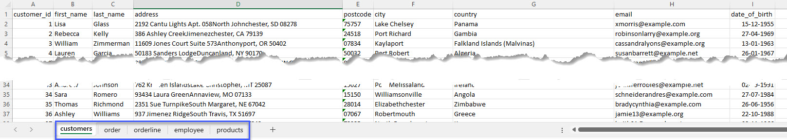
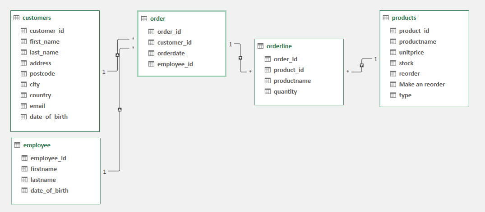
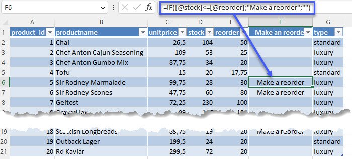
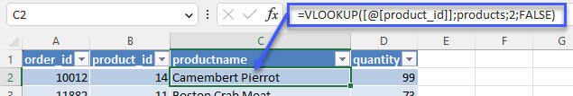
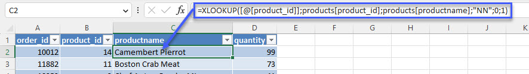
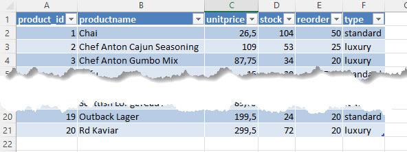
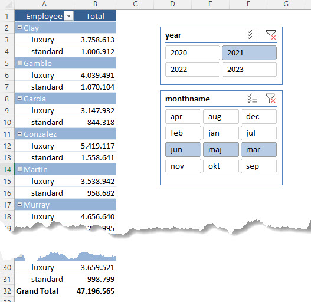

[HOME](./index.md){: .btn .btn-blue }

# Excel
### Quick Fact 1
There are **800 million Excel** users around the world and **less than 5%** know how to use Excel efficiently! 
In a room of 20 people, that means less than 1 person knows Excel to the Advanced level.

### Quick Fact 2
By knowing **5% more than your colleagues**, you are viewed as an **Excel expert!**

# Data
I have created an Excel files with some data.

- Customers
- Order
- Orderline
- Employee
- Products

All data are all in one Excel file. [Download](./ExcelData/sales_data.xlsx)

## Er-Diagram

# IF
The IF function is one of the most popular functions in Excel, and it allows you to make logical comparisons between a value and what you expect.

So an IF statement *can have two results*. The first result is if your comparison is **True**, the second if your comparison is **False**.

**For example**: *=IF([@stock]<=[@reorder];"Make a reorder";"")*

[Se more at Microsoft](https://support.microsoft.com/en-us/office/if-function-69aed7c9-4e8a-4755-a9bc-aa8bbff73be2)

# Lookup Functions
Lookup functions in Excel are functions that allow you to search for a specific value in a range of cells or a table, and return a corresponding value from another cell or column.

Lookup functions are particularly useful for working with large datasets, as they allow you to quickly and easily find specific values and extract corresponding data. 

It's important to ensure that your lookup criteria are accurate and specific, as incorrect or vague criteria can lead to inaccurate results.

There are several types of lookup functions in Excel, each with its own syntax and purpose, the must uses are; **VLOOKUP** and the *new* one **XLOOKUP**

## VLOOKUP
Use VLOOKUP when you need to find things in a table or range by row.

[Se more at Microsoft](https://support.microsoft.com/en-us/office/vlookup-942f678a-1bfc-4ccf-8dfa-f5057ded5c65)

## XLOOKUP
Use the XLOOKUP function to find things in a table or range by row. For example, look up the price of an automotive part by the part number, or find an employee name based on their employee ID. 

With XLOOKUP, you can look in one column for a search term and return a result from the same row in another column, regardless of which side the return column is on.

[Se more at Microsoft](https://support.microsoft.com/en-us/office/xlookup-function-b7fd680e-6d10-43e6-84f9-88eae8bf5929)

**Note:** *XLOOKUP is not available in Excel 2016 and Excel 2019*

# Tables
To make managing and analyzing a group of related data easier, you can turn a range of cells into an Excel table.

[Se more at Microsoft](https://support.microsoft.com/en-us/office/Import-and-analyze-data-ccd3c4a6-272f-4c97-afbb-d3f27407fcde#ID0EAABAAA=Tables&ID0EBBD=Tables)

# Pivot Tables
Excel pivot tables are a powerful tool for analyzing and summarizing large amounts of data. They allow you to quickly and easily create a summary table from a large dataset, without having to manually sort and filter the data.

To create a pivot table in Excel, you start by selecting the data you want to analyze. You then insert a pivot table and choose the columns you want to include in your summary table. You can also choose to group your data by specific categories, such as dates or product categories.

Once your pivot table is created, you can easily summarize your data by dragging and dropping fields into different areas of the pivot table.

Pivot tables also allow you to filter your data by specific criteria, such as by product or date range. This makes it easy to drill down into your data and get insights into specific areas of your business.

Overall, pivot tables are a powerful tool for analyzing and summarizing large datasets in Excel. They are easy to use and can provide valuable insights into your business operations.

