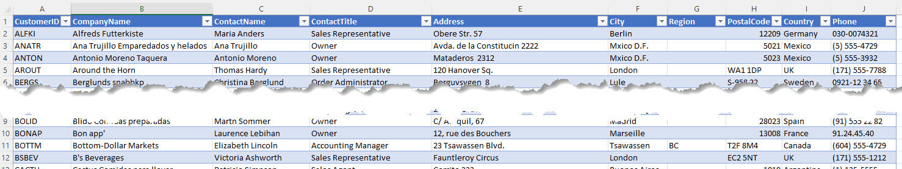
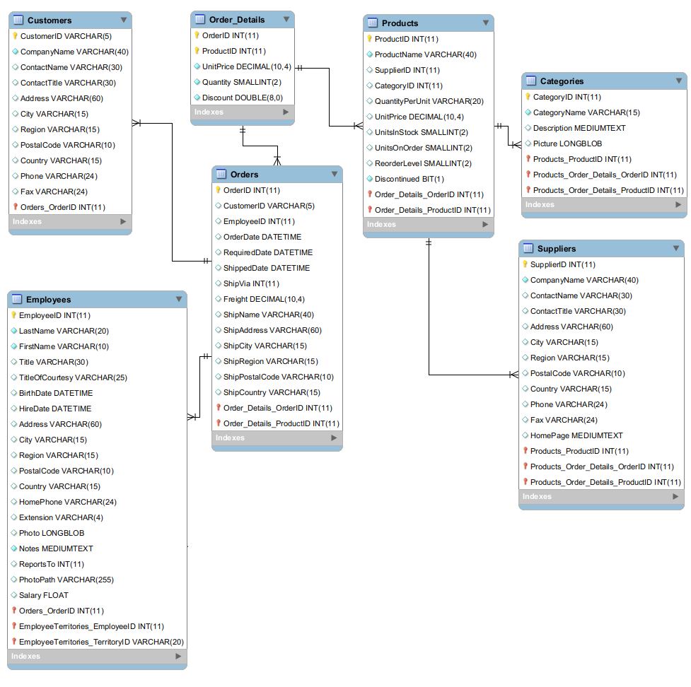
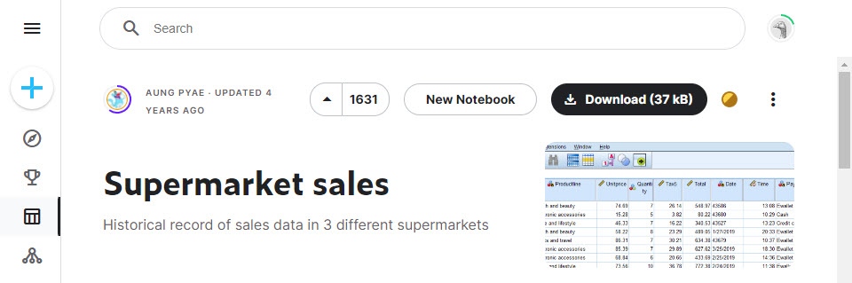
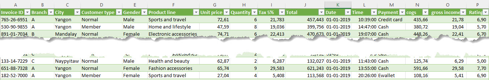

[HOME](../index.md){: .btn .btn-blue }

# Microsoft Power BI
Power BI is a unified, scalable platform for self-service and enterprise business intelligence (BI). Connect to and visualize any data, and seamlessly infuse the visuals into the apps you use every day.

Microsoft Power BI contains of 3 different programs:

- [Microsoft Power Bi Desktop](https://powerbi.microsoft.com/en-us/desktop/)
- [Microsoft Power Bi Mobile](https://powerbi.microsoft.com/en-us/mobile/)
- Microsoft Power services

## Get started building with Power BI
Microsoft have created a very good getting startede guide [Get started building with Power BI](https://learn.microsoft.com/en-us/training/modules/get-started-with-power-bi/)

# Northwind
 All the data from the Northwind database are copied into one Excel file.

## Excel file
- [northwind.xlsx](./Northwind/northwind.xlsx)

## Tables
- Customers
- Orders
- Order_Details
- Products
- Categories
- Suppliers
- Employees

## ER-Diagram

# Supermarket - Demo
The data for this demo project are from [kaggle.com](https://www.kaggle.com/datasets/aungpyaeap/supermarket-sales)

## Context
The dataset is one of the historical sales of supermarket company which has recorded in 3 different branches for 3 months data. 

Predictive data analytics methods are easy to apply with this dataset.

The dataset has:

- 16 columns
- 1.000 rows

## Information
There are several question we could get the answers from the dataset:

- How many total purchases were made per branch, and which branch had the highest total purchasing?
- Show the data about comparison of customer type per branch!
- Show the data about comparison of gender among customers, and which gender has a higher representation?
- Show the data about comparison of payment methods used by customer!
- What are the top 3 best-selling items, and how do the product lines rank based on the highest quantity sold?
- Sorted the product line based on the highest of total purchasing
- What is the total purchasing of each product line in every month?

*And proberly more!*

## Files
I have converted the datafile a little, you can get my version in CSV or Excel:

- [supermarket_sales.csv](./Supermarket/supermarket_sales.csv)
- [supermarket_sales.xlsx](./Supermarket/supermarket_sales.xlsx)

# DAX
DAX stands for Data Analysis Expressions, i.e. such expressions or formulas that are used for data analysis and calculations.

DAX formulas are very useful in Power BI, as they help data analysts to use the data sets they have to the fullest potential. DAX is used in Power BI, Excel, Power Pivot and also in Analysis Services.

DAX is a data functional language which has several prebuilt functions, operators and methods which allow us to do calculations on data as well as transformations on it.

- [DAX](./dax.md)

# Microsoft Samples
- [Microsoft Examples](./microsoft-sampel-financial.md)
- [Power BI Sample Dataset](./power_bi_sample-dataset.md)

# Links
- [Microsoft Power BI Danmark](https://powerbi.microsoft.com/da-dk)
- [Power BI get started documentation](https://learn.microsoft.com/en-us/power-bi/fundamentals/)