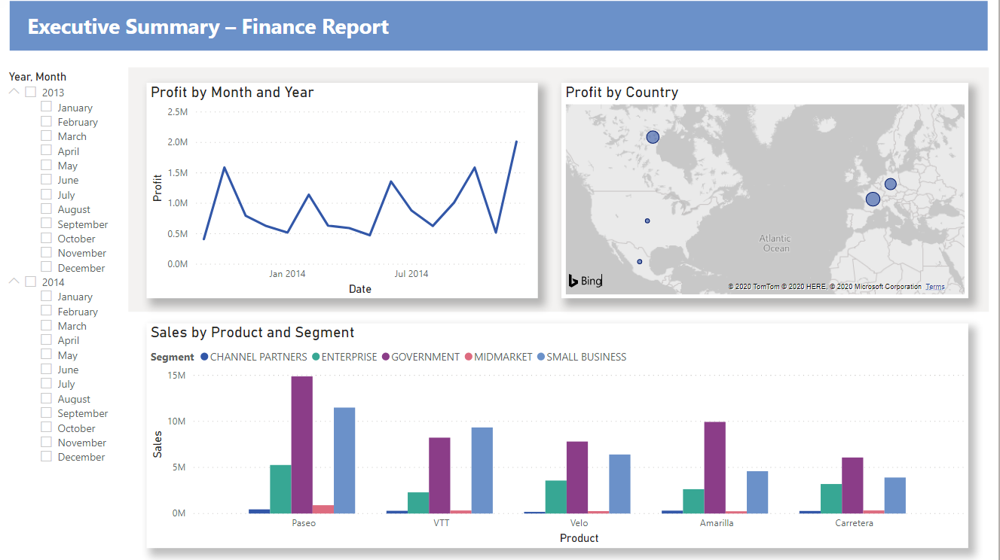

[HOME](./index.md){: .btn .btn-blue }

  

    Table of contents
  

  {: .text-delta }
1. TOC
{:toc}

# Financial Sample Excel workbook
Microsoft har oprette et eksempel på et dashboard fro nogle finansielle data, den er et godt eksempel på hvordan du kan oprettet en rapport.

Den indeholder en tabel med salgsdata, profit data sorteret efter markeds segmenter og lande.

## Download Excel filen
Du kan hente den her - [Financial Sample Excel workbook](https://go.microsoft.com/fwlink/?LinkID=521962)

# Download data direkte i Power Bi
Du kan også tilgå data direkte fra Power BI Desktop.

# Microsoft vejledninger
- [Power BI Desktop: From Excel workbook to stunning report](https://learn.microsoft.com/en-us/power-bi/create-reports/desktop-excel-stunning-report)
- [Power BI service: From Excel workbook to stunning report](https://learn.microsoft.com/en-us/power-bi/create-reports/service-from-excel-to-stunning-report)