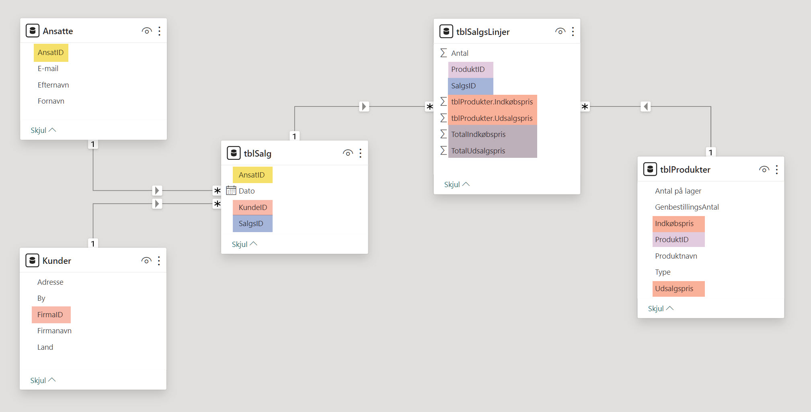

[HOME](./index.md){: .btn .btn-blue }

# Nordic Cykel

Dette er fiktive data på en virksomhed der sælger cykler i de 4 nordiskelande.

De har 20 cykelmodeller fordelt på 4 kategorier:

- Racercykel
- Mountainbike
- Citybike
- Elcykel

Filerne indeholder data fra 2020 til og med 2023, data er fordelt på 5 tabeller/ark

- Kunder
- Ansatte
- Produkter
- Salg
- Salgslinjer

## Er-diagram
De 5 tabeller har disse relationer og beregnede felter.

## Filer
Der er to Excel filer, den ene, [nordic_cykel_start.xlsx](./filer/nordic_cykler_start.xlsx), indeholder tomme rækker, dubletter og forkerte dataformater, den anden [nordic_cykel_slut.xlsx](./filer/nordic_cykler_slut.xlsx), er reneset for "*problemer*".

- [nordic_cykel_start.xlsx](./filer/nordic_cykler_start.xlsx)
- [nordic_cykel_slut.xlsx](./filer/nordic_cykler_slut.xlsx)

# Power BI Services
Power BI Services er Power BI´s cloud-baseret tjeneste, der giver dig mulighed for at importere data, oprette dashboards, dele dashboards, samarbejde og distribuere Power BI-rapporter og dashboards.

**Power BI Services** er et cloud baseret alternativ til **Power BI Desktop**.

Oprensning af data udfører vi i Power Query Online i et **Dataflow**. Det er også muligt at gøre det i din lokale version af Power Query i Power BI Desktop, hvis du har Windows.

Du tilgår Power Query og Dataflows via [app.powerbi.com](https://app.powerbi.com)

## Opret Workspace
- Opret et Workspace - *NordicCykel*
- Workspace settings
    - Power BI
    - General
        - Data model settings
        - Users can edit data models in the Power BI service (preview)

# Dataflow
Du skal opret et **dataflow** der henter data fra Excel filen - [nordic_cykler_start.xlsx](./filer/nordic_cykler_start.xlsx)

Upload denne Excel fil til **OneDrive**.

## Power BI Services
Åben Power BI Services - [app.powerbi.com](https://app.powerbi.com)

- New
- Dataflow
    - Under Define new tables
    - **Add New tables**
    - Vælg **Excel workbook**
    - Browse efter Excel filen, [nordic_cykler_start.xlsx](./filer/nordic_cykler_start.xlsx), på OneDrive
    - Select de data der skal bruges:
        - tblAnsatte
        - tblKunder
        - tblProdukter
        - tblSalg
        - tblSalgsLinjer
    - Klik på **Transform data**
    - Rens data, herunder:
        - Tommerækker
        - Dubletter
        - Datatype
    - Tilføj kolonner til *SalgsLinjer* fra tblProdukter
        - Udsalgspris
        - Indkøbspris
    - Navngiv dit Dataflow - *NordicCykel*
    - Luk dataflow

# Power BI Desktop
Dem af jer der har Windows PC'er og dermed kan installere Power BI Desktop, kan forbinde til dette Dataflow direkte fra Power BI Desktop.

- Hjem
- Hent data
- **Dataflows**
- Vælg Workspace (*NordicCykel*)
- Vælg Dataflow (*NordicCykel*)
    - Vælg de relevante tabeller (*Alle tabeller i dette tilfælde*)
    - Indlæs

- Publicer 
- Til Power BI Services
    - Workspace - **NordicCykel** 

# Dashboard Power BI Service
Åben Power BI Services - [app.powerbi.com](https://app.powerbi.com)

## Import af Excel data
Hvis du **ikke** har Power BI Desktop skal ud oprette en ny Report ud fra Excel filen - [nordic_cykler_slut.xlsx](./filer/nordic_cykler_slut.xlsx).

For at kunne forbinde til denne Excel fil skal du lægge den op på OneDrive.

- Login på **NordicCykel** workspace
- New - Report
- Excel (Preview)
- Browse efter [nordic_cykler_slut.xlsx](./filer/nordic_cykler_slut.xlsx)
- Vælg de relevante tabeller:
    - tblAnsatte
    - tblKunder
    - tblProdukter
    - tblSalg
    - tblSalgsLinjer
- Klik **Create**
- Gem

## Oprettelse af relationer
- Vælg - **dit dashboard**
- Klik på **Edit**
- Klik på **Open data model**
- Opret relationer (*One-To-Many*) mellem tabellerne
- Luk **Data model** visningen

## Oprettelse af Dashboards
Der er nu muligt at oprete relavante dashboards.

## PowerPoint
Det er muligt at oprette forbindelse mellem Power BI og PowerPoint så data kan vises interaktivt.

Det virker dog kun hvis du har en Windows computer og en Windows version af PowerPoint.

Nu kan du præsentere dine data interaktivt, slicere virker.

