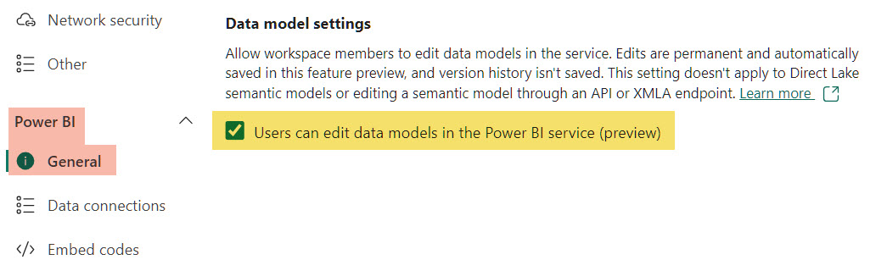
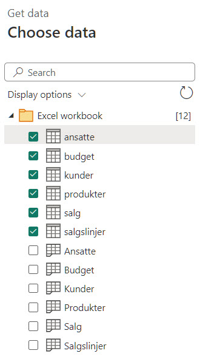
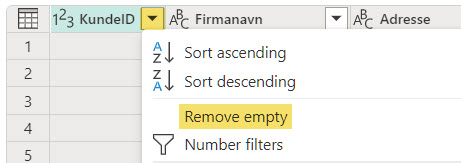
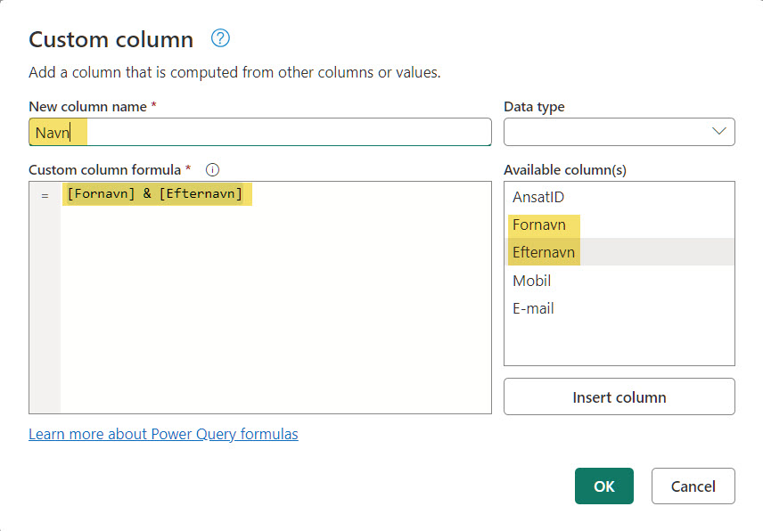
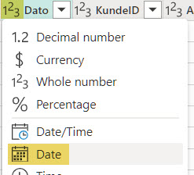

[HOME](./index.md){: .btn .btn-blue }

# Power BI Services
Power BI Services er Power BI´s cloud-baseret tjeneste, der giver dig mulighed for at importere data, oprette dashboards, dele dashboards, samarbejde og distribuere Power BI-rapporter og dashboards.

Power BI Services er et cloud baseret alternativ til Power BI Desktop.

- [app.powerbi.com](https://app.powerbi.com)
- 

Denne rapport oprettelse anvender **Power BI Services**, hvis du har en **Windows PC**, kan du med fordel anvende **Power BI Desktop**.

# Eksempel - Cykel Salg
I dette eksempel skal vi bruge nogle fiktive data omkring cykel salg i de nordiske lande, fra firmaet - **Nordic Cycle Service**

# Workspace
Opret et Workspace - Nordic Cycle Service - På Power BI Services.

Det skal bruges til dine rapporter og workflow omkring dette projekt.

## Indstillinger
Du skal i Workspace settings gøre det muligt at arbejde med data modeller, i dette Workspace.

- Workspace settings
- Power BI
- Data model settings
    - Users can edit data models in .....

## Data filer
- [nordic_cycle_service.xlsx](./cykel_salg/nordic_cycle_service.xlsx)

Denne Excel fil består af følgende tabeller:

- kunder
- ansatte
- produkter
- salg
- salgslinjer
- budget

**Du skal gemme denne Excel fil (nordic_cycle_service.xlsx) på OneDrive.**

## Data problemer
Der er *desvære* nogle problemer med disse data. 

### Kunder
- Der er tomme rækker
- Der dubletter

### Ansatte
- Der er tomme rækker

### Salg
- Der er tomme rækker
- Der er dubletter
- Dato er formateret som tal

### Salgslinjer
- Der mangler en salgspris, findes i tabellen Produkter
- Der mangler en Total

### Budget
- Der er tomme rækker
- I kolonnen Budget er der 2 informationer, årstal og budgettal

# Opret dashboard
Du skal oprette et dashboard der giver indsigt i salget af cykler.

Det første trin er import af data fra Excel filen og "tilpasning" af data.

## Import
Data skal importeres fra Excel filen

- New
- Dataflow
- Add new tables (*Define new tables*)
- Excel workbook
    - Browse OneDrive - Find data filen
- Vælg de tabeller du vil importere - Klik **Transform data**

## Tilpasning
Efter importen skal der fortages "rensning" og tilpasning af data. Dette gøres i **Power Query**.

## Kunder
I tabellen Kunder er der to problemer:

1. Tomme rækker
2. Dubletter

### Fjern tomme rækker
- Klik på "*Drop Down*" for KundeID
- Vælg **Remove empty**

### Fjern dubletter
- Højre klik på *KundeID*
- Vælg **Remove duplicates**

## Ansate
- I tabellen Ansatte skal tomme rækker fjernes.
- Der skal tilføjes et felt der giver den ansattes fuldenavn - Fornavn & Efternavn

### Tilføj Navn
- Vælg **Add column** menupunktet
- Vælg **Custom column**
- Tilføj kolonnen, **Navn = [Fornavn] & [Efternavn]**

## Salg
Ud over tomme rækker og dubletter er Dato kolonnen formateret som et tal

### Datoformat
- Klik på Dato kolonnen
- Vælg **Date**

## Salgslinjer
Her mangler vi prisen for de enkelte produkt der er solgt og en Total for linjen - *Antal * Pris*

- Vælg menupunktet **Home**
- Vælg menupunktet **Combine**
- Vælg **Merge queries**
- 

