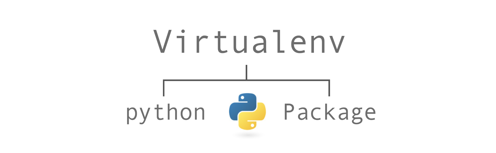
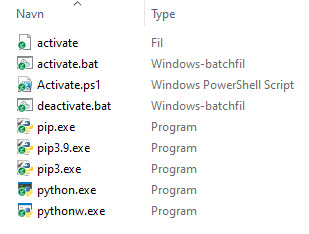
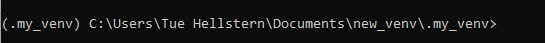
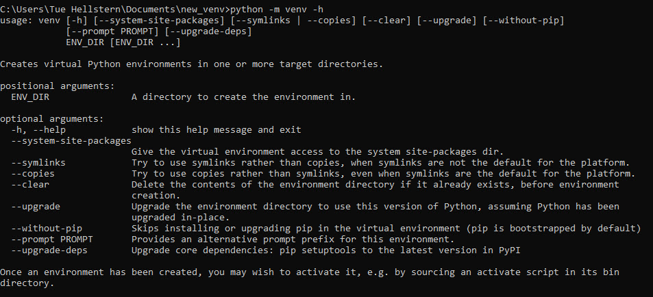

<span class="fs-1">
[HOME](../index.md){: .btn .btn-blue }
</span>

# Virtual environment - *venv*
A virtual environment, is a self-contained directory that comes with a specific Python version and additional packages.

Additionally, you can install or uninstall any Python libraries (*using pip*) once the virtual environment is activated.



The Python version (*by default the one installed on your Operating System will be included unless you explicitly specify a different one*), additional libraries and scripts installed in one virtual environment, are **completely isolated** from those installed in your machine or any other virtual environment.

Python comes with a virtual environment manager called **venv** for Python 3.

# venv commands
The first thing you need to do when developing your own Python application or library, is to create a virtual environment.

## Install 
In Python 3 the Virtual Environment are pre installed from the standard library - [venv](https://docs.python.org/3/library/venv.html).

```
pip3 install -U pip virtualenv
```

## Create the virtual environment
Create a new virtual environment, **my_env**, which is placed in the current directory.

By default, this new environment will **not include any of your existing packages**!

```
# macOS/Linux
python3 -m venv .my_venv

# Windows
python -m venv .my_venv
```

If you want to create a virtual environment in a specific directory, then include it with the *venv name*.

```
python3 -m venv path/to/your/venv/.my_venv
```

## Activate a virtual environment
Before you can start installing or using packages in your virtual environment you'll need to activate it. Activating a virtual environment will put the virtual environment-specific python and pip executables into your shell's PATH .

To do so, you need to call the activate script which is located under the **bin/** sub-directory in the created tree structure of your virtual environment.



There are different scripts for different OS, this is the Windows scripts.

```
# macOS/Linux
source my_venv/bin/activate

# Windows
.\Scripts\activate
```

If you look at the start of the terminal you should that each line begins with (**my_venv**) that indicates that currently, the virtual environment called **my_venv** is activated.



Once the virtual environment is activated, everything you install or uninstall will only have effect **within that specific environment and nowhere else**.

## Confirm
You can confirm you’re in the virtual environment by checking the location of your Python interpreter.

```
# macOS/Linux
which python

# Windows
where python
```

It should be in the env directory

## Installing packages
In your virtual environment you can install all the packages you need, the same way you normally install packages.

```
pip3 install *package*
```

## Listing Packages
To list installed packages

    python -m pip list


##  Deactivate a virtual environment
Deactivate a virtual environment, when you are finished using it.

```
deactivate
```

Notice that the virtual environment named (**my_venv**) has disappeared which means that no virtual environment is currently active.

## Remove/Delete a virtual environment
A virtual environment is really nothing more than a tree directory which gets automatically created with a specific content. Therefore, in order to get rid of a *venv* you simply need to remove/delete the directory from the disk.


## Clear an existing virtual environment
Sometimes, instead of completely deleting a virtual environment, you may instead want to **clear** all the packages that were previously installed.

```
# macOS/Linux
python3 -m venv --clear path/to/my_venv

# Windows
python -m venv --clear path/to/my_venv
```

## Help
You can find a comprehensive list of all the options you have when using **venv** by running this command:

```
# macOS/Linux
python3 -m venv -h

# Windows
python -m venv -h
```



## Step by Step
1. **Create a new virtual environment**
    - *python3 -m venv venv-name*
2. **Activate the virtual environment**
    - macOS - *source env/bin/activate*
    - Windows - *.\Scripts\activate*
3. **Packages**
    - Install 
        - *pip3 install name*
    - requirements.txt
        - pip3 install -r requirements.txt


# Links
- [docs.python.org/3/library/venv.html](https://docs.python.org/3/library/venv.html)
- [installing-using-pip-and-virtual-environments/](https://packaging.python.org/en/latest/guides/installing-using-pip-and-virtual-environments/)