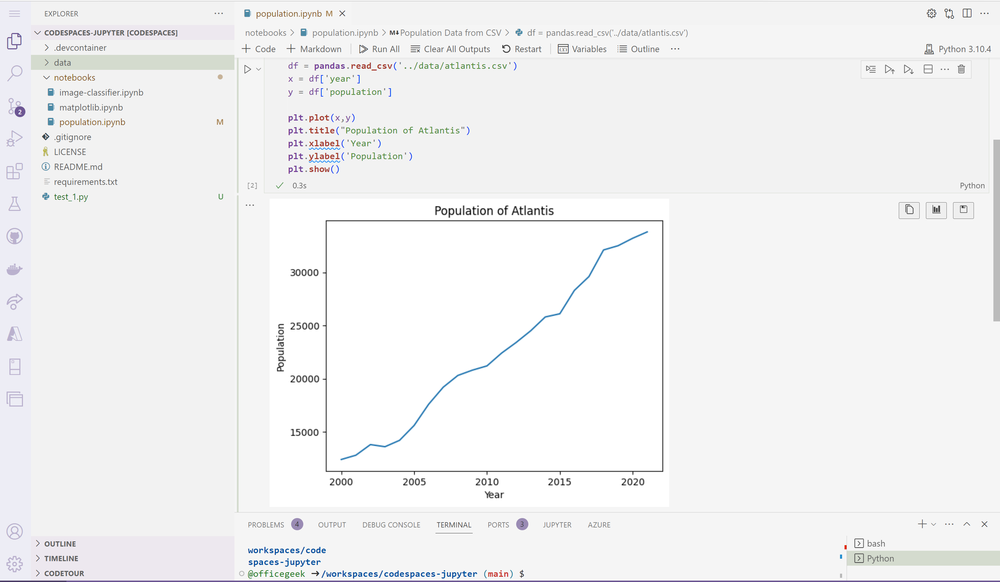

[HOME](../index.md){: .btn .btn-blue }

# GitHub Codespaces
GitHub Codespaces is a cloud-based development environment that allows you to create and run your code directly within the GitHub platform. 

It allows you to quickly spin up a fully configured development environment without the need to install any software locally. 

With Codespaces, you can edit, debug, and collaborate on your code in a browser-based editor or using Visual Studio Code.

Codespaces can be configured with your preferred tools, extensions, and settings, and you can easily switch between different Codespaces to work on different projects. 

Additionally, Codespaces can be set up to automatically sync with your code repositories, making it easy to pick up where you left off when switching devices or environments.

# Use Codespace
To use GitHub Codespaces, you first need to have a GitHub account. Once you have an account, you can follow these steps to create a new Codespace:

1. Navigate to your GitHub repository that you want to create a Codespace for.
2. Click on the "Code" button and select "Open with Codespaces" from the dropdown menu.
3. If you don't have any existing Codespaces, you'll be prompted to create a new one. Choose the configuration options that you want, such as the size of the virtual machine and the programming languages and tools you want installed.
4. Once you've created your Codespace, you'll be taken to the Codespace environment, which is a browser-based editor that you can use to write and test your code.

From there, you can start writing and editing your code just as you would in a local development environment. You can also collaborate with others by sharing access to your Codespace or by inviting others to join your Codespace as collaborators.

When you're done working on your project, you can close your Codespace and all of your changes will be saved automatically. The next time you open your Codespace, you'll be able to pick up right where you left off.