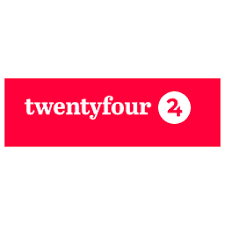

[HOME](../index.md){: .btn .btn-blue }

# Projekt - Twentyfour

## Vi kan bygge stort set alt, der er digitalt
Hos Twentyfour er vi en masse dygtige medarbejdere med teknologisk know-how og en stor passion for at hjælpe virksomheder med at forbedre deres resultat og brugeroplevelser.

Vi har i en lang årrække hjulpet store såvel som små virksomheder med at transformere forretningsidéer, planer og forskellige virksomhedskoncepter til pålidelige, moderne og skræddersyede digitale løsninger med fantastiske brugeroplevelser.

Vores succes er bygget på, at vi skaber værdi for vores kunder, og vores kunders kunder, ved at udvikle, integrere og vedligeholde komplekse systemer og websites.

[Twentyfour](https://twentyfour.dk)

## Materialle
- [Opgaveramme](./Twentyfour%20opgaveramme.pdf)
- [Aflevering 1](./Twentyfour%20aflevering%201.pdf)
- [Aflevering 2](./Twentyfour%20aflevering%202.pdf)
- [Datoer PowerPoint](./CASE%20datoer.pptx)

## Data
- [Deals-anonomyzed-data.xlsx](./Deals-anonomyzed-data.xlsx)

## Datoer
- 07-11-2023 - Projekt opstart med Twentyfour
- xx-xx-2023 - Aflevering del 1 (*Fronter*)
- xx-xx-2023 - Aflevering del 2 (*Fronter*)
- xx-xx-2023 - Aflevering del 3 (*Fronter*)
- xx-xx-2023 - Samlet aflevering (*WiseFlow*)
