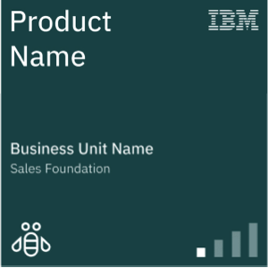
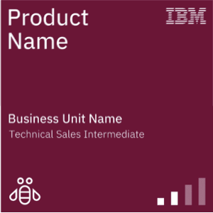

[HOME](./index.md){: .btn .btn-blue }

# 04-09-2023

## Slides
- [Cybersecurity subjects - PDF](./slide/groups.pdf)
- [Cybersecurity subjects - HTML](./slide/groups.html)

# Groups presentation

## INT - Cybersecurity subjects
Here are some cybersecurity **buzzwords** that are commonly used in the industry:
- SOC
- IAM
- Zero Trust
- IoT
- Blockchain
- MFA
- APT
- Zero-day Vulnerability
- EDR
- SOAR
- SIM
- SIEM
- DLP
- SEM

### Task
- You have to create a PowerPoint presentation explaining each of the **buzzword** in detalis. You need to get a **good understanding** of each!
- You have to present this for the Danish speaking people in the group

## DK - Online kursus - IT-Universitet
IT-Universitet har opretteen serie af online kurser i it-sikkerhed rettet med medarbejdere i små og mellemstore virksomheder - [sikkercyber.dk](sikkercyber.dk)

**Der er 3 hovedområder:**
- Grundlæggende IT-sikkerhed – 7 moduler
- Defensiv IT-sikkerhed – 3 moduler
- Offensiv IT-sikkerhed – 3 moduler

Hvert område er opdelt i moduler og en afsluttende quiz. Hvert modul tager ca. 20 minutter at gennemføre. For at tilgå kurserne skal i oprette en konto på [Sikkercyber.dk](https://sikkercyber.dk/) – *Hvilket er gratis*.

### Opgave
- I skal oprette en PowerPoint præsentation med de vigtigste punkter fra hvert modul
- I skal præsentere for de "*engelsk*" deltagere

## Each group
One or two groups gets the **uniq possibility** to present for the other groups.

# LinkedIn Learning
Leveraging ChatGPT for Smarter Cybersecurity, leveraging AI for advanced threat detection and prevention

[Leveraging ChatGPT for Smarter Cybersecurity](https://www.linkedin.com/learning-login/share?account=36836804&forceAccount=false&redirect=https%3A%2F%2Fwww.linkedin.com%2Flearning%2Fleveraging-chatgpt-for-smarter-cybersecurity%3Ftrk%3Dshare_ent_url%26shareId%3DimEoIwmwS%252FSnjiiyj3UoUg%253D%253D)

The length of the course are 43 min.

# IBM Certification
We can give you the unique opportunity to get one or more IBM certifications.

Taking an IBM certification can offer several potential benefits depending on your career goals, industry, and specific role. 

Here are some reasons why you might consider an IBM certification:

**Skill Validation**: IBM certifications are designed to validate your expertise and skills in specific technologies, products, or solutions offered by IBM. Having a certification can demonstrate to employers or clients that you have a certain level of proficiency and knowledge.

**Career Advancement**: Many employers value certifications as a way to assess a candidate's qualifications. Holding an IBM certification can make you stand out from other candidates and potentially lead to better job opportunities or career advancement within your current organization.

**Industry Recognition**: IBM is a well-established and respected technology company. Holding an IBM certification can enhance your professional credibility and recognition within the industry.

## Access
We have created a login with this information:

- Login: [www.ibm.com/training](https://www.ibm.com/training/)
- Username: Your KEA student e-mail
- Password:

# IBM Badges
There are two badge types that support sales enablement — the Sales foundation badge and the Technical sales intermediate badge. These badges are available with curated content for many products. They’re industry recognized, verifiable, and shareable on social platforms.

### Sales foundation badge
Learn how to position the IBM offering in today’s market, and articulate how it solves business problems, including differentiation from competitor offerings.

### Technical sales intermediate badge
Learn the best way to demo, position the offering, and differentiate it from competitors. You will be given a demo scenario to work through, steps and tips on building the demo, and supporting content to ensure a successful outcome.

# First Badge
We recommend that you start with the Badge: [Data Security Sales Foundation](https://www.ibm.com/training/badge/data-security-sales-foundation)

This badge earner understands the IBM Data Security portfolio. They understand the data protection market opportunity and the pain points and challenges customers face as they progress through digital transformation. Additionally, the badge earner can discuss and persuasively position IBM Data Security solutions to their customers and explain the benefits and differentiators of using IBM Data Security against the competition.
