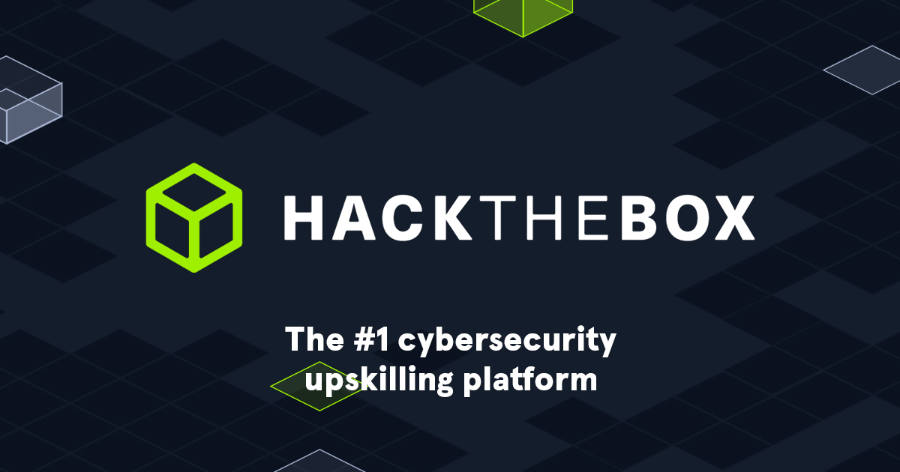

[HOME](./index.md){: .btn .btn-blue }

# HACKTHEBOX

Hack The Box offers advanced training for IT security professionals and hackers through gamified, hands-on experiences. Users learn hacking methodology, the penetration testing process, and how to research vulnerabilities by completing a series of challenges on the platform.

Completely self-driven, users are rewarded with points and increased rankings for solving progressively complex scenarios that teach them invaluable skills.

## Introduction to Lab Access
Over at Hack The Box, we use OpenVPN connections to create links between you and our labs and machines. You may be familiar with one of the many personal VPN services available to individuals, but our VPN serves an entirely different purpose.

- Se the guide at [Introduction to Lab Access](https://help.hackthebox.com/en/articles/5185687-introduction-to-lab-access)
- YouTube video - [Hack The Box FAQs: HOW TO CONNECT TO VPN](https://youtu.be/LMCKbR_wWds)

# Help
- [HACKTHEBOX Help](https://help.hackthebox.com/en/)
- [HACKTHEBOX YouTube](https://www.youtube.com/@HackTheBox)