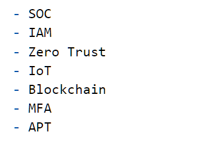
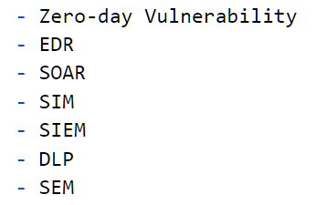

<!-- _backgroundColor: black -->
<!-- _color: white -->
# Cybersecurity subjects <!--fit-->

---

# Buzzwords

- You have to create a PowerPoint presentation explaining each of the **buzzword** in detalis. You need to get a **good understanding** of each!
- You have to present this for the Danish speaking people in the group
---

# IT-Universitet
IT-Universitet har opretteen serie af online kurser i it-sikkerhed rettet med medarbejdere i små og mellemstore virksomheder - [sikkercyber.dk](sikkercyber.dk)

## Der er 3 hovedområder
- Grundlæggende IT-sikkerhed – 7 moduler
- Defensiv IT-sikkerhed – 3 moduler
- Offensiv IT-sikkerhed – 3 moduler

---

# IT-Universitet
Hvert område er opdelt i moduler og en afsluttende quiz. Hvert modul tager ca. 20 minutter at gennemføre. For at tilgå kurserne skal i oprette en konto på [sikkercyber.dk](https://sikkercyber.dk/) – *Hvilket er gratis*.

## Opgave
- I skal oprette en PowerPoint præsentation med de vigtigste punkter fra hvert modul
- I skal præsentere for de "*engelsk*" deltagere

---

# Each group
One or two groups gets the **uniq possibility** to present for the other groups.